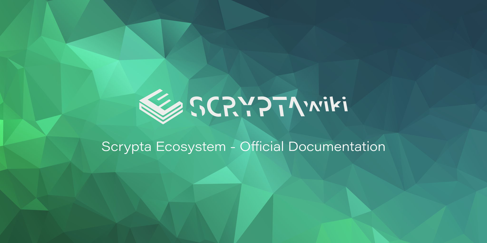

  

# La Guida all'ecosistema Scrypta

La Wiki-Guide di Scrypta fornisce una panoramica completa dell'ecosistema Scrypta. Utilizzate il pannello di navigazione sul lato sinistro di questa pagina per selezionare la documentazione che desiderate leggere.

Per una panoramica sintetica dell'ecosistema Scrypta vi consigliamo di consultare la sezione:

[Informazioni Generali](general-info/cosa-è.md)

In alternativa, inizia subito con Scrypta installando il **LYRA Wallet** (Full Node) o **Manent APP** (Light Wallet):

[Come installare il LYRA Wallet](scrypta-full-node/installazione.md)

[Manent APP](dapps/manent-app.md)

[Manent Web](dapps/manent-web.md)

Ricordiamo infine che con Scrypta è possibile creare e gestire dei ***Tokenized Asset*** grazie alla tecnologia sidechain **Planum**, se sei interessato a questo aspetto, consulta questa sezione:

[**Planum** - Sidechain Layer](planum/README.md)

