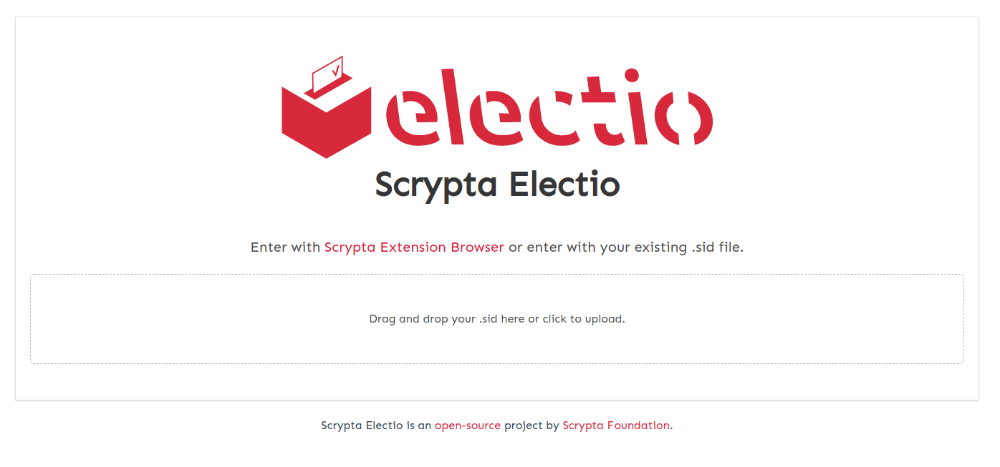
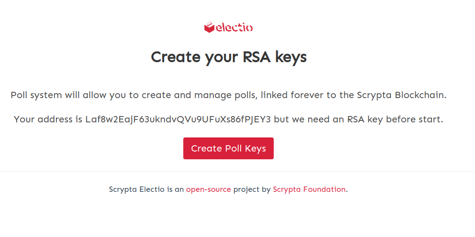
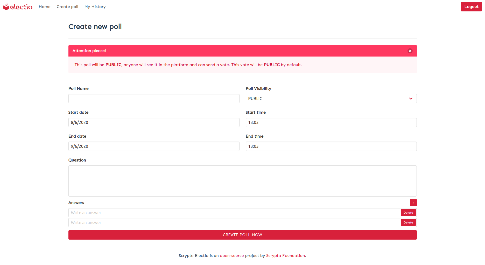
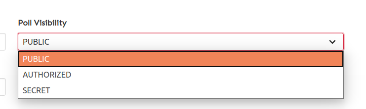
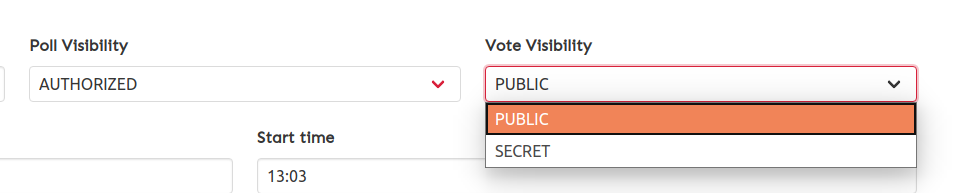

# Electio
*Sistema di E-Voting a distanza tramite blockchain*

## Caratteristiche

Electio è una piattaforma creata per il voto elettronico. La blockchain decentralizzata e permissionless di Scrypta permette un alto livello di trasparenza, sicurezza e affidabilità in tutte le fasi del voto.

- **Procedura sicura grazie alla tecnologia blockchain e RSA**
 
la combinazione di due algoritmi crittografici rende il voto attraverso electio estremamente sicuro e affidabile.

- **Meccanismo anti-manipolazione** 
 
È valida e conteggiata solo l’ultima espressione di voto dell’elettore. Il voto coercitivo o di scambio risultano difficilmente praticabili.

- **Risultati della votazione immediati**
 
Il registro distribuito permette uno scrutinio dei voti immediato azzerando i tempi di attesa.

- **Verifica dell’acquisizione corretta del proprio voto**
  
Ogni votante potrà verificare la corretta acquisizione del proprio voto.

## Tipologie di votazione

### Voto con autorizzazione

- **Quesito pubblico con autorizzazione / Voto Segreto**
 
Il quesito della votazione è visualizzabile solo attraverso password dedicata, il voto dell’elettore, che viene autorizzato a votare dal creatore del quesito, è segreto.

- **Quesito pubblico con autorizzazione / Voto palese**
 
Il quesito della votazione è visualizzabile in chiaro;  il voto dell’elettore,  che viene autorizzato a votare dal creatore del quesito, è palese.

### Quesito Segreto

- **Quesito segreto / Voto Palese**
 
Il quesito della votazione è visualizzabile solo attraverso password dedicata, il voto dell’elettore, che viene pre-autorizzato a votare dal creatore del quesito, è palese (non segreto).

- **Quesito segreto / Voto Segreto**
 
Il quesito della votazione è visualizzabile solo attraverso password dedicata, il voto dell’elettore, che viene pre-autorizzato a votare dal creatore del quesito, è segreto.

### Quesito Pubblico (sondaggistica)

- **Quesito pubblico / Voto Palese**
 
Il quesito della votazione è visualizzabile in chiaro, il voto dell’elettore è in chiaro e tutti possono votare senza autorizzazione. Questa modalità è utile anche per fini di sondaggio.

## Guida alla creazione di una votazione

Come descritto in precedenza, all'interno di Electio è possibile sviluppare diverse tipologie di voto, ciascuna con caratteristiche diverse.
 Tuttavia gli step per configurare la votazione nella modalità desiderata sono pressochè simili e verranno illustrate di seguito.

Innanzitutto bisogna accedere alla finestra di creazione della votazione tramite [Electio](https://vote.electio.app/#/), ed effettuare il login tramite .sid file o [Scrypta Extension Browser](https://id.scryptachain.org/).

 Dopo aver inserito la password e completata la procedura di login, il sistema ci richiederà di creare una chiave RSA.

 Cliccando su "Create Poll Keys", il sistema ci richiederà la password della nostra identità digitale, e subito dopo l'autenticazione ci troveremo nella home page personale di Electio, dove ci verrà mostrato un riepilogo delle attività esistenti.
  Al momento il sistema non ha ancora nulla da mostrare, quindi al primo accesso troveremo qualcosa di simile a quanto riportato in figura.

Procediamo con la creazione del nostro primo sondaggio cliccando su **"Create a Poll Now!"**, così da spostarci nella  finestra di configurazione del sondaggio.
 Ci troveremo in una pagina simile a questa, dove dovranno essere inseriti tutti i parametri del nostro sondaggio.

Come evidenziato in precedenza, Electio ci offre la possibilità di creare tipologie di votazione con diverse impostazioni di visibilità (Public, Authorized o Secret), e tale scelta si effettua dal menù a tendina "Poll Visibility"

Selezionando una delle voci presenti nel menù a tendina, Electio adatterà in automatico la tipologia di poll da realizzare sulla base della scelta da noi effettuata, presentandoci i campi richiesti per quella specifica tipologia di votazione.

 Con la modalità **"Public"** non ci saranno ulteriori scelte da effettuare per la tipologia di voto, in quanto il sondaggio sarà completamente pubblico.
 Scegliendo le modalità **"Authorized"** oppure **"Secret"**, comparirà un menu a tendina aggiuntivo che ci chiede di scegliere l'impostazione per la visibilità del voto (che potrà essere **"Public"** oppure **"Secret"**)
.

Una volta scelte le impostazioni per tipologia di quesito e tipologia di voto all'interno della votazione, è possibile procedere con la configurazione vera e propria. Effettuate tutte le scelte richieste dal sistema, procediamo con la creazione del voto.

Nel caso in cui si scelga la tipologia di voto con autorizzazione **(Authorized)** dovremo compilare la lista degli indirizzi che rappresentano le identità digitali degli utenti abilitati a votare.

Nel caso in cui si scelga la tipologia di quesito segreto **(Secret)** è necessario impostare una password specifica da consegnare ai votanti che inseriranno per poter leggere in chiaro il quesito e quindi poter votare.

## Guida al voto
Se si accede per la prima volta alla piattaforma, oer votare è necessario effettuare il login e reinserire la password per la creazione della chiave RSA. Subito dopo compariranno in home le votazioni a cui siamo abilitati a partecipare.
Basterà accedere alla votazione desiderata ed effettura la nostra scelta. Ricordiamo che è possibile votare più volte entro la scadenza impostata dal banditore della votazione ma solo l'ultimo voto verrà conteggiato.

Dopo aver votato, potremo entrare nuovamente nella schermata della votazione e il sistema ci mostrerà la scelta conteggiata apponendole accanto una "X". 

::: warning NOTA BENE
Il banditore della votazione non è abilitato a votare. In alcuni casi specifici il "creatore" della votazione è quindi da considerarsi come "ente"; in questo caso l'eventuale presidente di un ipotetico consiglio di amministrazione sarà dotato di identità digitale (attraverso indirizzo della rete Scrypta) al pari degli altri membri, ma gestirà anche l'indirizzo relativo all'ente (es. consiglio di amministratore) che bandisce la votazione.
:::

## Guida alla lettura dei risultati

Terminata la votazione, che si conclude in base ai tempi impostati al momento della creazione, i risultati saranno visibili da chiunque ha partecipato alla votazione nella sezione chiamata *My History*, raggiungibile dal menu superiore. 

Il conteggio dei voti avviene in automatico analizzando il block explorer della rete Scrypta. Ogni voto è quindi scritto indelebilmente sulla blockchain con marcatura temporale e firma digitale, pur mantenendo (nel caso in cui necessario) l'anonimato dei partecipanti alla votazione, e potrà essere contro verificato qualora necessario. 
