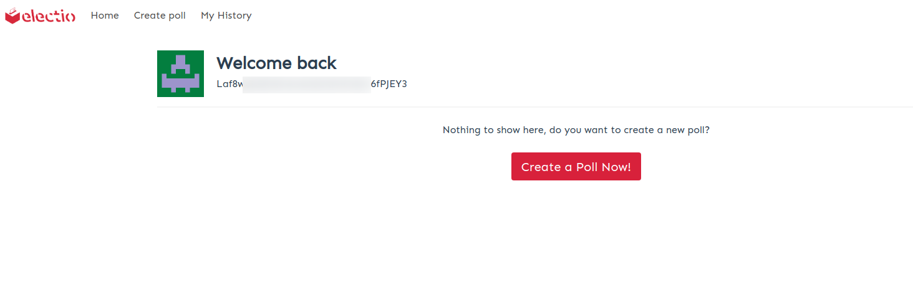

# Electio
*Sistema di E-Voting a distanza tramite blockchain*

## Caratteristiche

Electio è una piattaforma creata per il voto elettronico. La blockchain decentralizzata e permissionless di Scrypta permette un alto livello di trasparenza, sicurezza e affidabilità in tutte le fasi del voto.

- **Procedura sicura grazie alla tecnologia blockchain e RSA**
 
la combinazione di due algoritmi crittografici rende il voto attraverso electio estremamente sicuro e affidabile.

- **Meccanismo anti-manipolazione** 
 
È valida e conteggiata solo l’ultima espressione di voto dell’elettore. Il voto coercitivo o di scambio risultano difficilmente praticabili.

- **Risultati della votazione immediati**
 
Il registro distribuito permette uno scrutinio dei voti immediato azzerando i tempi di attesa.

- **Verifica dell’acquisizione corretta del proprio voto**
  
Ogni votante potrà verificare la corretta acquisizione del proprio voto.

## Tipologie di votazione

### Voto con autorizzazione

- **Quesito pubblico con autorizzazione / Voto Segreto**
 
Il quesito della votazione è visualizzabile solo attraverso password dedicata, il voto dell’elettore, che viene autorizzato a votare dal creatore del quesito, è segreto.

- **Quesito pubblico con autorizzazione / Voto palese**
 
Il quesito della votazione è visualizzabile in chiaro;  il voto dell’elettore,  che viene autorizzato a votare dal creatore del quesito, è palese.

### Quesito Segreto

- **Quesito segreto / Voto Palese**
 
Il quesito della votazione è visualizzabile solo attraverso password dedicata, il voto dell’elettore, che viene pre-autorizzato a votare dal creatore del quesito, è palese (non segreto).

- **Quesito segreto / Voto Segreto**
 
Il quesito della votazione è visualizzabile solo attraverso password dedicata, il voto dell’elettore, che viene pre-autorizzato a votare dal creatore del quesito, è segreto.

### Quesito Pubblico (sondaggistica)

- **Quesito pubblico / Voto Palese**
 
Il quesito della votazione è visualizzabile in chiaro, il voto dell’elettore è in chiaro e tutti possono votare senza autorizzazione. Questa modalità è utile anche per fini di sondaggio.

## Guida alla creazione di una votazione

Come descritto in precedenza, all'interno di Electio è possibile sviluppare diverse tipologie di voto, ciascuna con caratteristiche diverse.
 Tuttavia gli step per configurare la votazione nella modalità desiderata sono pressoche' simili, e verranno illustrate di seguito.

Innanzitutto biogna accedere alla finestra di creazione del sondaggio tramite [Electio](https://vote.electio.app/#/), ed effettuare il login tramite .sid file o Scrypta Extension Browser.

 Dopo aver inserito la password e completata la procedura di login, il sistema ci richiederà di creare una chiave RSA.

 Cliccando su "Create Poll Keys", il sistema ci richiederà la password della nostra identità digitale, e subito dopo l'autenticazione ci troveremo nella home page personale di Electio, dove ci verrà mostrato un riepilogo delle attività esistenti.
  Al momento il sistema non ha ancora nulla da mostrare, quindi al primo accesso troveremo qualcosa di simile a quanto riportato in figura.

Procediamo con la creazione del nostro primo sondaggio cliccando su **"Create a Poll Now!"**, così da spostarci nella  finestra di configurazione del sondaggio.
 Ci troveremo in una pagina simile a questa, dove dovranno essere inseriti tutti i parametri del nostro sondaggio.

Come evidenziato in precedenza, Electio ci offre la possibilità di creare tipologie di sondaggio con diverse impostazioni di visibilità (Public, Authorized o Secret), e tale scelta si effettua dal menù a tendina "Poll Visibility"
.
Selezionando una delle voci presenti nel menù a tendina, Electio adatterà in automatico la tipologia di poll da realizzare sulla base della scelta da noi effettuata, presentandoci i campi richiesti per quella specifica tipologia di votazione.

  Con la modalità **"Public"** non ci saranno scelte da effettuae per la tipologia i voto, in quanto il sodaggio saraà completamente pubblico.
 Scegliendo le modalità **"Authorized"** oppure **"Secret"**, comparirà un menu a tendina aggiuntivo che ci chiede di scegliere l'impostazione per la visibilità del voto (che potrà essere **"Public"** oppure **"Secret"**)
.

Una volta scelte le impostazioni per tipologia di sondsaggio e tipologia di voto all'interno del sondaggio, è possibile procedere con la configurazione vera e propria del sondaggio. Effettuate tutte le scelte richieste dal sistema, procediamo con la creazione del sondaggio.
