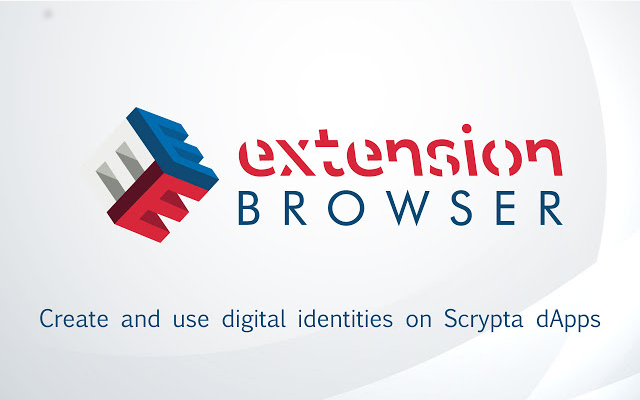
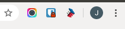
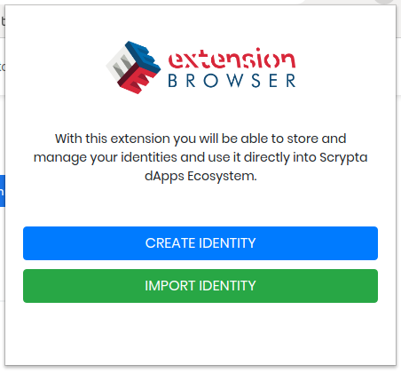
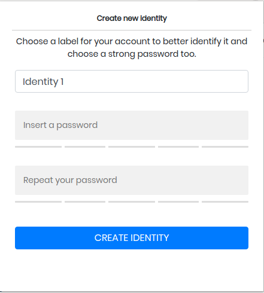
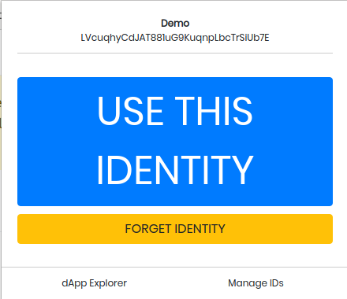
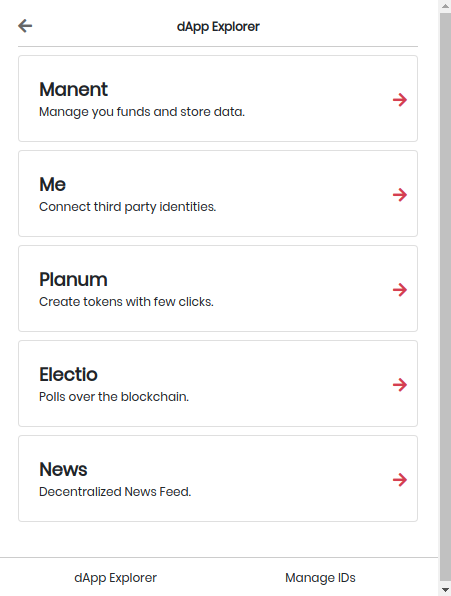
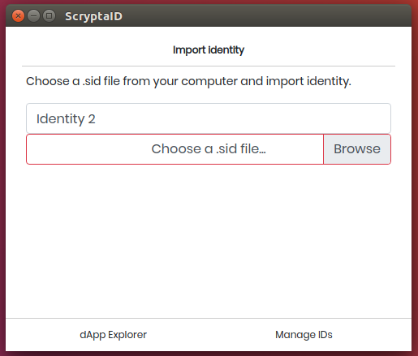

# Scrypta Browser Extension

L'estensione di Scrypta per browser è un utile strumento per creare, usare e gestire le identità di Scrypta su tutte le dApps online e offline.

L'estensione del browser crea un ambiente protetto per il salvataggio e la gestione delle identità Scrypta (anche detti **.sid file**).
Queste identità vengono iniettate direttamente nelle dApp Scrypta (quelle ufficiali per lo meno) e, tramite una semplice interfaccia grafica, si possono creare e modificare.

## Link agli store

L'estensione è scaricabile sia sui browser Chromium (Chrome, Brave, Vivaldi, etc) sia su Firefox:
- **Chrome web Store**: [https://chrome.google.com/webstore/detail/scryptaid/kphclbededgemedgbfgblpmdccjbbhdm](https://chrome.google.com/webstore/detail/scryptaid/kphclbededgemedgbfgblpmdccjbbhdm)
- **Firefox Add-ons**: [https://addons.mozilla.org/en-US/firefox/addon/scryptaid/](https://addons.mozilla.org/en-US/firefox/addon/scryptaid/)

### Operazioni principali
Una volta completata l'installazione dell'estensione nel vostro browser, in alto a destra comparirà il simbolo contraddistinto dall'icona , disposto accanto alle altre estensioni gia' installate 

Al primo avvio dell'estensione, ci verrà chiesto se vogliamo creare una nuova identità o importarne una già esistente.

## Creazione Identità

Quando si avvia l'estensione per la prima volta, per creare un'identità è sufficiente premere il pulsante **"CREATE IDENTITY"**, si aprirà questa schermata: 

Scegliere l'etichetta che contraddistingue l'identità che state creando, e scegliete una **password sicura**.
::: warning 
**ATTENZIONE:** Poiche' il .sid file collegato alla vostra identità servirà per utilizzare tutte le dApps Scrypta, si raccomanda di annotare o cmq ricordare la password dell'identità.

Perdendo la password non sarà piu' possibile recuperarla, perdendo ad esempio l'accesso ad eventuali fondi contenuti nel wallet, dati caricati tramite Manent e tutto cio' che è collegato a quella identità all'interno di tutte le dApps dell'ecosistema Scrypta.
:::
 

Una volta creata l'dentità, si aprirà la pagina principale dell'estensione dove potrete vedere **nome** e **indirizzo** associati all'identità in uso, oltre alle principali funzioni da utilizzare.

### dApp Explorer
Il dApp explorer fornisce dei collegamenti rapidi alle dApps ufficiali di Scrypta.

 
Cliccando sulla dApp di vostro interesse, verrete redirezionati alla pagina della dApp in questione. 
Una volta arrivati nella pagina della dApp, aprite l'estensione e cliccate su **"USE THIS IDENTITY"**.
 Quindi la pagina si ricaricherà e avrete eseguito l'accesso!

### Manage IDs

Da questa schermata è possibile gestire una o più identità, cambiare identità principale, importare un'identità esistente o crearne di nuove. 

Attraverso il tasto **"IMPORT IDENTITY"**, utilizzando un .sid file già in vostro possesso, sarà possibile importare una identità già esistente all'interno di Scrypta Extension Browser ed utilizzarla per le principali funzioni già descritte.

