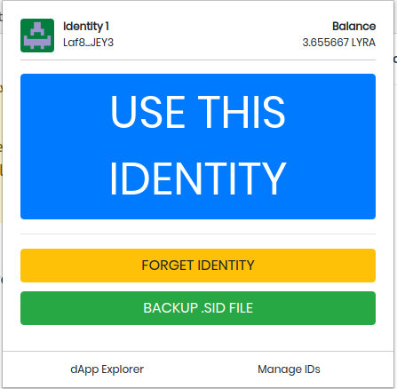

# Scrypta Browser Extension

The Scrypta browser extension is a useful tool for creating, using and managing Scrypta identities on all online and offline dApps.

The browser extension creates a secure environment for saving and managing Scrypta identities (also called **. Sid files **).
These identities are injected directly into the Scrypta dApps (the official ones at least) and, through a simple graphical interface, new identities can be created and existing ones modified.

## Link to stores

The extension can be downloaded both on Chromium browsers (Chrome, Brave, Vivaldi, etc) and on Firefox:
- **Chrome web Store**: [https://chrome.google.com/webstore/detail/scryptaid/kphclbededgemedgbfgblpmdccjbbhdm](https://chrome.google.com/webstore/detail/scryptaid/kphclbededgemedgbfgblpmdccjbbhdm)
- **Firefox Add-ons**: [https://addons.mozilla.org/en-US/firefox/addon/scryptaid/](https://addons.mozilla.org/en-US/firefox/addon/scryptaid/)

### Main operations
Once the installation of the extension is completed in your browser, the symbol marked with the icon will appear at the top right , placed next to the other extensions already installed. 

The first time you start the extension, you will be asked whether to create a new identity or import an existing one.

## Identity Creation

When you start the extension for the first time, to create an identity just press the **"CREATE IDENTITY"** button, this screen will open:

Choose the label that identifies the identity you are creating, and choose a **secure password**. 
::: warning 
**CAUTION:** Since the .sid file linked to your identity will be used to use all Scrypta dApps, it is recommended to write down or remember the identity password.

Losing the password it will no longer be possible to recover it, thus losing, for example, access to any funds contained in the wallet or data uploaded via Manent or even everything that is connected to that identity within all the dApps of the Scrypta ecosystem.
:::
 

Once the identity has been created, the main page of the extension will open where you can see **name** and **address** associated with the identity in use, as well as the main functions to be used. 

## dApp Explorer
The dApp explorer provides quick links to the official Scrypta dApps.

 
By clicking on the dApp of your interest you will be redirected to the page of the dApp in question. Once you get to the dApp page, open the extension and click on. Once you arrive on the dApp page, open the extension and click on **"USE THIS IDENTITY"**. Then the page will reload and you will be logged in!

## Manage IDs

From this screen it is possible to manage one or more identities, change primary identity, import an existing identity or create new ones.

Using the **"IMPORT IDENTITY"** key, using an .sid file already in your possession, it will be possible to import an existing identity into the Scrypta Extension Browser and use it for the main functions already described.

