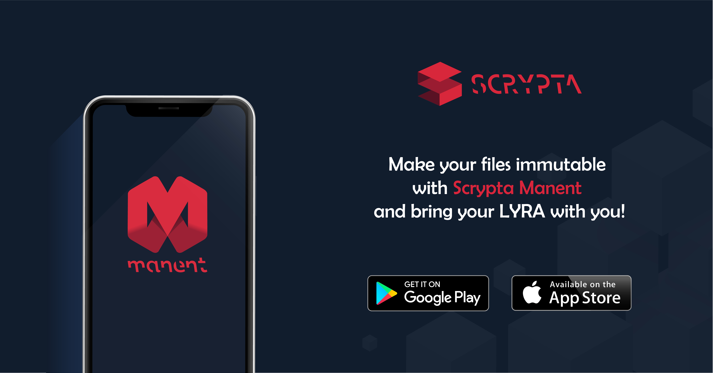

# Manent APP

## Panoramica

#### Scrypta Manent App - Light Wallet con Blockchain Certification Technology
***

Rendi i tuoi file immutabili con Scrypta Manent e porta sempre con te le tue **LYRA**!

Manent è la prima app ufficiale di [Scrypta](https://scryptachain.org), sviluppata per interagire con la blockchain in maniera semplice, veloce e sicura!
Gestisci le tue **LYRA** coin con Manent, grazie alle sue funzioni di mobile wallet; proteggi le tue idee o le tue invenzioni grazie alla blockchain per certificarne la loro autenticità e renderle immutabili, permanenti e tenerle al sicuro!

Manent disponibile in entrambe le versioni [web](https://web.manent.app) e mobile ([IOS](https://apps.apple.com/us/app/scrypta-manent/id1484816083)/[Android](https://play.google.com/store/apps/details?id=foundation.scrypta.manent)).

***
### Join Manent App
##### Manent Mobile App
- [Google Play](https://play.google.com/store/apps/details?id=foundation.scrypta.manent)
- [App Store](https://apps.apple.com/us/app/scrypta-manent/id1484816083)

##### Manent Web App
- [Browser App](https://web.manent.app)
- [Scrypta ID](https://chrome.google.com/webstore/detail/scryptaid/kphclbededgemedgbfgblpmdccjbbhdm) - Estensione Browser  (addons)

::: tip  
**Hai il nostro pieno supporto!**

Hai bisogno di aiuto? Invia una mail a: [**info@scryptachain.org**](mailto:info@scryptachain.org)
Oppure visita la pagina di [Assistenza](https://wiki-it.scryptachain.org/manent-app/manent-support)
:::
***

### Ecco cosa puoi fare:
##### CONSERVA, INVIA E RICEVI LYRA
Gestisci le tue LYRA coin con Manent grazie alle sue **funzioni di mobile wallet** in maniera facile e veloce. Puoi inviare le tue LYRA coin semplicemente scannerizzando un QR Code. Quando invii LYRA tramite l’app, tutto è immediato e verificabile all’interno della blockchain grazie al suo **registro distribuito**.

#### CERTIFICA I TUOI FILE O DOCUMENTI IMPORTANTI
Con Manent, grazie alla **marcatura temporale**, puoi caricare ogni tipo di file o documento apportandogli valenza legale e probatoria; rispettando le norme nazionali ed internazionali, unendo la semplicità di un’app alle potenzialità tecnologiche della **blockchain**.

#### PROTEGGI LE TUE INVENZIONI
Abbiamo pensato di aiutare gli autori di opere fotografiche, di poesie o romanzi e testi digitali, opere d’arte e artigianato e ancora illustratori, grafici, designer e sviluppatori di software, a proteggere le proprie creazioni in maniera **immediata, sicura e con costi bassissimi**, contro qualsiasi forma di plagio, contraffazione o diffusioni illecite. 

#### TIENI LE TUE LYRA E I TUOI FILE AL SICURO
Manent ti offre diversi tools di sicurezza. Grazie alla tua password personale e al sistema **SID file**, il tuo account ha una duplice protezione: per garantirti la massima sicurezza, questo file di autenticazione verrà salvato localmente nel tuo smarphone e ti consentirà di accedere al tuo account in qualunque momento e da qualsiasi dispositivo.

#### SEI UN FANATICO DELLA SICUREZZA?
Manent ha pensato anche a voi! Se non ti basta il Sid file e la password potrai accedere o importare il tuo account personale tramite **Paper Wallet**, un **QR code** stampabile da importare tramite scannerizzazione, oppure ancora tramite la nostra **Scrypta Card**, una card con tecnologia **NFC**, proprio come una comune carta di credito.

#### STAI SENZA PENSIERI
Con Manent puoi recuperare il tuo account in tantissimi modi, anche se perdi il tuo dispositivo o ne compri uno nuovo! Ti basta importare il tuo profilo caricando il file .sid, accedendo tramite Scrypta Card o ancora scannerizzando il tuo Paper Wallet.

I Dati e file caricati sulla blockchain di Scrypta vengono elaborati dall'infrastruttura e raggiungono un elevatissimo livello di **ridondanza e impermeabilità**, tale da renderli a tutti gli effetti immutabili e immuni da alterazioni e falsificazioni.

##### TI SUPPORTIAMO IN OGNI MOMENTO
Hai difficoltà? Invia una mail a: info@scryptachain.org 
O unisciti al nostro canale [Discord](https://www.discord.me/scrypta).

#### VUOI SAPERNE DI PIU'?
- Puoi utilizzare Manent su **più dispositivi**.
- Una password protegge tutte le operazioni in app.
- Il Sid file tutela l’uso della tua identità e previene accessi indesiderati.
- Supporta tutte le funzionalità di base di un wallet per criptovalute.
- Account multipli: Gestisci più account Wallet con una sola app.
- Ogni singolo dato o documento caricato con Manent avrà un hash: una funzione   matematica che trasforma i dati originali in un’impronta digitale garantendone l’unicità.
- La tecnologia Blockchain di Timestamp garantisce la data certa di upload, conferendo una marcatura temporale inconfutabile.
- Qualsiasi file caricato risiede in un archivio decentralizzato basato su **IPFS (Inter Planetary File System)** e **[IdANode](https://wiki.scryptachain.org/developers/ida-node) (Interconnected dApp Nodes)**.

## Guide & Tutorials
***
 ### Creare un account
 Il processo per creare un account è semplice:
Dovrai solo inserire due volte una **password** da te scelta.

Adesso metti in sicurezza il tuo account effettuando il backup seguendo le istruzioni riportate di seguito).
Questo passaggio è fondamentale e consente di proteggere la tua firma digitale e il relativo portafoglio.

::: warning  
**Manent è un'applicazione decentralizzata**, è quindi concepita per operare senza alcun server centrale. In questo modo tu sei l'unico responsabile della password e della relativa e-signature (firma digitale).
:::

::: danger 
**TIENI LA PASSWORD AL SICURO**

Se perdi la password, non sarà più possibile per nessuno recuperarla e il tuo account diventerà **per sempre** inaccessibile. 
:::
***

### Backup dell' account
- Tocca l'icona **Menu** (angolo in alto a destra) > **Backup**
- Seleziona il metodo desiderato: 
**DOWNLOAD .SID FILE** (.sid) - o  - **DOWNLOAD PAPER WALLET** (.pdf)
** Questi file verranno archiviati sul dispositivo, nella cartella selezionata.

::: warning  
Dopo aver scaricato il file **.SID**, è consigliabile salvarlo in un luogo sicuro come una chiavetta USB, e rimuovere il file dal dispositivo.
:::

::: warning  
Dopo aver scaricato il file .pdf **PAPER WALLET**, si suggerisce di stamparlo e di riporre la stampa in un luogo sicuro. Successivamente, rimuovi il file .pdf dal tuo dispositivo.
:::

::: danger 
**CUSTODISCI CON CURA IL TUO PAPER WALLET**

Il **PAPER WALLET espone la tua chiave privata** sotto forma di codice QR. 
Questa è la tua firma elettronica e rappresenta la tua identità digitale e vuoi che nessun'altro la utilizzi illecitamente.
:::

***

### Importazione dell'Account
Con **MANENT** puoi gestire account multipli, potrai quindi effettuare l'importazione di più account.
- Tocca l'icona **Menu** > **Accounts**
- Tocca l'icona "**+**" (angolo in alto a destra dello schermo).

Seleziona il metodo di importazione che preferisci tra quelli elencati di seguito:
#### RESTORE SID FILE
Naviga tra le cartelle del tuo dispositivo, seleziona il .SID File da importare  e conferma con **OK**.
Adesso potrai gestire l'account importato.

#### READ LYRA CARD
Avvicina una LYRA Card al tuo dispositivo in modo che possa leggerne le informazioni attraverso il sensore NFC.

::: warning  
Per leggere la LYRA CARD (scheda NFC hardware) è necessario abilitare la **Near Field Communication** sul dispositivo mobile..
:::

#### RESTORE PAPER WALLET
Questa funzione abilita la fotocamera del tuo dispositivo in modo che tu possa inquadrare e scansionare il QR Code **"ENCRYPTED WALLET"** presente sul tuo PAPER WALLET.

::: danger 
Il **PAPER WALLET ESPONE LA TUA CHIAVE PRIVATA** sotto forma di **QR CODE**.
Assicurati di conservarlo in un luogo sicuro!
:::
***
