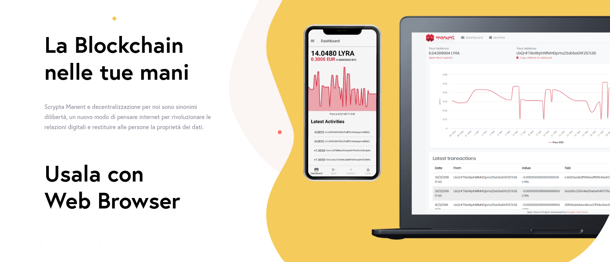
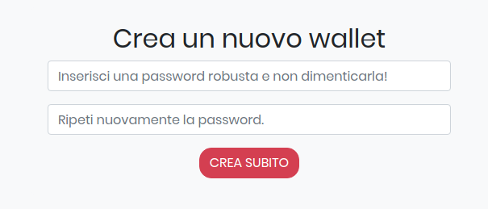
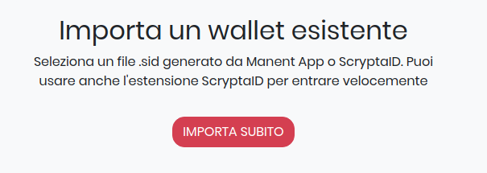
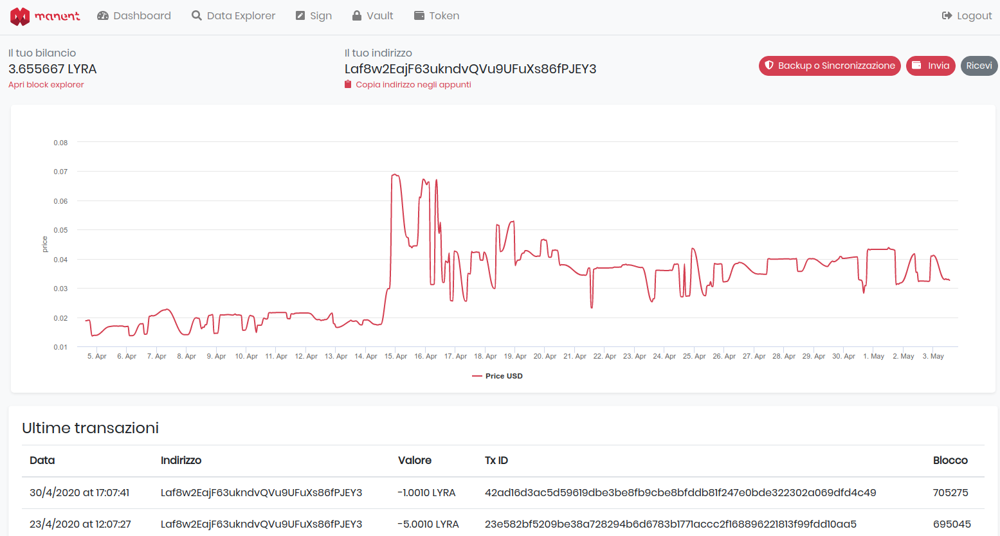
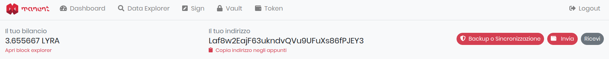
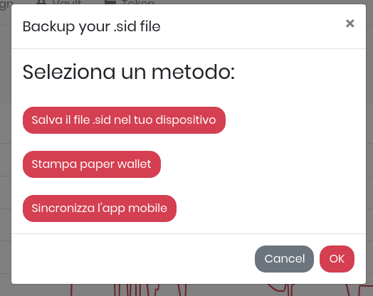
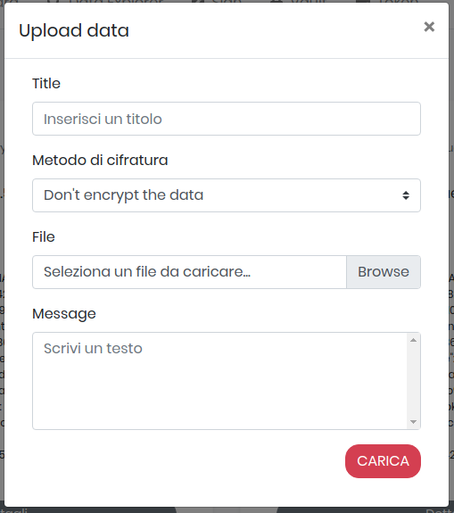

# Manent Web

## Panoramica

### Scrypta Manent Web wallet

[Scrypta Manent Web](https://web.manent.app/) è la versione online di [Manent App.](../dapps/manent-app.md)

Accessibile via browser da [https://web.manent.app]**https://web.manent.app**, permette di effettuare tutte le principali operazioni al pari della versione mobile:
- Invio ricezione e trasferimento fondi (sia LYRA che Planum tokens)
- Archiviazione file e documenti (con e senza encryption)
- Consultare variazioni di portafoglio con grafici del prezzo
- Consultare il balance dei propri Planum tokens (se presenti).
***

## Creazione wallet e login

Se non avete ancora un wallet, e' possibile crearne uno in modo semplice e veloce inserendo una password di encryption da voi scelta, che andrà conservata e ricordata per futuri accessi.

Nel caso in cui abbiate gia' creato un portafoglio o state già utilizzando **Manent App**, è possibile accedere al portafoglio **Manent Web** in diversi modi:
- Selezionando un file .sid generato da **Manent App** o tramite **ScryptaID**.
- Usando direttamente l'estensione **ScryptaID** attraverso il vostro browser web.

::: warning  
**Importante:** fai un backup e ricorda che sei il **SOLO** responsabile per questo file .sid e la password associati. Tienilo al sicuro.
:::

::: danger 
Smarrire il file e/o la password renderà impossibile per chiunque accedere al portafogli e ai fondi/dati in esso contenuti!
:::
***

## Interfaccia grafica
### Funzioni

Una volta completato l'accesso a **Manent Web**, ci viene presentata la dashboard, con tutte le informazioni del nostro portafoglio digitale.

La finestra principale è riservata al grafico dell'andamento del prezzo di **LYRA**, nella parte superiore abbiamo il menu per accedere a tutte le principali funzioni e il balance dello specifico indirizzo collegato al **.SID file** con cui abbiamo effettuato l'accesso.
Sul lato destro troviamo i collegamenti per effettuare un backup del portafoglio e per l'invio/ricezione di fondi.

### Backup e sincronizzazione
Attraverso questo collegamento, si accede alle diverse opzioni disponibili per effettuare il backup del vostro portafoglio digitale.

::: warning  
Dopo aver scaricato il file .pdf **PAPER WALLET**, si suggerisce di stamparlo e di riporre la stampa in un luogo sicuro. Successivamente, rimuovi il file .pdf dal tuo dispositivo.
:::

::: danger 
**CUSTODISCI CON CURA IL TUO PAPER WALLET**

Il **PAPER WALLET espone la tua chiave privata** sotto forma di codice QR. 
Questa è la tua firma elettronica e rappresenta la tua identità digitale e vuoi che nessun'altro la utilizzi illecitamente.
:::

#### Data explorer
Explorer per la ricerca di informazioni su indirizzi e transazioni.

#### Sign
Tool per la firma e la verifica di un messaggio su blockchain Scrypta.

#### Vault
Tool per effettuare l'upload di documenti e files sulla blockchain Scrypta.

#### Token
Sezione in cui è possibile consultare il balance dei tokens creati o ricevuti, ed effettuare l'invio dei tokens ad altri indirizzi.