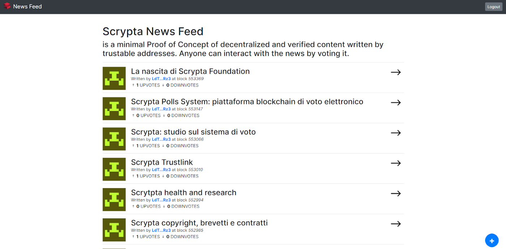
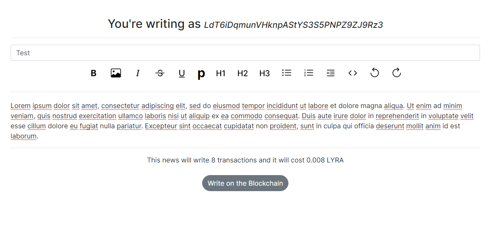
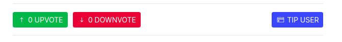
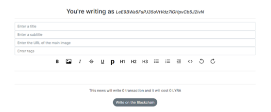
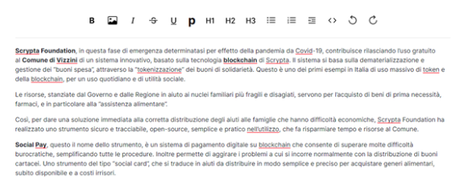
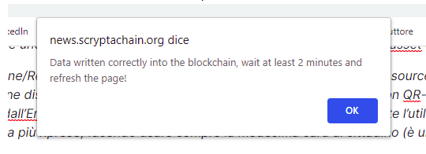
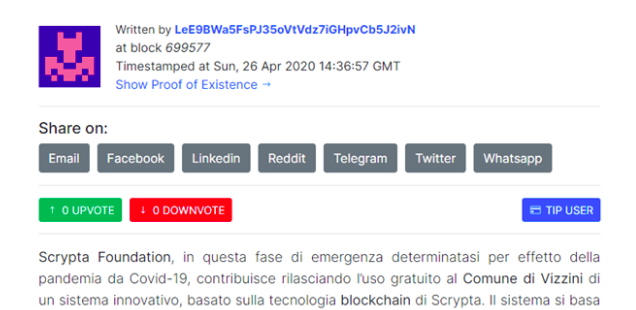

# News

## Premessa

Il mondo dell’informazione al giorno d’oggi crea e pubblica un’immensa mole di contenuti digitali sul web sotto forma di articoli, immagini o video. Il concetto di fiducia verso la fonte delle informazioni diventa quindi di importanza fondamentale.

Inoltre, l’uso di social media come Facebook, Instagram e altre piattaforme digitali, ha fatto emergere il problema della diffusione di informazioni palesemente false. E con l’avvento dell’intelligenza artificiale, le animazioni digitali e il social engineering, il confine tra contenuti manipolati e autentici è molto labile. Sempre più sentiamo parlare infatti di “fake news” e “deepfake” che diventano virali.

Spesso le persone cadono nella trappola delle notizie false poiché non hanno degli strumenti efficaci per controllare con rapidità ed esattezza la fonte e quindi l’autenticità dell’informazione.

E’ qui che subentrerebbe la blockchain come soluzione alla tracciabilità dei contenuti e delle fonti. Con la natura pubblica e “aperta”, la blockchain consente alle informazioni di essere prodotte e distribuite su Internet in modo trasparente, immutabile e sicuro. 

Questo grazie alle sue funzioni di registro distribuito e decentralizzato, che con le sue funzioni di **marcatura temporale** e **firma digitale**, diventa uno strumento eccezionale per creare linee di fiducia tra il creatore di informazione e il fruitore.

## Introduzione

### Scrypta News - Proof of Concept

Il modulo ideato da Scrypta, che in modo semplice può dialogare con piattaforme dedicate, permette agli editori di caricare direttamente su Blockchain Scrypta i propri articoli in modo permanente, apponendo ad essi una firma digitale e una marcatura temporale “timestamp”. 

Grazie a questo i fruitori possono facilmente tracciare il contenuto e la sua fonte. Un processo quindi, che determina la certezza della provenienza dell’informazione e la protezione dei contenuti editoriali.

## Come Funziona
Scrypta News è concepita in combinazione [Manent](https://manent.app/) e [Scrypta ID](https://me.scrypta.id/), servizi entrambi disponibili sia da browser che da mobile.

- **Manent** è un’applicazione decentralizzata che permette di interagire in maniera semplice con la blockchain. Basta creare un account e fare il backup del *sid.file* (da conservare in un luogo sicuro). 
  > Questo passaggio è fondamentale e consente di proteggere la propria firma elettronica.

- **Scrypta ID** permette all’utente di identificarsi e verificare il proprio set di indirizzi (Github, Google, Linkedin, Twitter, E-Mail, Telefono). 

Per maggiori informazioni, potete consultare la guida di ScryptaID a [questo link](../id/README.md).

A questo punto è possibile accedere al modulo [Scrypta News](https://news.scryptachain.org/), effettuare il login con la propria identità, inserendo il proprio sid.file o utilizzando [**Scrypta Browser Extension**](https://id.scryptachain.org/) e procedere alla pubblicazione dell’articolo su blockchain.

::: tip NOTA
E’ chiaro che, nel caso ad esempio di un giornale online che vuole identificare i propri collaboratori e le loro operazioni digitali, data la natura aperta del framework ScryptaID, è possibile creare uno storage per tutte le identità e collegarle, ad esempio, all’e-mail aziendale.
:::

L’utente quindi potrà verificare l’identità dell’autore dell’articolo, data, luogo e momento esatto in cui è stato prodotto e quindi accertarsi dell’autenticità della provenienza dell’informazione.

E’ possibile quindi sin da subito testare l’esempio già funzionante del proof of concept realizzato da Scrypta:

[Scrypta News Website](https://news.scryptachain.org/)

## UPVOTE, DOWNVOTE e TIPUSER

Dopo il login, i lettori possono votare attraverso le funzioni di UPVOTE, DOWNVOTE  e inviare donazioni in LYRA con TIP USER.

## Guida sul caricamento degli articoli in blockchain

Una volta effettuato il login, che ricordiamo può essere fatto attraverso Extension Browser o file .sid, è possibile inserire il proprio articolo cliccando sul simbolo “ + ” in basso a destra.

 
Comparirà una sezione in cui inserire i dettagli iniziali dell’articolo: 

- titolo, 
- sottotitolo, 
- immagine di copertina, 
- tags.

A questo punto si procede a compilare il corpo del testo con una usuale interfaccia grafica da editor testuale.

Una volta terminato basterà cliccare su “Write on the blockchain” e Inserire la propria password.

infine si avrà conferma dell’esito dell’operazione.

Ora l’articolo è scritto indelebilmente sulla blockchain! E  comparirà presto nella sezione articoli di Scrypta News.

Come si può vedere dall'esempio, viene impressa una marcatura temporale (timestamp) e l’indirizzo collegato all’autore (firma digitale):

## Editing
Grazie alla tecnologia [Progressive Data Management](../idanode/progressive-data-management.md) di Scrypta, è permesso all’autore, ed esclusivamente ad esso, di editare l'articolo. Quella editata sarà la versione visualizzata come “versione corrente”; le precedenti versioni continuano ad esistere solo all’interno  della blockchain Scrypta.

Se volete editare un articolo, recatevi nella sezione dei vostri articoli cliccando sull’icona relativa (accanto a logout). Quindi cliccate il simbolo “matita” relativo all’articolo da editare. Effettuate le modifiche e cliccate su *Write on the blockchain*.

## Video Tutorial

[La Blockchain contro le Fake News - Scryptachain](https://www.youtube.com/watch?v=5sNQ34nu1LU) di Tiziano Tridico

<iframe width="560" height="315" src="https://www.youtube.com/embed/5sNQ34nu1LU" frameborder="0" allow="accelerometer; autoplay; encrypted-media; gyroscope; picture-in-picture" allowfullscreen></iframe>