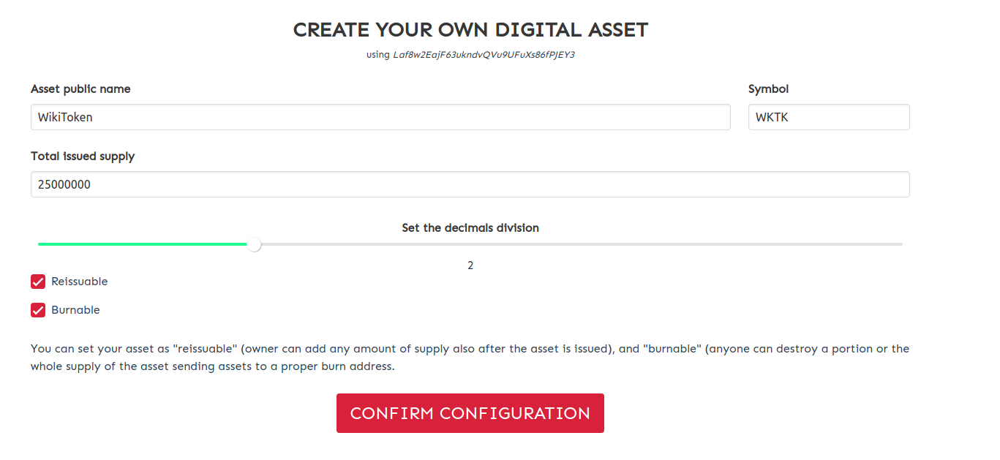
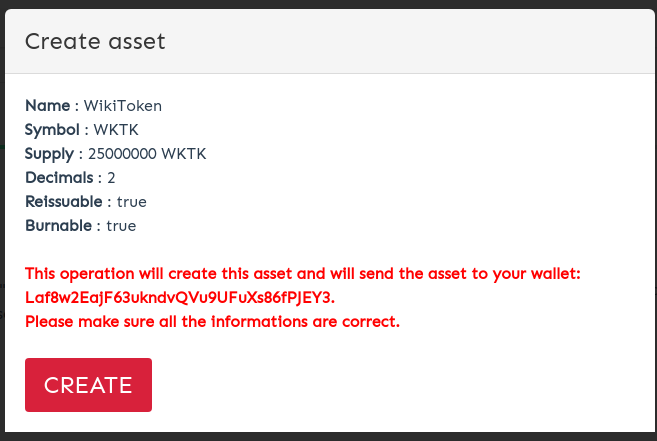
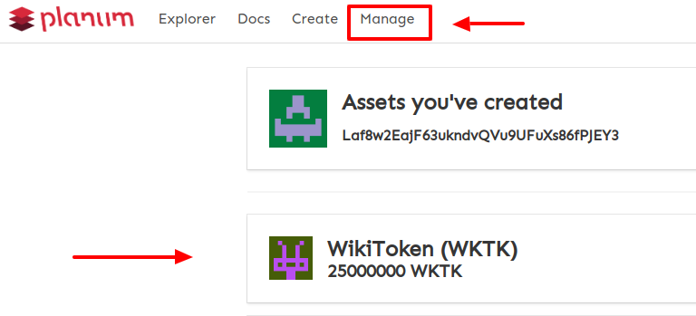
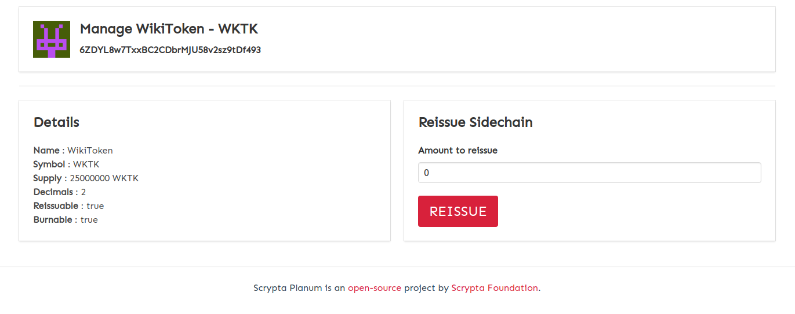
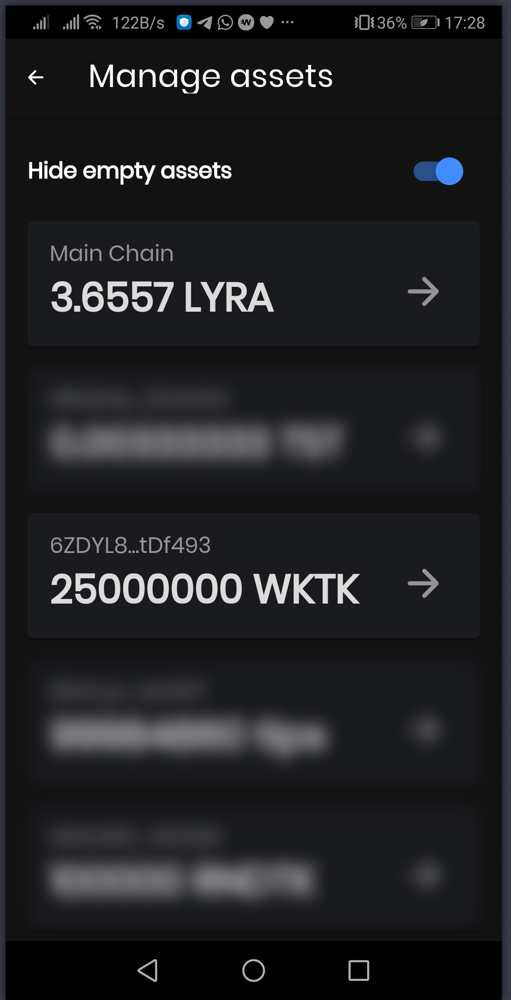
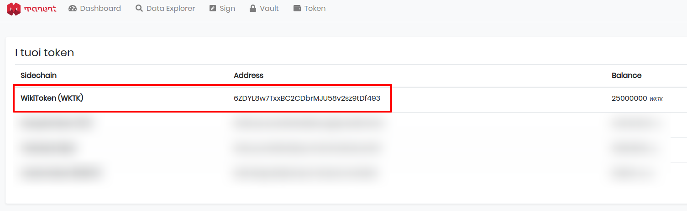
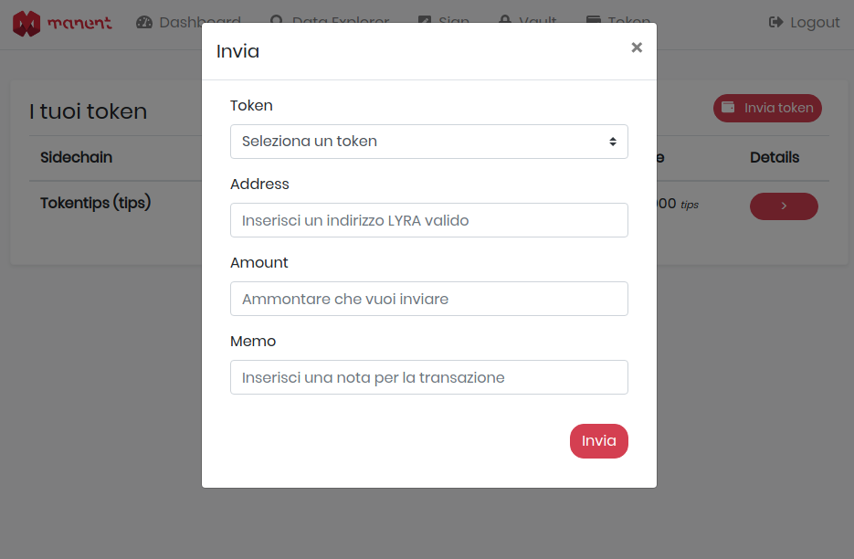
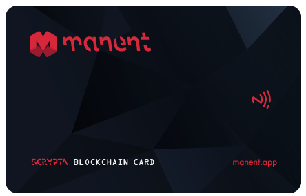

# Planum - Panoramica
Sidechain Layer open-source e permissionless che fornisce a chiunque un’interfaccia chiara con cui creare, emettere e tracciare risorse tokenizzate.

“Planum”, accessibile tramite il link https://planum.dev, è un layer parallelo alla blockchain di Scrypta che consente di emettere la propria risorsa tokenizzata, archiviarla, gestirla e proteggerla utilizzando la stessa rete blockchain di IdaNode Scrypta.
Qualsiasi “tokenized asset”, una volta generato con le proprie metriche, ha il suo ciclo di vita indipendente in un livello di sidechain protetto, che opera attraverso la blockchain di Scrypta, e in futuro potrà essere scambiato con LYRA e tutti gli altri token.

## Cos'è la "Tokenizzazione"

Per definizione, il processo di tokenizzazione è in sostanza la traduzione di risorse del mondo reale in blockchain, convertendole in risorse digitali e fornendone una proprietà affidabile.
In un modo molto semplice, possiamo digitalizzare e convertire qualsiasi cosa in una fornitura di risorse digitali attraverso il processo di “tokenizzazione”. In questo modo il bene fisico, una volta simbolizzato, diventa “fungibile”, può essere trasferito, frazionato, immagazzinato o scambiato elettronicamente tra persone diverse in modo digitale. 

In realtà, investimenti di grande valore come proprietà immobiliari, opere d’arte come beni da collezione o altri tipi di beni che rappresentano un valore economico, a causa di diversi tipi di restrizione, non sono accessibili a tutti gli investitori.
La tokenizzazione tramite blockchain risolve questo problema, abbassando le barriere di investimento e favorendo l’introduzione di nuovi capitali finanziari nel settore di interesse.
Solo per citarne alcuni, i campi applicativi più rilevanti potrebbero essere:

- Mercato degli investimenti immobiliari
- Sistemi di membership e abbonamento
- Industrie di gaming
- Fintech
- Biglietteria online
- Reti di sistemi di pagamento
- Tokenizzazione di team sportivi e franchising
- Emissione di token non fungibili.

L’intero processo riduce le barriere territoriali eliminando qualsiasi intermediario, abbassando il rischio di investimento e migliorando la liquidità di asset tangibili e intangibili.

# Guide e tutorial
## Come funziona “Planum”: dalla creazione all’emissione dei tokens

Accedendo alla piattaforma attraverso https://planum.dev sarà possibile scegliere se creare il proprio token oppure usare l’explorer per i token già esistenti.
Il processo è molto veloce, non richiede specifiche o approfondite competenze tecniche se non una consapevolezza di ciò che si sta facendo.
Il processo può essere riassunto in 4 step:

- Login a ["Planum"](https://planum.dev) attraverso l’identità digitale di Scrypta.
- Definizione dei parametri della sidechain del token.
- Creazione dell’asset.
- Gestione dell’asset.

### Login a “Planum “ attraverso l’identità digitale di Scrypta
Per iniziare a creare la propria sidechain, e’ necessario accedere a https://planum.dev effettuando il login attraverso uno dei diversi tools sviluppati e messi a disposizione da Scrypta per la creazione e la gestione dell’identità digitale.
Per un’esperienza ottimale di usabilità e sicurezza si richiede di scaricare ed usare ["ManentApp"](https://manent.app) disponibile in entrambe le versioni [web](https://web.manent.app) e mobile ([IOS](https://apps.apple.com/us/app/scrypta-manent/id1484816083)/[Android](https://play.google.com/store/apps/details?id=foundation.scrypta.manent)).

Ciò consentirà di creare facilmente la vostra prima identità digitale, oppure di importarne una già esistente.
*Per completezza, vi invitiamo a consultare la [sezione wiki](https://wiki.scryptachain.org/developers/scryptaid) relativa.*

Una volta che la vostra identità digitale è stata creata, è possibile effettuare il login a “Planum” con il vostro .sid file o usando [l’estensione per browser Scrypta ID](https://id.scryptachain.org/) (un tool che permette di creare e gestire le identità digitali per usare con facilità le dApps di Scrypta).

## Definizione dei parametri della sidechain del token
Dopo il login, si aprirà l’interfaccia principale, dove verrà richiesto di introdurre tutti i parametri di configurazione della vostra sidechain.
Questi parametri descrivono gli attributi del vostro asset tokenizzato, che funzionerà sul suo corrispondente layer della sidechain.

Riempiendo i campi richiesti verranno definiti i parametri della nostra sidechain:

- **Asset public name:** Nome del token
- **Symbol:** Ticker del token
- **Total issued supply:** supply totale desiderata.
- **Decimal division:** numero di decimali in cui e’ divisibile il nuovo digital asset.

Tra le opzioni a disposizione, l’utente può scegliere se creare un token “reissuable” (cioè per il quale sarà possibile incrementare la supply anche dopo l’emissione del token), o “burnable” (è possibile ridurre la supply “bruciando” una parte o tutta la supply di tokens).
Premendo il tasto **"confirm configuration"** si aprirà una finestra di riepilogo con tutti i parametri scelti per la creazione della nostra sidechain.

Una volta confermata la vostra scelta attraverso il tasto **"CREATE"**, si procederà immediatamente all'emissione del vostro token, sulla blockchain Scrypta, coi parametri da voi scelti, con la token supply totale che viene automaticamente trasferita all'indirizzo corrispondente all'identità digitale del creatore del token.

Cliccando su **"Manage"** vi ritoreverete nella pagina in cui sono presenti i token emessi sotto la vostra identità digitale Scrypta. 

Cliccando sul nome del token di vostro interesse, si aprirà la finestra di gestione del token in oggetto con le opzioni disponibili.

Allo stesso tempo, il nostro asset tokenizzato viene reso disponibile nel balance del portafoglio digitale creato tramite Manent APP sotto la stessa identità digitale del creatore del token.
Il token apparirà nella lista, con tutti gli altri token emessi o posseduti dallo stesso creatore, oltre al balance di Lyra (in quanto main chain).

Allo stesso modo, il balance del nuovo token sara' presente all'interno di Manent web app

## Gestione degli asset
Una volta che il token e’ stato emesso e diventa visibile all’indirizzo principale, il token può’ essere trasferito a chiunque, conservato dentro le dApp di Scrypta o scambiato elettronicamente con altri token o con Lyra in quanto valuta principale del network.
In accordo con la nostra roadmap, stiamo già lavorando ad una piattaforma dove sara’ possibile scambiare digitalmente tutti i token emessi attraverso **“Planum”**.

Poiché i token non hanno un proprio specifico indirizzo per ciascuna sidechain, per trasferire un ammontare di token è necessario semplicemente conoscere l’indirizzo Lyra del ricevente.
Dalla propria finestra di invio del wallet, basta scegliere il token che si vuole inviare, l’indirizzo Lyra del ricevente e l’ammontare, proprio come si fa quando si inviano cryptovalute tradizionali.

## Costi e velocità delle transazioni
Vale la pena fare notare che i costi di emissione e di scambio dei token sono rappresentati solo dalle fee di sistema che sono equivalenti, come negli altri casi, a 0.001 LYRA per una singola transazione di 8000 Bytes (l’ammontare di dati che e’ possibile trasmettere tramite blockchain e’ stato di recente incrementato dagli sviluppatori dal valore originale di 80 Bytes).

Ciò significa che ciascun trasferimento di token costerà 0,001 LYRA e le fee delle transazioni non sono correlate all'ammontare di token che si vuole generare o trasferire ad altri utenti.

Il trasferimento degli asset avviene in modo quasi istantaneo grazie alla lettura della mempool eseguita dagli [IdANode](https://wiki.scryptachain.org/developers/ida-node) che permettono la validazione delle transazioni anche senza la prima conferma della rete.
La validazione e’ fatta a livello di [IdANode](https://wiki.scryptachain.org/developers/ida-node), per cui permette di essere sicuri che la transazione trasmessa sia valida e che venga inserita nel primo blocco disponibile.

***
# Uno sguardo più approfondito sulla creazione dei token

Il processo di creazione dei token si compone dei seguenti step, gestiti in modo automatico dagli [IdANode](https://wiki.scryptachain.org/developers/ida-node):

>Definizione dei campi di Genesi.
Creazione di un nuovo indirizzo da [IdANode](https://medium.com/developers/ida-node).
Creazione del [Trustlink](https://wiki.scryptachain.org/developers/ida-node/trustlink).
Invio di un minimo di 1 LYRA da parte dell’owner al [Trustlink](https://wiki.scryptachain.org/developers/ida-node/trustlink).
Scrittura su blockchain della transazione di Genesi.
Invio dell’intera token supply dal [Trustlink](https://wiki.scryptachain.org/developers/ida-node/trustlink) al creatore della sidechain.

Con [Trustlink](https://wiki.scryptachain.org/developers/ida-node/trustlink) si definisce un indirizzo multisignature generato da due o piu’ indirizzi standard, e viene creato tra l’utente che desidera emettere il token e l’IdaNode richiamato per la creazione dell’asset tokenizzato.
Per garantire l’unicità, l’orizzontalità e la non replicabilità della sidechain, l’indirizzo viene generato *on-the-fly* e la sua chiave privata viene distrutta immediatamente dopo aver scritto la prima transazione di genesi.
Nel momento in cui il Trustlink trasferisce l’intera token supply all’owner, sara’ possibile inviare transazioni usando la prima transazione come USXO, il corrispondente dell’UTXO ma relativo alle sidechain).
Ci siamo quindi focalizzati a creare una replica del sistema di UTXO usando la blockchain di Scrypta come database e delegando la validazione delle transazioni direttamente agli [IdANodes](https://medium.com/developers/ida-node) e agli altri client come [Manent App](https://medium.com/manent-scrypta-blockchain-wallet/manent-mobile-app).
Tutte le informazioni immesse e scritte nella blockchain sono validate dagli [IdANode](https://wiki.scryptachain.org/developers/ida-node) e rese disponibili dal database degli stessi [IdANode](https://wiki.scryptachain.org/developers/ida-node), proprio come le altre informazioni.

## Manent Card Integration
Tutte le identità digitali e i rispettivi balances possono essere collegati ad una Scrypta Card Wallet, uno strumento potente e affifabile che puo’ essere utilizzato per creare backup sicuri del vostro wallet, per la gestione quotidiana dei vostri fondi Lyra, la gestione delle identità digitali e delle informazioni in esse contenute o come sistema di pagamento all'interno delle sidechain o dei POS fisici.

Link references:
https://planum.dev
https://wiki.scryptachain.org/developers/sidechain
https://wiki.scryptachain.org/developers/scrypta-core/ida-node-management