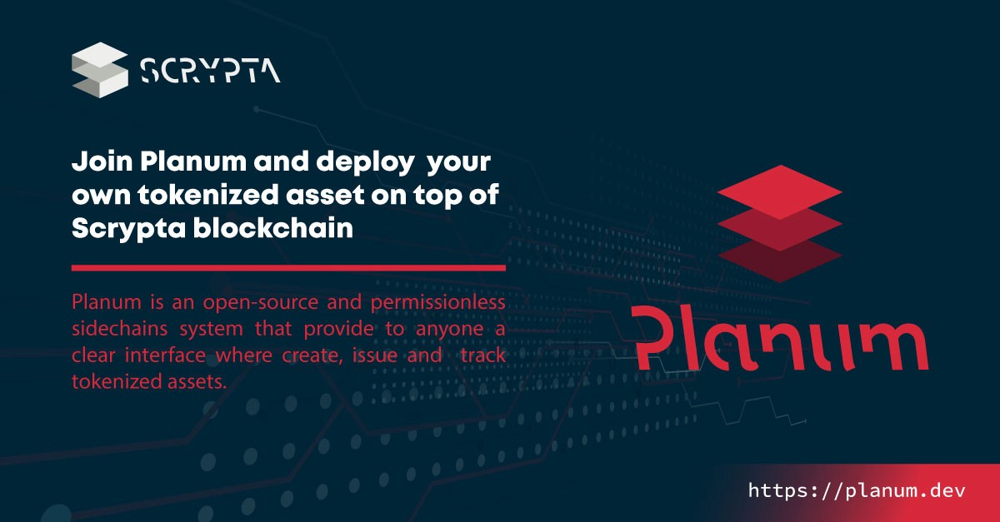
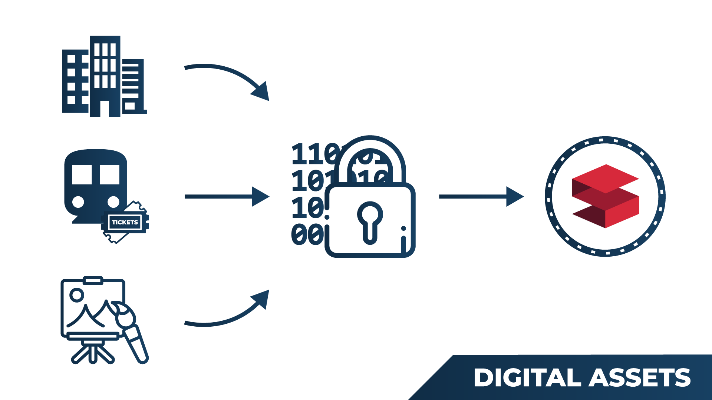
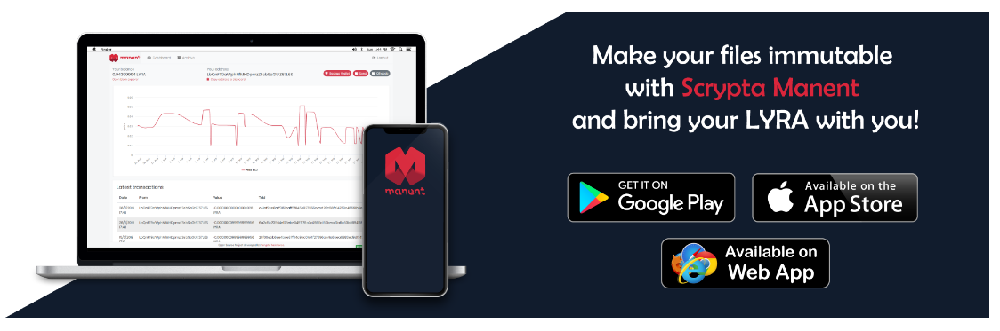

# Planum 
## Panoramica
Sidechain Layer open-source e permissionless che fornisce a chiunque un’interfaccia chiara con cui creare, emettere e tracciare risorse tokenizzate.

“Planum”, accessibile tramite il link https://planum.dev, è un layer parallelo alla blockchain di Scrypta che consente di emettere la propria risorsa tokenizzata, archiviarla, gestirla e proteggerla utilizzando la stessa rete blockchain di IdaNode Scrypta.
Qualsiasi “tokenized asset”, una volta generato con le proprie metriche, ha il suo ciclo di vita indipendente in un livello di sidechain protetto, che opera attraverso la blockchain di Scrypta, e in futuro potrà essere scambiato con LYRA e tutti gli altri token.

## Cos'è la "Tokenizzazione"

Per definizione, il processo di tokenizzazione è in sostanza la traduzione di risorse del mondo reale in blockchain, convertendole in risorse digitali e fornendone una proprietà affidabile.
In un modo molto semplice, possiamo digitalizzare e convertire qualsiasi cosa in una fornitura di risorse digitali attraverso il processo di “tokenizzazione”. In questo modo il bene fisico, una volta simbolizzato, diventa “fungibile”, può essere trasferito, frazionato, immagazzinato o scambiato elettronicamente tra persone diverse in modo digitale. 

In realtà, investimenti di grande valore come proprietà immobiliari, opere d’arte come beni da collezione o altri tipi di beni che rappresentano un valore economico, a causa di diversi tipi di restrizione, non sono accessibili a tutti gli investitori.
La tokenizzazione tramite blockchain risolve questo problema, abbassando le barriere di investimento e favorendo l’introduzione di nuovi capitali finanziari nel settore di interesse.
Solo per citarne alcuni, i campi applicativi più rilevanti potrebbero essere:

- Mercato degli investimenti immobiliari
- Sistemi di membership e abbonamento
- Industrie di gaming
- Fintech
- Biglietteria online
- Reti di sistemi di pagamento
- Tokenizzazione di team sportivi e franchising
- Emissione di token non fungibili.

L’intero processo riduce le barriere territoriali eliminando qualsiasi intermediario, abbassando il rischio di investimento e migliorando la liquidità di asset tangibili e intangibili.

# Guide e tutorial
## Come funziona “Planum”: dalla creazione all’emissione dei tokens

Accedendo alla piattaforma attraverso https://planum.dev sarà possibile scegliere se creare il proprio token oppure usare l’explorer per i token già esistenti.
Il processo è molto veloce, non richiede specifiche o approfondite competenze tecniche se non una consapevolezza di ciò che si sta facendo.
Il processo può essere riassunto in 4 step:

- Login a ["Planum"](https://planum.dev) attraverso l’identità digitale di Scrypta.
- Definizione dei parametri della sidechain del token.
- Creazione dell’asset.
- Gestione dell’asset.

### Login a “Planum “ attraverso l’identità digitale di Scrypta
Per iniziare a creare la propria sidechain, e’ necessario accedere a https://planum.dev effettuando il login attraverso uno dei diversi tools sviluppati e messi a disposizione da Scrypta per la creazione e la gestione dell’identità digitale.
Per un’esperienza ottimale di usabilità e sicurezza si richiede di scaricare ed usare ["ManentApp"](https://manent.app) disponibile in entrambe le versioni [web](https://web.manent.app) e mobile ([IOS](https://apps.apple.com/us/app/scrypta-manent/id1484816083)/[Android](https://play.google.com/store/apps/details?id=foundation.scrypta.manent)).

