# SocialPay

## Introduction

### Purpose of the project - Dematerilization of shopping vouchers
During the emergency phase caused by the Covid-19 pandemic, the Scrypta Foundation released a system for the dematerialisation and management of **"shopping vouchers"**, also known as *"Tokenization"* of solidarity vouchers, for free use for all municipalities

The system, called **"SocialPay"**, is proposed as a solution for the rapid delivery by municipalities to citizens entitled to vouchers.
The entire project has been released in **open-source**, meaning that it is possible to generate everything needed to issue and manage the shopping vouchers for the Municipality in complete autonomy.

Visit [SocialPay website](https://socialpay.live/).

### What the system provides

The system provides a **management platform** supplied to each **Municipality** which allows:
- To keep track of each Card numbered and differentiated by QR-CODE.
- To connect the identity of the citizen entitled to their Card.
- To provide the digital representation of the economic value of the voucher through the Card (this digital value can be spent at the operators participating in the circuit)
- To monitor the service through real-time usage data.

The system is therefore composed of the following elements:

- A **Web-App** supplied to the Merchant which allows:
     - Acquire the payment of goods through the Card
     - View the transaction history and balance
     - Request a refund from the Municipality which will take the form of a bank transfer.

- The **Cards with QR-CODE** supplied to the Citizens entitled:
     - The Card will be delivered by the Municipality.
     - The Card will be presented by the citizen to the operators participating in the circuit to use the coupons.

## How it works

The municipality distributes a numbered ** Card ** assigned to a subject identified by the body directly to the entitled citizens.
Together with the card, it will provide a 5-digit **PIN code** which allows the exclusive use of funds.

Merchants who adhere to the digital shopping voucher system will be provided with a special
**web application** that allows them to use their **smartphone / tablet** as a virtual POS.
With the camera of the device it is possible to frame the QR-Code on the back of the Card assigned to
citizen and charge the amount corresponding to the amount of the purchase made in their business.

Citizens must still authorize the purchase by entering the PIN in the merchant's virtual POS.

Each operator through his application will be able to constantly check his digital account
where he will verify the crediting of the sums in real time.

In addition, within the web-app there is a specific function **"Request Refund"** to forward the refund request to the Municipality, which will take the form of a bank transfer.

## Features and comparison

Following is a comparative table between SocialPay and other systems for the delivery and management of shopping vouchers:

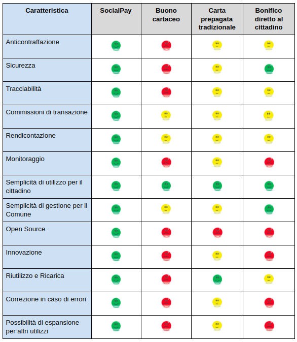


1. **Anti counterfeiting**
   
Transactions are recorded on the blockchain, therefore it is not possible to alter them in order to increase or decrease the credit relating to the vouchers against the will of the municipality or citizen. You cannot print false coupon cards: the only cards enabled are those registered in the municipality's software.

2. **Security**
   
Since the technological infrastructure is not entrusted to a centralized supplier, as it is a decentralized system, if the Municipality or the Operator were to suffer an IT attack or have problems related to its operation, this will not affect SocialPay's functioning. The cards can be replaced and blocked easily as the municipality - or the citizen himself - can withdraw the funds at any time and track their movements in case of unauthorized transactions.

3. **Traceability**
   
SocialPay uses a blockchain infrastructure that allows effective traceability during the use of the system. On the contrary, systems based on paper vouchers are traceable only once the operator has returned the vouchers to the municipality. Other solutions based on rechargeable card are usually entrusted to proprietary software systems that make the tracking tied to the specific application and not perfectly transparent.

4. **Transaction fees in the system**
   
Transactions within the system, i.e. the sending of credit for the shopping vouchers by the municipality to citizens and from them to merchants, have no cost. System fees are paid in LYRA (0.001 LYRA, equal to a few thousandths of a euro per transaction: these are provided by the municipality and do not depend on the value of the transaction.

5. **Accountability**
   
It is managed in a simple and streamlined way, so that the municipality does not have a work "overflow". The software allows you to export the traces relating to transactions and refund requests. Refund requests are also managed through the blockchain, ensuring a high level of transparency of the PA.

6. **Economic sustainability**
   
The overall cost that the municipality must bear to adopt and maintain a voucher management system is measured not only in the supply itself but also in the support costs and possibly modification or evolutionary maintenance. The cards can be recharged without any limit, thus allowing the system to be used in the future for other use cases. Furthermore, since SocialPay is an open-source project, it can be adopted and developed independently by any body with technical expertise. Last but not least, there is no commission fee for any type of transaction.

7. **Monitoring**
   
The periodic and systematic detection of all transactions in real time, which can be carried out through the Planum explorer, makes the system totally transparent while guaranteeing user privacy. It is a useful tool for analyzing the progress of disbursements, expenses and reimbursements made.

8. **Activation speed**
   
The QR-Code technology of the cards, chosen by Scrypta, allows the SocialPay Card to be produced quickly in any type of printing shop.
Alternatively, it is possible to create a system that uses NFC Card (Nearfield Communication).

9. **Charging speed**
    
Through the Management Dashboard it is possible to reload the cards with a click in total safety and quickly.

10.  **Ease of use for the citizen**
    
Merchants who join the system are provided with a special web application which can be accessed from their smartphone or tablet (virtual POS). Once logged in, the application allows you to read the back of the Card assigned to the citizen and withdraw the amounts related to the purchase.

The citizen authorizes the purchase by entering the PIN in the merchant's virtual POS. Each operator through his web application can constantly check his digital account, and transactions.

Within the application there is also a function that allows the operator to formulate with a click the request for redemption of the cashed digital tokens, by simply sending a refund request to the Municipality, which will proceed with the balance by bank transfer.

11.  **Simplicity of management for the Municipality**
    
The municipality distributes a numbered QR-code card directly to eligible citizens. A PIN is provided with the card which allows the exclusive use of the funds.
Finally, the municipality, through a simple management dashboard, can pay contributions, even on several occasions, by recharging the same citizen card. The municipality also automatically receives requests for reimbursement from the operator and can constantly check the correct functioning of the entire process by the Management.

12. **Open Source**
    
It is possible to replicate the entire system to issue and manage the vouchers for any institution, in safety. In fact, the Scrypta Foundation makes its technology available to anyone who wants to contribute to the project. It is possible to create, in accordance with the municipal will, a copy of the project and request the insertion of the code by "pull request" on the dedicated Github:

[**https://github.com/scryptachain/socialpay**](https://github.com/scryptachain/socialpay)

Alternatively, you can request support from the Scrypta Consortium, the network contract of companies operating with Scrypta technology:

[**https://scryptaconsortium.org/**](https://scryptaconsortium.org/
)

13.  **Innovation**
    
Social Pay is a process of "tokenization" of the vouchers, which means the creation of a digital value in tokens issued within the Scrypta blockchain using Planum technology. The widespread implementation of such a service leads to significant savings for the Public Administration due to the simplification of control, distribution and payments activities certified by innovative algorithmic systems specifically designed for the validation of data transmissions.

14.  **Possibility of development for other uses**
    
SocialPay by Scrypta can be replicated for other uses and purposes, such as that of meal vouchers, gift cards, digital tickets and many other use cases in which there is an Administrator who provides the service, a reference Target that will use the cards, and "Points of Sale", also online, where you can use the issued and distributed tokens.

## Merchant guide
### Digital POS and shopping voucher cards


The **Municipality of "*nomecomune*"**, which adopts the **SocialPay** system, prepares, for eligible citizens, the **Card *"Digital Shopping Voucher"*** to be used exclusively for the purchase of basic necessities and pharmaceutical products.

The Municipality provides the Operator with a Merchant Card free of charge equipped with **QR-CODE** and protected by a specific PIN code (numeric password) which will be used for the main configuration operations and for the use of the specific web application supplied with the operator himself.

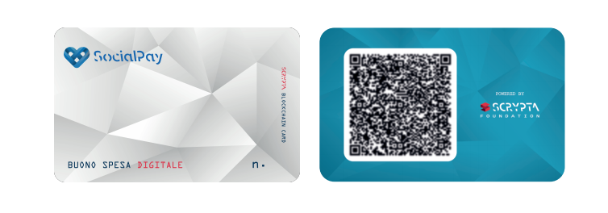

### Merchant procedures
#### Access to the system

| <div style="width:250px"></div>| <div style="width:250px"></div>|
| :---: | :---: |
| 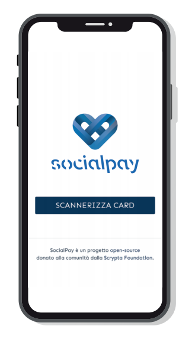 | Log in by connecting to your site with your smartphone / tablet, to be used as a virtual POS: <br>[https://nomecomune.socialpay.live/](https://nomecomune.socialpay.live/).<br><br>Click on **SCAN CARD”** and capture the **QR Code** of the card that was delivered to you (Merchant Card).<br><br>You will be asked to enter the **PIN** that was assigned to you together with **CARD**.<br><br>You are now able to receive payments through **DIGITAL EXPENSES** of eligible citizens. 

::: tip  
**NOTE:** For devices **iOS**browser must be used **“Safari”**, for devices **Android** you need to use **“Google Chrome"**.
:::

#### Receiving payment

| <div style="width:250px"></div>| <div style="width:250px"></div>|
| :---: | :---: |
| 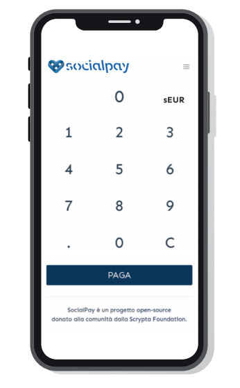 | Access the web-app from your smartphone or tablet at the address: [https://nomecomune.socialpay.live/](https://nomecomune.socialpay.live/)<br><br>In **HOME**you will find the * keypad"* of the virtual **POS** as from image.<br><br>Enter the amount of the receipt due and press the button **PAY**.
***sEUR shown in the figure is a digital representation of the Euro.***

Now capture the QR-CODE on the back of the customer's card with your smartphone
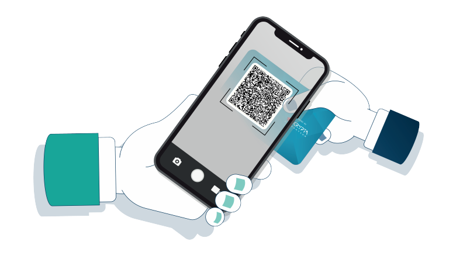

The customer authorizes the purchase by entering his **PIN** in the virtual POS.
The transaction takes place in real time.

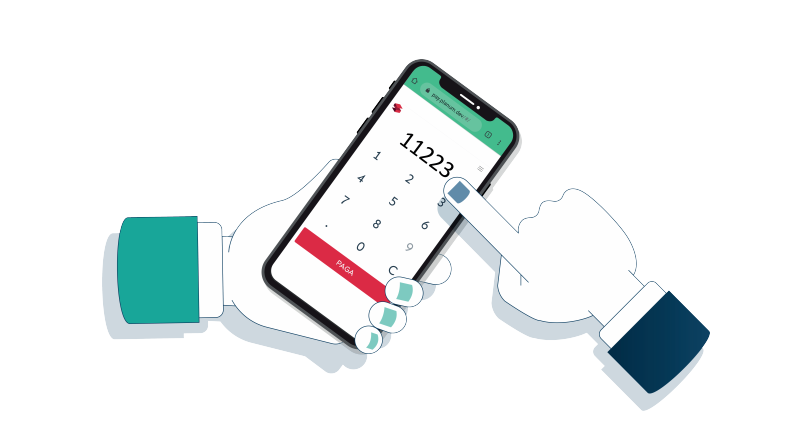
After making the transaction, you will instantly see a notification of the payment.

#### Balance control, transaction history and payment receipt

| <div style="width:250px"></div>| <div style="width:250px"></div>|
| :---: | :---: |
| 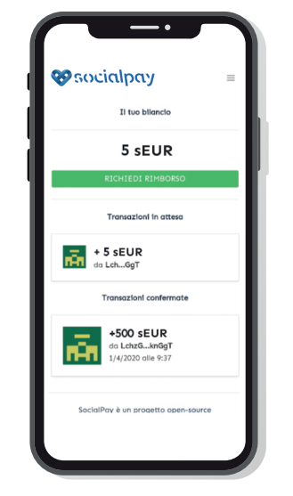 | Through the application, by accessing the menu via the symbol  and selecting **“TRANSACTION HISTORY”**, you can constantly check your balance and transactions. <br><br>There is also a specific function within this section **“REQUEST REFUND”** to forward the request to the Municipality, which will proceed with the bank transfer of the computed amount. 

#### Check refunds
| <div style="width:250px"></div>| <div style="width:250px"></div>|
| :---: | :---: |
| 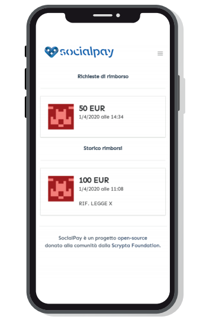 |In the section **“REFUND MANAGEMENT**, accessible by accessing the menu using the symbol , you will be able to see your * pending refunds * (i.e. those requested and that the Municipality has yet to take charge) and *refunds processed* (amounts already paid by the Municipality).
::: tip  
**NOTE:** With the status of ***refund processed** it is understood that the Municipality has taken over the reimbursement which will take place according to the banking schedule.
:::

#### Check City Card Balance
| <div style="width:250px"></div>| <div style="width:250px"></div>|
| :---: | :---: |
| The application allows you to check the balance of the * Customer-Card *, which can be found at all authorized merchants.<br><br> In the section **CHECK CARD**, accessible by accessing the menu using the symbol , Press the button **"CHECK NOW"** and capture the **QR CODE** of the customer's card.<br><br> This will display the available balance. | 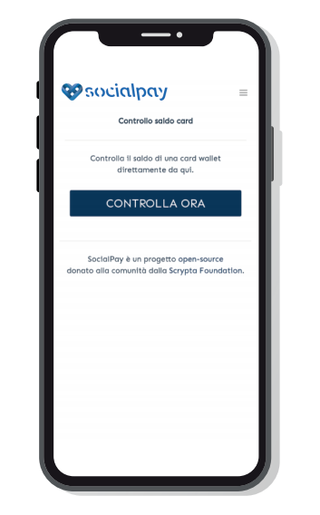

### APPENDIX - How to access the portal via Android / IOS

#### Android
| <div style="width:250px"></div>| <div style="width:250px"></div>|
| :---: | :---: |
| 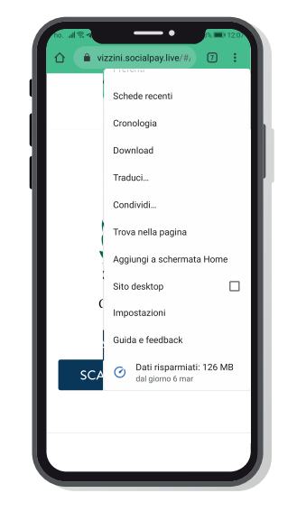 | -Launch Chrome for Android and open the web page: **[https://nomecomune.socialpay.live/](https://nomecomune.socialpay.live/)**<br><br> -Access the **menu** via the symbol  and then **"Add to home screen”**.<br><br> - Assign the link a name and Chrome to add it to the home screen.<br><br>The icon can be moved wherever you want and the chosen site will appear, like any other app, by touching the link. <br> <br> Chrome for Android loads the website as if it were a "web app" separately from the browser, so you can open it directly from the switcher app.

#### iPhone/iPad
| <div style="width:250px"></div>| <div style="width:250px"></div>|
| :---: | :---: |
| - ALaunch Safari on Apple iOS open the web page: **[https://nomecomune.socialpay.live/](https://nomecomune.socialpay.live/)**<br><br> - For technical problems due to Apple, SocialPay cannot be used if it is added to the Home screen of the iPhone or iPad; consequently we recommend typing (or saving in favorites) the url address of the web-app. <br> <br> - We also remind you that Social Pay can only be used by the browser **Safari**. |  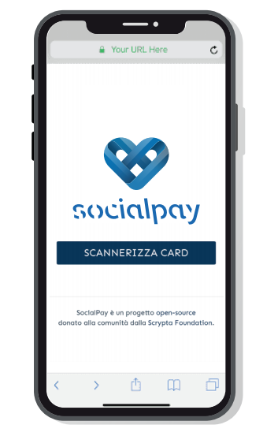 


## Guide for the citizen
### Digital shopping voucher card


Il **Comune di "*nomecomune*"** che adotta il sistema **SocialPay** predispone, per i cittadini aventi diritto, la **Card *“Buono Spesa Digitale”*** da utilizzare esclusivamente per l’acquisto di beni di prima necessità e presidi farmaceutici.

Ogni Card Cittadino è dotata di **QR-CODE** e protetta da apposito codice PIN (password numerica) che servirà per finalizzare gli acquisti presso i gli esercenti convenzionati.


::: warning 
**IMPORTANTE** Si raccomanda di custodire la Card con la massima cura in quanto contiene fondi realmente spendibili, e di non rivelare a nessuno il pin collegato alla Card.
:::

### Come utilizzare la Card

- Recarsi presso il punto vendita convenzionato e procedere all'acquisto. 
- Al momento del pagamento, mostrare la Card al negoziante che provvederà a scansionare il QR CODE addebitando l'importo speso.
- Inserire il PIN della Card nel terminale del negoziante per concludere l'acquisto.

::: tip 
**NOTA:** Potrai verificare il tuo il saldo conto presso qualunque punto vendita convenzionato.
:::

## Gestionale
### Istruzioni

#### Accesso al gestionale

| <div style="width:350px"></div>| <div style="width:250px"></div>|
| :---: | :---: |
| 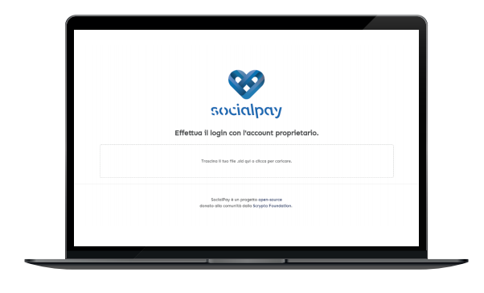 | Il login avviene caricando o trascinando il **.sid file** in dotazione e, subito dopo, inserendo la password associata che vi è stata fornita. |

#### Dashboard del gestionale

| <div style="width:350px"></div>| <div style="width:250px"></div>|
| :---: | :---: |
|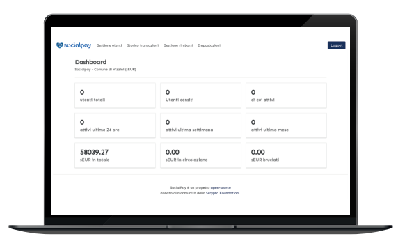|Effettuato l’accesso, verrete dirottati immediatamente sulla **Dashboard (Sezione HOME)** nella quale vengono visualizzati i dati generali di utilizzo. |

::: tip  
**NOTA:** La dicitura **sEUR “bruciati”** indica che le somme in oggetto non sono più disponibili, in quanto già inviate *(bruciate)* sotto forma di richiesta di rimborso.
:::

### Gestione utenti
La finestra GESTIONE UTENTI si compone di due sezioni:
- **“Carica file .csv di origine”**
- **"Elenco utenti”**

#### Carica file .csv di origine
Utilizzare questa sezione se si vogliono caricare più utenti contemporaneamente.<br>Dopo aver caricato il **file .csv**, tutti gli utenti all'interno del file verranno aggiunti al gestionale e saranno disponibili e visualizzabili nella sezione **"Elenco utenti"**.<br><br>Il file .csv viene generato in automatico durante la fase di creazione delle card e sarà composto dai seguenti campi:<br>
**SERIALE | WALLET | TIPOLOGIA | NOME | IDENTIFICATIVO | COMPONENTI NUCLEO FAMILIARE**<br>


::: tip  
**NOTA:** In caso di nominativi o dati duplicati, tali nominativi verranno ignorati dal sistema.
:::

#### Elenco utenti
La sezione **Elenco utenti** permette di visualizzare tutti gli elementi inseriti all'interno del sistema (**Esercenti** e **Cittadini**).<br>
Oltre alla visualizzazione è possibile effettuare **ricerche** specifiche, avvalendosi dei filtri di ricerca disponibili.<br>Inoltre, dalla colonna **"AZIONI"** è possibile compiere operazioni aggiuntive sul singolo utente.<br><br>
Le azioni disponibili sono nell'ordine:
- **MODIFICA**
- **VISUALIZZA**
- **ELIMINA**
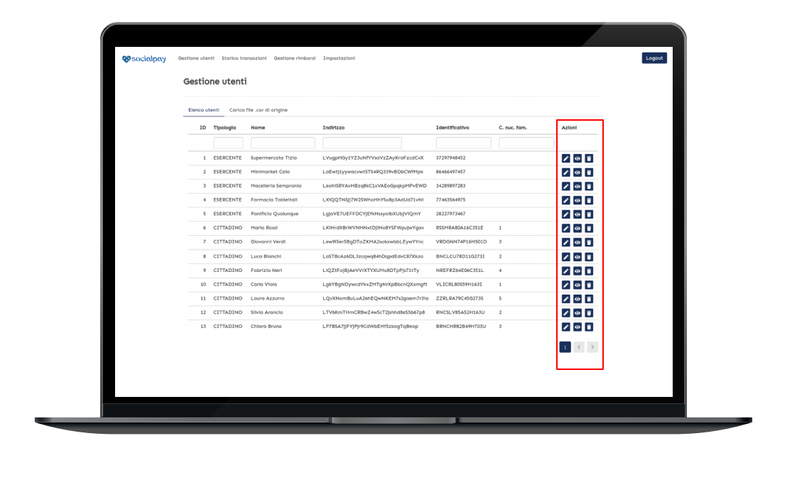

#### Azione **MODIFICA**
Attraverso questa azione, indicata dal simbolo , è possibile modificare i dati dell’utente.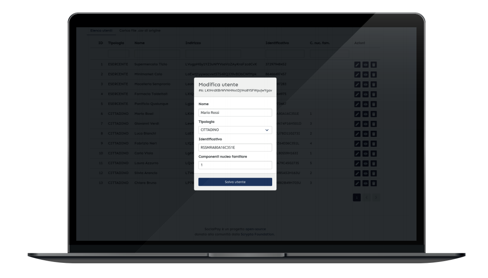

Una volta effettuate le modifiche desiderate, per confermare tali modifiche è necessario cliccare su **“Salva utente”**.

#### Azione **VISUALIZZA**
Attraverso questa azione, indicata dal simbolo , è possibile visualizzare i dettagli dell'utente selezionato, il suo bilancio e lo storico transazioni.<br>Inoltre questa sezione permette di predisporre l’invio di importi in **sEUR** all’utente selezionato.<br>L’operazione è **istantanea** e richiede l’inserimento della vostra password.


##### *Note sulle commissioni di transazione:

Per svolgere tutte le operazioni di transazioni o richieste rimborso,è necessario pagare delle commissioni di transazione dell’infrastruttura blockchain. Tali commissioni sono nell'ordine di millesimi di euro.<br><br>
**In fase di ricarica delle card**<br>
- Durante la fase di ricarica delle card, al fine di fornire a ciascun utente la possibilità di effettuare operazioni sul network sin da subito, è necessario inviare una modica quantità di LYRA per ciascun utente.<br>
::: tip  
- Si consiglia di inviare **0.1 LYRA** per ciascun utente (sia **"Cittadino"** che **"Esercente"**), quantitativo sufficiente allo svolgimento di circa 100 operazioni.<br><br>
- Si consiglia anche di inviare **0.1 LYRA** per le transazioni ogni qual volta è prevista una “ricarica” al **"Cittadino"**.<br><br>
- Non è indispensabile re-inviare LYRA per l'**"Esercente"** poiché riceverà automaticamente **0.001 LYRA** ogni qual volta viene inviata la notifica di avvenuto rimborso; tale operazione verrà illustrata in seguito in modo più dettagliato.
:::

::: warning  
**Se si prevede di effettuare un numero di operazioni superiore a 100, sarà necessario inviare un quantitativo di LYRA adeguato al volume di transazioni previste.**<br>
:::

#### Azione **ELIMINA**
Attraverso questa azione, indicata dal simbolo , l’utente selezionato viene eliminato dall’elenco.<br>Si raccomanda di procedere con cura verificando i dati prima dell'eliminazione.

### Storico transazioni
In questa sezione vengono visualizzate tuttee le transazioni effettuate all’interno del sistema.

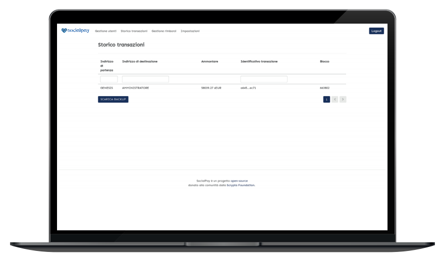

All'interno di questa sezione, tramoite gli appositi filtri, è possibile effettuare ricerche per **indirizzo** o per **transazione**.<br>Attraverso il pulsante **“SCARICA BACKUP”**  è possibile effettuare il backup dello storico transazioni in oggetto tramite file in formato **.csv** (Excel).  

### Gestisci rimborso
Non appena viene cliccato il pulsante **“CONTABILIZZA RIMBORSO”**, viene richiesto l’inserimento della password di amministratore.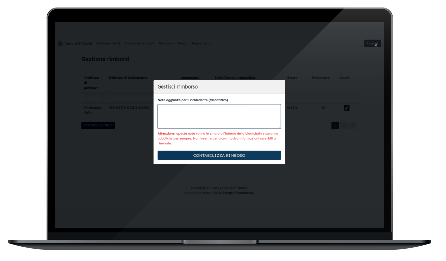<br>A questo punto l’Esercente riceverà una speciale transazione di notifica che conferma l’avvenuto bonifico da parte del Comune.<br>Risulta quindi evidente che questa operazione è da effettuare **SUBITO DOPO** aver predisposto lo specifico bonifico bancario di rimborso.<br><br>L’operazione sarà quindi visibile sulla colonna **“RIMBORSATO”** (nello specifico il campo verrà automaticamente riempito con **“SI”**).
Inoltre, questa speciale transazione, accrediterà nel conto dell’esercente la somma di **0.001 LYRA**, che gli permetterà di richiedere i rimborsi futuri.

Questa funzione è infine corredata dalla possibilità di aggiungere delle note di testo aggiuntive che vengono inviate all’esercente.

::: warning  
**Attenzione**: Le note a corredo delle transazioni sono dei dati che vengono scritti **in chiaro** nel registro distribuito della blockchain Scrypta.<br>Si **RACCOMANDA** pertanto di non inserire informazioni sensibili, che possano violare il rispetto della privacy.<br>
:::

### Impostazioni
Attraverso questa sezione è possibile effettuare operazioni come il salvataggio e la cancellazione di tutto l’elenco utenti.
Per compiere l’operazione di **salvataggio**, è necessario cliccare sul pulsante **“SCARICA BACKUP”**.
Il file generato, in formato .csv, permetterà di conservare una copia dell'intero archivio utenti, e sarà necessario per importare nuovamente l'archivio.
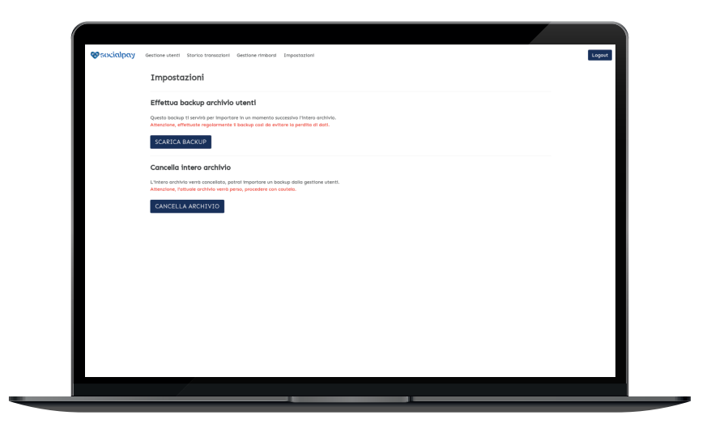

::: warning  
**Attenzione**: Si **RACCOMANDA** fortemente di effettuare i backup dell'elenco utenti con regolarità, al fine di evitare o quantomeno limitare la perdita di dati.<br>
:::

Per compiere l’operazione di **cancellazione** dell'archivio, è necessario cliccare sul pulsante **"CANCELLA ARCHIVIO”**. A questo punto, l’intero elenco utenti verrà azzerato.

::: danger  
**Attenzione**: Utilizzando questa funzione, l'attuale archivio **VERRA' INTERAMENTE E DEFINITIVAMENTE CANCELLATO"**.
<br>**L'operazione di cancellazione non e' annullabile**.
<br>Pertanto, se non avete effettuato il backup in precedenza e cancellate i dati, l'intero archivio andra' **DISTRUTTO**.

**PROCEDERE CON CAUTELA.**
:::


## SocialPay per gli sviluppatori

Il [repository "SocialPay" di Github](https://github.com/scryptachain/socialpay) a cui si fa riferimento, contiene tutto il materiale necessario ed è diviso per regioni e comuni. All'interno si trovano i file che generano tre diversi progetti:

- **Admin:** questo progetto è una personalizzazione del software di gestione Scrypta Planum Admin, che serve a gestire le sidechain.
- **Pos:** questo progetto serve a generare il front-end per i commercianti e che permette di spendere i buoni
- **Card:** questo progetto serve a generare le card wallet stampabili in formato QR code per distribuirle ai cittadini

Una cartella generica chiamata **`documentazione`** contiene tutte le presentazioni, i sorgenti grafici delle card e i prestampati legali per la convenzione con il comune.

### Operazioni preliminari

Si consiglia di scaricare le cartelle di base aggiornate dal [branch di sviluppo su Github:](https://github.com/scryptachain/socialpay/tree/development)

Dopo aver scaricato le cartelle si dovrà installare tutte le dipendenze attraverso il comando **`npm install`** all'interno di ogni sottocartella (**`admin`**, **`card`**, **`pos`**).

### Creazione della sidechain

La creazione della rappresentazione digitale di valore avviene attraverso la tecnologia Sidechain di Planum, pertanto è necesario effettuare delle operazioni preliminari prima di poter iniziare a compilare i progetti:

- Collegati a [https://web.manent.app](https://web.manent.app) e crea un nuovo account Scrypta.
Inserisci una password forte perchè questo account sarà l'account proprietario della sidechain. 

::: warning  
**Importante:** Effettua il backup del file .sid e del paper wallet per sicurezza, e ricorda che sei il **SOLO** responsabile di questi dati. Custodisci questi file tenendoli al sicuro **OFFLINE**.
:::

- Ti serviranno almeno 1.001 LYRA per far partire la sidechain e dovrai versare almeno 0.1 LYRA per ogni account cittadino o esercente, se non dovessi esserne in possesso ti invitiamo ad effettuare una richiesta ufficiale all'email [info@scrypta.foundation](mailto:info@scrypta.foundation).

- Collegati su [Planum](https://planum.dev) e crea una nuova sidechain attraverso l'apposito tool di creazione. Rimandiamo ad una guida più dettagliata per eventuale supporto: https://medium.com/@scryptachain/scrypta-lancia-planum-un-sidechain-layer-per-lemissione-di-tokenized-asset-ee156d300f4d. 

**I parametri consigliati per la creazione sono i seguenti:**
```
nome: SocialPay - Comune di ...
ticker: sEUR
decimals: 2
supply: Quantità da assegnare
reissuable: true
burnable: true
```

- Dopo che avrai generato la sidechain dovrai appuntarti l'indirizzo univoco, che ti servirà per collegare le applicazioni alla tua sidechain. Questo indirizzo puoi trovarlo sempre su [https://planum.dev/#/explorer](https://planum.dev/#/explorer) alla riga corrispondente, sotto la colonna **`address`**.


### Compilare la parte di amministrazione

Il software di amministrazione è un progetto electron e dovrai modificare il file sotto **`admin/config.json`** inserendo i parametri richiesti e dovrai inserire i loghi del comune di riferimento nella cartella **`admin/public`**.

Dopo aver modificato tutto il necessario è possibile provare in anteprima il software attraverso il comando **`npm run electron:serve`** oppure creare la build vera e propria con il comando **`npm run electron:build`**.

### Compilare il web PoS

Il web PoS è un progetto VueJS e dovrai modificare il file sotto **`admin/config.json`** inserendo i parametri richiesti e dovrai inserire i loghi del comune di riferimento nella cartella **`admin/public`**.

Dopo aver modificato tutto il necessario è possibile provare in anteprima il software attraverso il comando **`npm run serve`** oppure creare la build vera e propria con il comando **`npm run build`**.

La cartella di distribuzione **`dist`** dovrà essere pubblicata all'interno di un server Apache. E' fondamentale che venga installato un certificato SSL, consigliamo il servizio gratuito [https://letsencrypt.org/](https://letsencrypt.org/) che potrà fornire un certificato SSL gratuito.

### Creare le card wallet

Le card wallet vengono create attraverso lo script NodeJS presente nella cartella **`card`**. E' necessario modificare i file grafici nella cartella **`assets/`** al fine di personalizzare le card per il vostro comune. Il progetto genererà sotto la cartella **`prints/`** il numero di card richieste ed il solo QR Code ad mandare eventualmente alla tipografia.

Un altro file **`out.csv`** verrà creato e conterrà tutti i PIN necessari a sbloccare le card. Questo file dovrà essere conservato gelosamente offline e servirà per importare le anagrafiche all'interno del software di amministrazione. Per caricare le anagrafiche si dovrà eliminare la seconda colonna.

Per generare le card e il documento PIN accompagnatorio si deve modificare il file **`config.json`** inserendo i riferimenti necessari e dare il seguente comando **```node index.js -g=100```**. 
Per modificare la quantità è necessario modificare il numero **`100`** con la quantità desiderata. E' molto importante fare un backup della cartella **`prints`** e del file **`out.csv`** in quanto questi file vengono cancellati ad ogni nuova generazione.

## Contribuire al progetto

Se vuoi contribuire al progetto puoi creare, in accordo con la volontà comunale, una copia del progetto e richiedere l'inserimento del codice tramite Pull Request nel github dedicato:

[SocialPay Github](https://github.com/scryptachain/socialpay).

All'interno delle cartelle troverai un file **`config.json`** che ti permette di configurare i parametri di base. Questi comprendono principalmente le modifiche grafiche, di titoli e, chiaramente, permettono di collegare la sidechain tramite indrizzo univoco.

Si consiglia di forkare questo progetto e aggiungere il proprio comune così da darne evidenza a tutti i contributori del progetto. Qualora non trovassi la cartella della tua regione, dovrai crearla tu stesso.

Alla fine del processo di aggiunta e creazione del progetto per il tuo comune potrai richiedere l'aggiunta nel repository ufficiale tramite pull request.

## Supporto

Se hai bisogno di aiuto per integrare il progetto o trovi bug da risolvere, puoi aprire una issue su [github socialpay](https://github.com/scryptachain/socialpay), scrivere a [info@scrypta.foundation](mailto:info@scrypta.foundation), o contattarci tramite [i nostri social](../general-info/link.md#social-media) ti risponderemo al più presto.

## Video Tutorial

[**Buoni Spesa? Basta Sprechi! Usiamo la BLOCKCHAIN!**](https://www.youtube.com/watch?v=oRNoxwsRG5M) di Tiziano Tridico


<iframe width="560" height="315" src="https://www.youtube.com/embed/oRNoxwsRG5M" frameborder="0" allow="accelerometer; autoplay; encrypted-media; gyroscope; picture-in-picture" allowfullscreen></iframe>