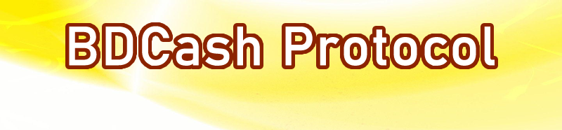

# The Guide to the BDCash Protocol

BDCASH is a decentralized and public blockchain. Its consensus method is Proof of Stake (PoS), with validators called Masternodes (MN).

 Through [GitHub](https://github.com/BdcashProtocol) it is possible to monitor the daily research and development work carried out by the entire our ecosystem.

The blocks are extracted by the stakers every minute, this guarantees a fast "timeframe" for the execution of transactions and the writing of information. Each block can contain less of 1MB of information. The capacity of each individual transaction to contain arbitrary data (through OP_RETURN) is 10 kilobytes.

The BDCASH team has developed a second operating layer, through the **NODESH**, which allows (in a facilitated, but not exclusive way) the management of arbitrary information through what we have defined: **Progressive Data Management** (PDM). The PDM allows reading, writing and invalidation operations, which in turn constitute the essence of each application (decentralized or not).

This documentation includes the current status of the open-source libraries currently developed by BDCASH team and its operating system, for further clarification you can contact us by sending an email to: partners@bdcashprotocol.com or by joining our channel [Discord](https://discord.me/bdcashprotocol).

## Architecture

The BDCASH ecosystem is based on ** five fundamental pillars ** thanks to which more or less complex decentralized applications can be developed, which interact at various levels with the Blockchain:
-   **BDCashCore:** is the main javascript library. It allows the creation and management of .sid files, the signature of transactions and data, and the basic interfacing with NODESH.
    
-   **NODESH:** is the NodeJS library needed to develop the blockchain interface nodes, these nodes perform various functions including: block explorer, UTXO tracking and file storage on the IPFS (Interplanetary File System) system.
    
-   **IDBDCASH:** is the NodeJS library that manages the interaction between external digital identities and the addresses of the BDCash blockchain. Thanks to the framework it is possible to identify and "mark" bdcash addresses using various external providers.
    
-   **Trustlink BDCASH:** integrated within the NODESH, the Trustlink is a mechanism thanks to which it is possible to create wallets called "multisignatures" which provide for the obligation of the presence of multiple signatures to perform transactions and therefore data writing.

-   **Chains Platform:** it is the solution to help tokenization processes: an open and permissionless sidechain system that allows you to create, exchange and track your own digital assets (tokenized assets) only through the bdcash blockchain.

-   **Smart Contracts BDCASH:** is the scripting system that allows you to create application details, directly incorporated into the NODESH. To learn more about the system you can read an in-depth analysis [here (Soon)](#l).

Through the use of these tools it is possible to develop infinite applications, decentralized or not, for multiple use cases.