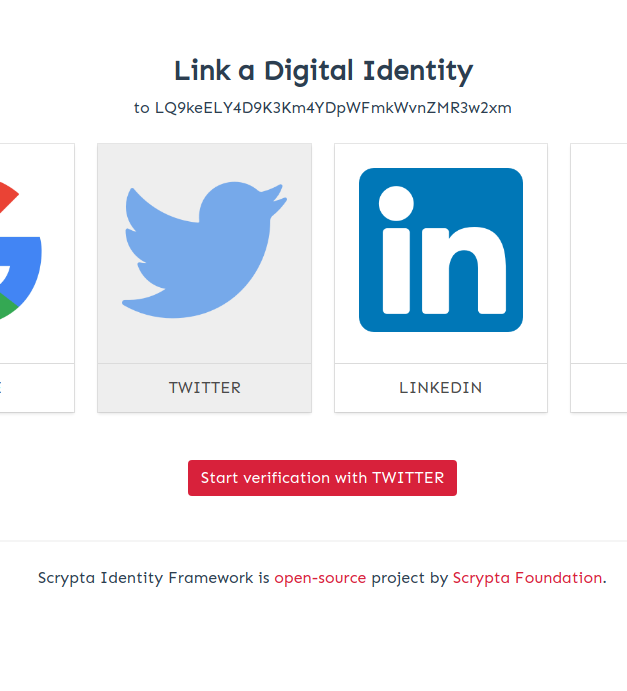
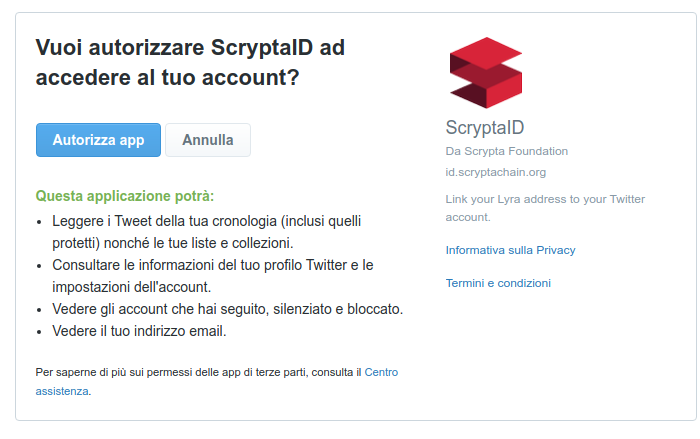
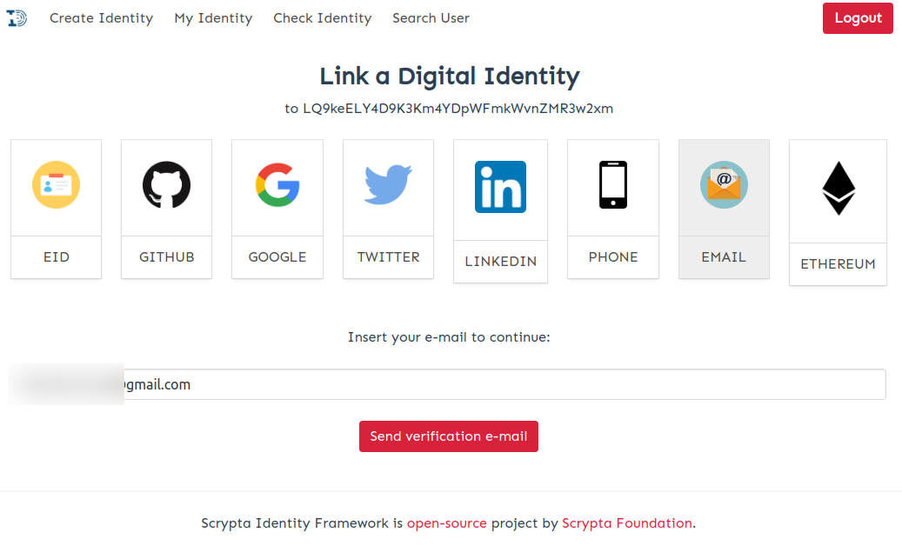
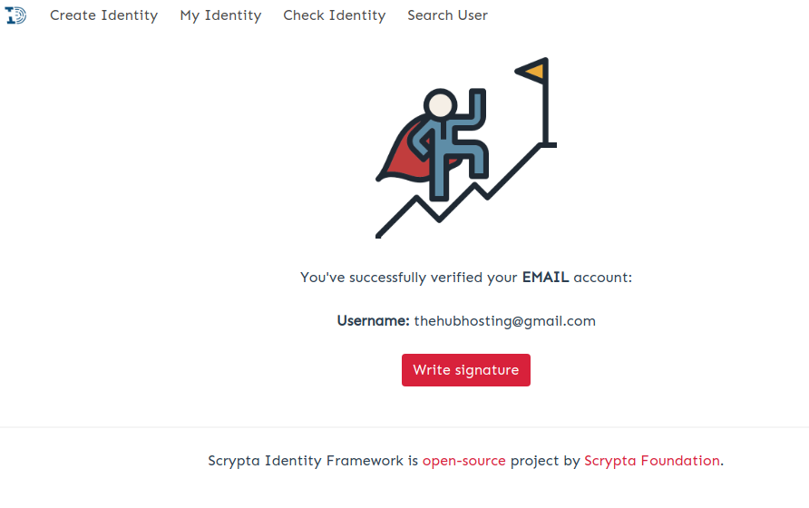

# Identification platform

## Premise

The Scrypta digital identity framework allows the coupling of a Lyra address to one or more digital and / or physical identifiers.

Scrypta provides a privacy oriented public *Gateway* that will allow you to interact with identification technology. This *Gateway* can be reached at: [https://me.scrypta.id](https://me.scrypta.id)

Once inside the system with your `.sid` file you can interact with all the available identifiers:

- CIE (Electronic Identity Card),
- Mail (also PEC),
- Mobile phone,
- Google account,
- Twitter,
- Linkedin,
- Github,
- Ethereum (ETH address).

For more information on the *.sid* file and the login system in the Scrypta dApps, visit the [Scrypta Browser Extension](../dapps/extension-browser.md) section.

## Digital Identification

Google, Twitter, Github, Linkedin have a very similar authentication process.
In the example image, we will link the identity *LQ9keELY4D9K3Km4YDpWFmkWvnZMR3w2xm* to a test Twitter account

  Once you click on the icon of the service you want to associate, just press the button to start the identity verification and follow the instructions on the screen to complete the authentication.

  Once the service authentication has been completed, you will receive confirmation that the digital identity has been connected with the chosen identifier, with your username and unique ID.

After pressing the *Write Signature* button, you will receive a notification on the screen that the process has been successfully completed.
We recommend that you always make an updated backup of your *.sid* file

## Identification with CIE

To identify with CIE, you must first enter your Identity Card number and begin the process. The system will create a file *p7m* which will invite you to download. Now you will have to sign this file through a digital signature app like [Sign with CIE](https://www.firmoconcie.it/). Now you can upload the signed file within ScryptaID and complete the authentication.

## Identification with OTP (E-Mail / SMS)

### Email
The association of e-mails and sms takes place through two-factor authentication, so you will need to access your e-mail and authorize the association.

Once you have entered your e-mail in the form, the system sends a One Time Password to the e-mail address to which you intend to connect the identity, to be used to complete the identity connection.
Just enter the OTP in the field as requested by the system, to correctly complete the connection between your ScryptaID and your email account.

After pressing the *Write Signature* button, you will receive a notification on the screen that the process has been successfully completed.
We recommend that you always make an updated backup of your *.sid* file

### SMS

In the case of association through your telephone number, you must enter the code received via sms in the appropriate field.

## Identification with Ethereum

To identify an ETH address you must first install [MetaMask](https://metamask.io/).
Once Metamask is installed, proceed with the information on the screen to connect your Ethereum address to ScryptaID

As soon as you request authentication, MetaMask will automatically open asking for confirmation of the association between ScryptaID and your Ethereum account.

Simply press *"Connect"* to complete the connection of your ScryptaID with your Ethereum address.

## Revocation
It is possible to "revoke" each connected service individually. This operation may be necessary in the event that a specific service associated with our identity is not yet available, or for other security reasons.

To do this, go to the *"My Identity"* window, press the revocation icon relating to the service we want to dis-associate  and enter your password. The specific identification will be marked in the blockchain as "invalidated" and the platform will no longer show the related service as associated with our identity.

::: warning ATTENTION:
After authenticating by associating the desired providers, it is important to make a backup of the *.sid* file associated with your address, and therefore with your digital identity.
Basically the *.sid* file will contain new information related to your identity payload.

If you use [Scrypta Browser Extension](https://id.scryptachain.org/), you will need to un-remove the previous *.sid* file (via the "*Forget Identity*" function) and import the new one, even if it belongs to the same blockchain address.
:::