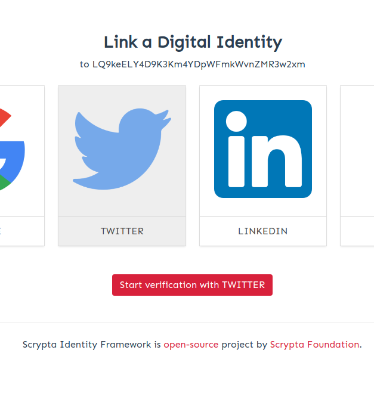
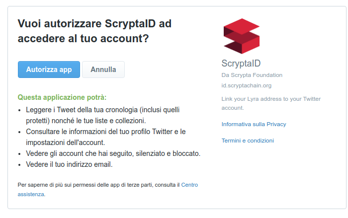
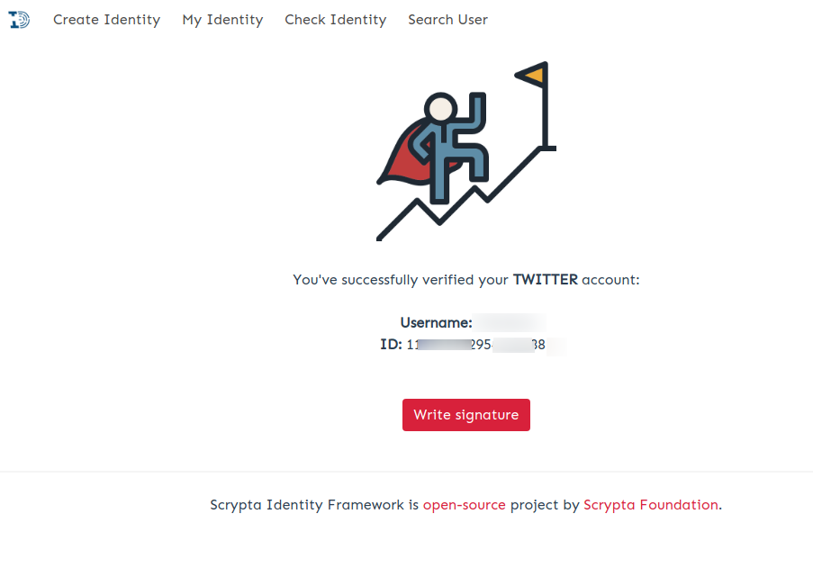
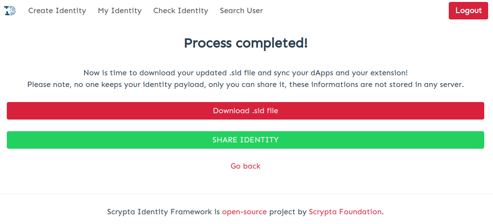
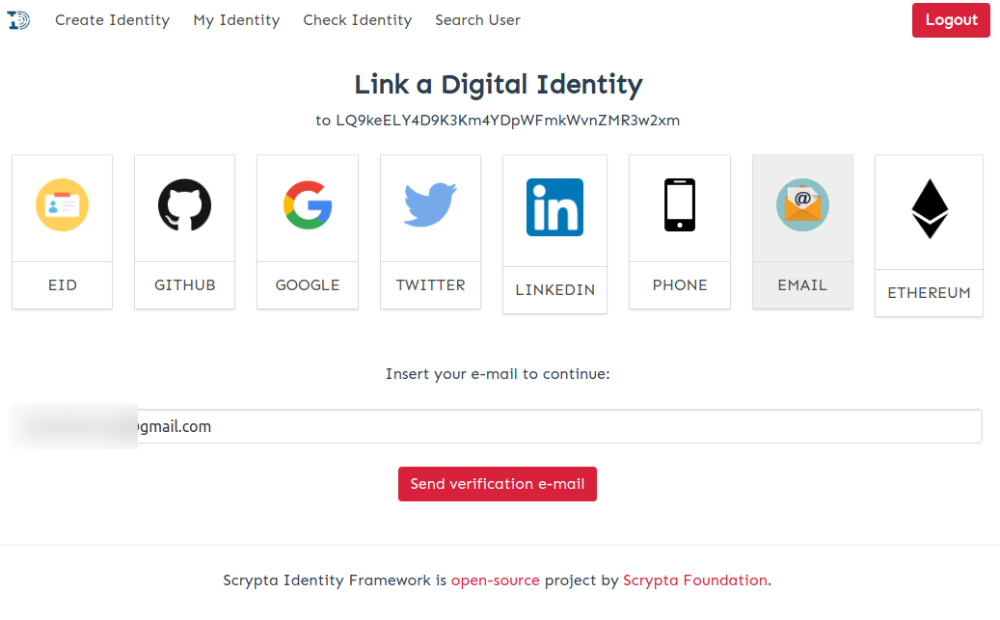
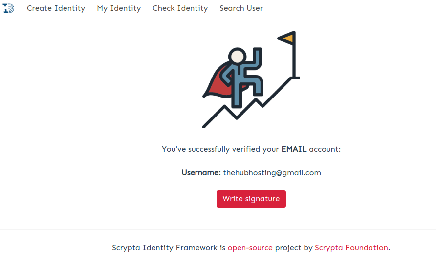
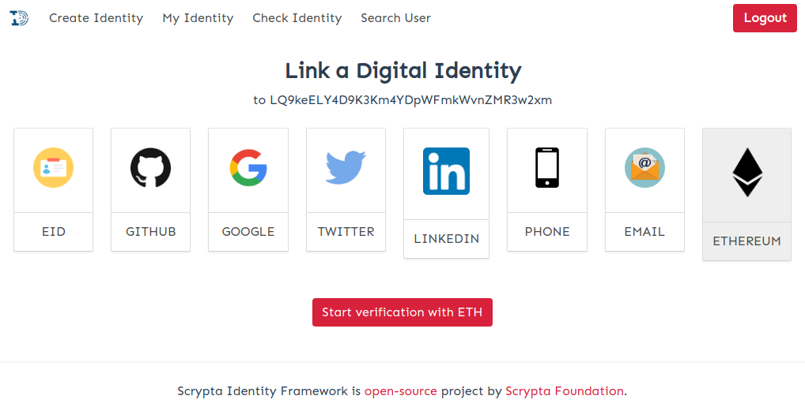
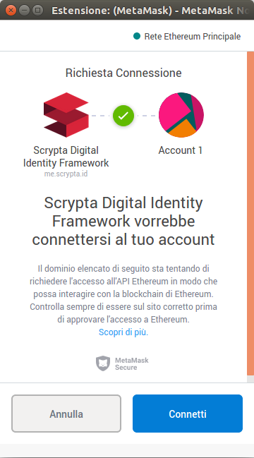

# Piattaforma di identificazione 

## Premessa

Il framework di identità digitale Scrypta permette l'accoppiamento di un indirizzo Lyra ad uno o più identificatori digitali e/o fisici.

Scrypta mette a disposizione un *Gateway* pubblico privacy oriented che vi permetterà di interagire con la tecnologia di identificazione. Tale *Gateway* è raggiungibile all'indirizzo: [https://me.scrypta.id](https://me.scrypta.id).

Una volta entrati all'interno del sistema con il vostro `.sid` file potrete interagire con tutti gli identificatori disponibili:

    • CIE (Carta d'Identità Elettronica)
    • Mail (anche PEC)
    • Telefono cellulare
    • Google account
    • Twitter
    • Linkedin
    • Github
    • Ethereum (indirizzo ETH)

Per maggiori informazioni sul *.sid* file e il sistema di login nelle dApp Scrypta, visita la sezione [Scrypta Browser Extension](../dapps/extension-browser.md).

## Identificazione digitale

Google, Twitter, Github, Linkedin hanno un processo di autenticazione molto simile.
Nell'immagine di esempio, linkeremo l'identità *LQ9keELY4D9K3Km4YDpWFmkWvnZMR3w2xm* ad un account Twitter di prova

  Una volta cliccato sull'icona del servizio che si intende associare, basterà premere il tasto per inziare la verifica dell'identità e seguire le istruzioni a schermo per completare l'autenticazione del servizio.

  Una volta completata l'autenticazione del servizio, riceverete la conferma dell'avvenuto collegamento dell'identità digitale con l'identificatore scelto, con il vostro Username e ID univoco.

Dopo aver premuto il tasto *"Write Signature"*, riceverete a schermo la notifica che il processo è stato completato con successo.
Si consiglia di effettuare sempre un backup aggiornato del proprio *.sid* file

## Identificazione con CIE

Per l'identificazione con CIE è necessario innanzitutto inserire il proprio numero di Carta d'Identità e cominciare il processo. Il sistema creerà un file (p7m) che ti inviterà a scaricare. Adesso dovrai firmare questo file attraverso un app di firma digitale come [Firmo con CIE](https://www.firmoconcie.it/). Adesso potrai  effettuare l'upload del file firmato all'interno di ScryptaID e completare l'autenticazione.

## Identificazione con OTP (E-Mail / SMS)

### Via Email
L'associazione di e-mail ed sms avviene attraverso un'autenticazione a due fattori, bisognerà quindi accedere alla propria mail ed autorizzare l'associazione.

Una volta inserita la propria mail nel form, il sistema invia, all'indirizzo e-mail al quale si intende collegare l'identità, una One Time Password da usare per completare il collegamento dell'identità.
Basta inserire la OTP nel field come richiesto dal sistema, per completare correttamente il collegamento fra la vostra ScryptaID e la vostra casella email.

Dopo aver premuto il tasto *"Write Signature"*, riceverete a schermo la notifica che il processo è stato completato con successo.
Si consiglia di effettuare sempre un backup aggiornato del proprio *.sid* file

### Via SMS

Nel caso dell'associazione tramite il proprio numero telefonico, è necessario inserire nell'apposito campo il codice ricevuto via sms.

## Identificazione con Ethereum

Per identificare un indirizzo ETH è necessario innanzitutto installare [MetaMask](https://metamask.io/).
Una volta installato Metamask procedete con le informazioni a schermo per collegare il vostro indirizzo Ethereum a ScryptaID

Non appena richiederete l'autenticazione  si aprirà automaticamente MetaMask chiedendovi la conferma di associazione tra ScryptaID e il vostro account Ethereum.

Sarà sufficiente premere *"Connetti"* per completare il collegamento del vostro ScryptaID con il vostro indirizzo Ethereum.

## Revoca
E' possibile "revocare" singolarmente ogni servizio collegato. Questa iperazione potrebbe esse necessaria nel caso in cui  nn si disponesse un determinato servizio associato alla nostra identità, o per altre ragioni di sicurezza. 

Per fare ciò bisogna recarsi sulla finestra *"My Identity"*, premere l'icona di revoca  e inseirire la propria password. La specifica identificazione verrà segnata come "invalidata" in blockchain  e la piattaforma non mostrerà più il relativo servizio come associato alla nostra identità. 

::: warning ATTENZIONE:
Dopo essersi autenticati associando i provider desiderati è importante effettuare un backup del file *.sid* associato al proprio indirizzo, e quindi alla propria identità digitale.
In sostanza il .sid file conterrà nuove informazioni relative al vostro *payload* di identità. 

Se utilizzate [Scrypta Browser Extension](https://id.scryptachain.org/), sarà necessario dis-asocciare il precedente *.sid* file (tramite la funzione "*Forget Identity*") e importare il nuovo, anche se fa capo allo stesso indirizzo blockchain.
:::