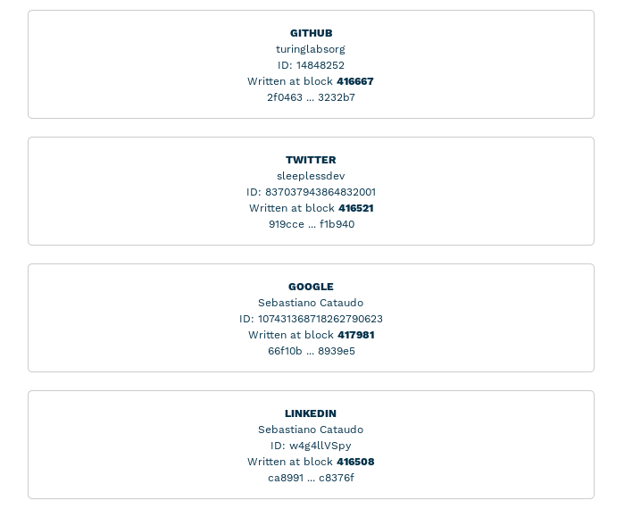
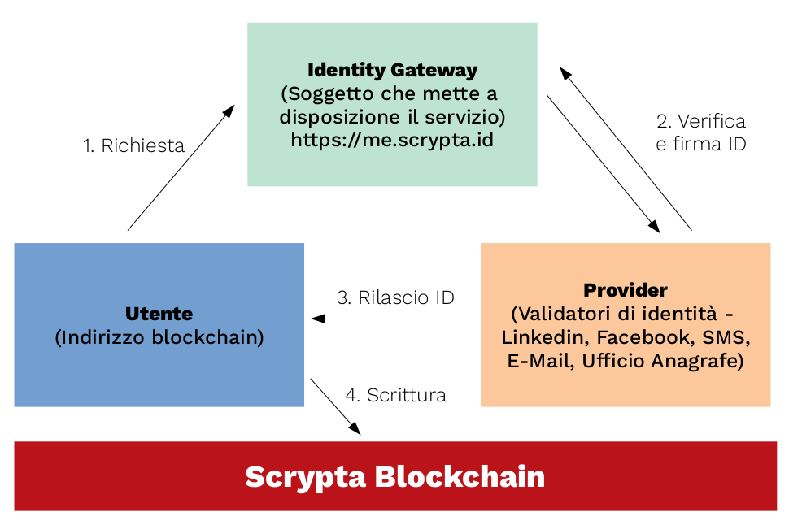

# Scrypta Identity Framework

## Introduzione

Il sistema di identità di Scrypta si articola in due componenti fondamentali, la prima riguarda la gestione delle identità strettamente digitali, ovvero gli indirizzi Lyra; la seconda riguarda l'autenticazione degli indirizzi con autenticatori esterni.

La prima componente può essere gestita in vari modi, ma sostanzialmente riguarda i file .sid che abbiamo menzionato nella documentazione di _Scrypta Core_. Questi payload di identità possono essere gestiti tramite:

- [**ScryptaID Browser Extension**](https://id.scryptachain.org/) (Chrome, Firefox, etc) 
 > [https://github.com/scryptachain/scrypta-id](https://github.com/scryptachain/scrypta-id)
- [**Manent Mobile App**](https://manent.app/) (iOS, Android) 
 > [https://github.com/scryptachain/scrypta-manent-app](https://github.com/scryptachain/scrypta-manent-app)
- [**Manent Web App**](https://web.manent.app/#/) (Chrome, Firefox, Mobile browser)
> [https://github.com/scryptachain/scrypta-manent-web](https://github.com/scryptachain/scrypta-manent-web)

La seconda componente può essere utilizzata tramite un Gateway di identità, come quello che mette a disposizione Scrypta  attraverso l'URL: 

- [**https://me.scrypta.id/**](https://me.scrypta.id/) 
 
oppure attraverso altri Gateway messi a disposizione da altri soggetti esterni.

I payload di identità, la cui struttura ha a che fare unicamente con gli indirizzi, presentano un'ulteriore proprietà chiamata *identity*:

```
{

 "pub":"LLLjx7yV4nhUzSapBAHogb5BdgUR6VCB3o",

 "api_secret":"33239857dbe3d37fd35b807578a0132b",

 "key":"03097163386854cde5801aec574948e15b9e24c79da65414d4e5588e7140846165",

 "prv":"SnvpeER7kdeMFGRimBzV5EJfX2ZfxmAQwin1qAHD2kXb8XRF983g",

 "identity": {
	Provider: {
		"identity": {
			"created_at": Timestamp,
			"method": Provider,
			"username": Username,
			"token": TokenReleasedByProvider
		},
		"fingerprint": PayloadSignedByGateway
	}
  }

}
```

Come possiamo intuire, per ogni **Provider** (Twitter, Github, E-mail) dopo la corretta verifica da parte del **Gateway**, viene scritto un payload contenente:
- **created_at**: Il timestamp dell'operazione.
- **method**: una ripetizione del provider utilizzato.
- **id**: l'id dell'utente presso il provider.
- **username**: l'username dell'utente presso il provider.
- **token**: il token rilasciato dal provider (che potrà essere usato per la verifica dell'account).

Questo payload viene firmato dal gateway (la cui chiave privata dovrà risiedere all'interno dello stesso) e la firma viene inserita all'interno della proprietà **fingerprint**.

Questo stesso payload viene firmato dall'indirizzo che richiede l'autenticazione. La firma viene scritta all'interno della blockchain in modo da poterla comparare per verifica con quella presentata dall'utente in fase di identificazione.

**N.B.** il payload di identità viene nuovamente cryptato e la custodia viene comunque demandata all'utente, questo per garantire decentralizzazione e sicurezza. 
<!--stackedit_data:
eyJoaXN0b3J5IjpbOTc0OTEwMTEyLC0xNTM4OTc0ODI2LC0xNT
gwMjY0OTE0LDE1NzEzOTAzOTAsOTU0Njc2ODUzXX0=
-->

## Note tecniche

Il codice sorgente dello Scrypta Identity Framework, che gestisce i Gateway di identità, è ispezionabile a questo indirizzo: 

[https://github.com/scryptachain/scrypta-identity-framework](https://github.com/scryptachain/scrypta-identity-framework)

Questo è il componente che mette a disposizione le interfacce verso gli autenticatori esterni.

::: tip TECNOLOGIE UTILIZZATE

**Scrypta Identity Framework** é un'applicazione in [**NodeJS**](https://nodejs.org). 
I provider sono gestiti tramite [**PassportJS**](http://www.passportjs.org/); eccezion fatta per la verifica di e-mail, integrata tramite [**Mailgun**](https://www.mailgun.com/) e la verifica di numero di telefono, tramite [**Twilio**](https://www.twilio.com/). 

la verifica delle e-mail e del telefono avviene internamente cosicche gateway e provider del servizio coincideranno.

:::
::: warning NOTA BENE

la verifica delle e-mail e del telefono avviene internamente cosicche gateway e provider del servizio coincideranno.

:::

## Riscontro dell'identità

Ogniqualvolta l'utente vorrà identificarsi, dovrà mostrare in chiaro il proprio payload di identità (operazione effettuabile tramite mobile app) e la controparte (sempre via app, in automatico) verificherà che i payload presentati siano effettivamente validi. In sostanza verrà effettuta una verifica tramite chiave pubblica, payload e blockchain.

Il risultato, riscontrabile dal sito https://me.scrypta.id, sarà qualcosa del genere, che rendiamo graficamente per questioni di privacy:




Effettivamente si potrà verificare che, ad esempio, il payload di _Github_ scritto al blocco **416667** è il seguente ed è collegato all'indirizzo `LZzzH9C7outN754hqfyTZ6Hhjk2nsoX9no`. Queste informazioni sono riscontrabili qui:
https://proof.scryptachain.org/#/uuid/3e7ce.f696.4b11.bf0c.cec51cff386e
```
{ 
	"signature": "2f04635376ef2cbbc9c083b6093e5bfc864bc779a8aa670c431f5ad14c2e261003ef2aaeaab8990f9a3cec8a67296a05b1463b5f9ba98c78d83d1269163232b7",
	"gateway": "0240f294ef20c7bbb82bae24d8d22c7ab94d195adf153162482b6bf540393d7dd5", 
	"fingerprint": "79a7c75eb20eca8ca36b781bbde1e0e960a39e4d4d92f4d4452cf47c7e5b0b936c5051690f84ee177d497003ea50dd32192cf18422130a1eb8bb6172cd48275f" 
}
```

Spiegamo meglio cosa viene scritto all'interno della blockchain: 
- **signature**: è la firma del payload da parte dell'indirizzo `LZzzH9C7outN754hqfyTZ6Hhjk2nsoX9no`.
- **gateway**: è la chiave pubblica dell'indirizzo del Gateway.
- **fingerprint**: come detto, è la firma dello stesso payload da parte dell'indirizzo del gateway.

## Schema di funzionamento

Ecco uno schema di funzionamento che riassume tutti i passaggi effettuati:



## Provider integrati

Al momento i provider integrati e funzionanti sono i seguenti:
- Github
- Google
- Linkedin
- Twitter
- E-Mail
- Telefono

## Obiettivo finale

L'obiettivo finale di questo framework è dare la possibilità ad enti, istituzioni o aziende di creare il proprio set di indirizzi la cui identità viene garantita grazie alla blockchain ed il metodo sopra menzionato. 

Scrypta sta implementando questo sistema di identità all'interno dell'app mobile Manent dando la possibilità agli utenti di scambiarsi le informazioni di identità e salvarle all'interno del proprio "Address Book". Questo permetterà una duplice operazione, la prima è quella di poter avere effettivamente una lista di contatti fidati e la seconda è quella di creare TrustLink con questi contatti, così da poter siglare accordi o firmare documenti.

## Estendibilità e casi pratici

E' chiaro come nel caso ad esempio di un'azienda che vuole identificare i propri dipendenti (e le loro operazioni digitali, permettendogli -ad esempio- di firmare documenti o interagire con una dApp aziendale) che la gestione di questi payload attraverso i file .sid (decentralizzati) può essere macchinosa. 

Grazie alla natura aperta del framework, nulla vieta di creare uno storage centralizzato per tutte queste identità e collegarle, ad esempio, all'e-mail aziendale.

Grazie a questi indirizzi identificati si potranno compiere quindi le operazione più varie, dallo scambio di fondi alla firma di documenti, fino alla creazione di trustlink.
<!--stackedit_data:
eyJoaXN0b3J5IjpbMTAxOTIzNzY2MywxNjc4NjM1NTA5LDE3MT
gxMDkxODMsMTMyMTM3MTI5OSwtMjExNDEwNjAzNF19
-->