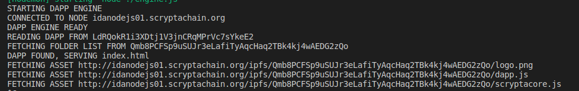

# dApps Engine

dApps Engine è il sistema attraverso cui caricare le dApp (Applicazioni Decentralizzate) direttamente sulla blockchain. Se pur in uno stato assolutamente _alpha_, l'engine permette di caricare (lato IdANode) ed eseguire (lato client) del codice e delle dApp.

La filosofia di Scrypta è quella di avviare le dApp direttamente nel dispositivo dell'utente, così da non sovraccaricare la rete (se pur capiente) ed evitare i colli di bottiglia che ne deriverebbero dall'uso di potenza computazionale "cloud" in larga scala . Di fatto l'idea è che i nodi debbano interfacciarsi con la Blockchain e le dApp debbano essere eseguite dai dispositivi. L'interazione tra i due avviene appunto grazie agli IdANode, che permettono le operazioni di lettura e scrittura e che, in realtà, possono sempre essere avviati localmente.

Le dApp, in effetti, vengono caricate su IPFS, e la cartella contenente i file viene scritta sulla blockchain. Essendo la cartella rappresentata da un hash, questa cambierà ogni volta che vengono fatte delle modifiche. Queste modifiche possono essere a sua volta scritte  nello stesso indirizzo, così da avere una sorta di versioning consultabile sulla blockchain.  L'effettiva autenticità dell'aggiornamento risiede nel fatto che solamente lo sviluppatore avrà la chiave privata dell'indirizzo.

Queste operazioni, che al momento vengono fatte manualmente, potranno essere svolte attraverso un'interfaccia grafica nel Developer Portal, che è in fase di costruzione.

Possiamo definire il dApps Engine un punto di arrivo per l'intero ecosistema. Esso verrà potenziato e reso un prodotto stabile nel corso dei prossimi mesi. Quì è' possibile seguire lo sviluppo dal repository dedicato:
https://github.com/scryptachain/scrypta-dapps-engine


## [POST] /upload

L'unico endpoint disponibile, al momento, è quello di `upload` delle dApp e consta di due passaggi:
1) Caricamento della cartella con i file sull'IdANode.
2) Salvataggio della transazione contenente l'informazione della dApp.

Queste operazioni potrebbero essere effettuate tramite gli endpoint dedicati `/ipfs/upload` e `/write`.

I campi da inviare sono i seguenti:
- **files [obbligatorio]:** i file della dApp, inviati via form-data 
- **dapp_address [obbligatorio]:** l'indirizzo della dApp
- **private_key [obbligatorio]:** la chiave privata dell'indirizzo

In futuro prevediamo la possibilità di inserire ulteriori campi per identificare la dApp del tipo `version`, `dApp name`, `logo` etc. Questo servirà per creare una sorta di dApp explorer decentralizzato dove chiunque potrà effettivamente pubblicare dApp.

La risposta dell'endpoint, se tutto è stato correttamente validato, sarà come quella dell'operazione di scrittura:
```
{

	"uuid":  "ee0e4794.7b69.476a.a49b.c4bdaa078ab6",

	"address":  "LdRQokR1i3XDtj1V3jnCRqMPrVc7sYkeE2",

	"fees":  0.002,

	"collection":  "",

	"refID":  "",

	"protocol":  "dapp://",

	"dimension":  107,

	"chunks":  2,

	"stored":  "*!*ee0e4794.7b69.476a.a49b.c4bdaa078ab6!*!!*!!*!dapp://*=>QmeHZ86FBr2nZ6fdQk32qkXQXCs6wELE6Ldo584k3TWLMA*!*",

	"txs":  [

		"f76cb402f844f4b11566b5ace76f7f94559febcf17a757f2079ed1e2a8ccd2a6",

		"5382ee73823a8676320fb554a43d78928c80babb72509d79d4b5d089483743c7"

	]

}
```

Se andiamo ad analizzare il dato inserito, ovvero `QmeHZ86FBr2nZ6fdQk32qkXQXCs6wELE6Ldo584k3TWLMA` attraverso l'enpoint `/ipfs/ls/QmeHZ86FBr2nZ6fdQk32qkXQXCs6wELE6Ldo584k3TWLMA` vedremo che effettivamente contiene la nostra cartella appena caricata:
```
[

	{

		"hash":  "QmaWcMiVPLMePAspNqhY7U4ByDDmuTKDitogWDwUCoo49x",

		"path":  "QmeHZ86FBr2nZ6fdQk32qkXQXCs6wELE6Ldo584k3TWLMA/dapp.js",

		"name":  "dapp.js",

		"depth":  1,

		"size":  204,

		"type":  "file"

	},

	{

		"hash":  "QmYFPVBraRnzMguR7SwyKMtvo2ZzUThUAcrRkQ1TEv6Mci",

		"path":  "QmeHZ86FBr2nZ6fdQk32qkXQXCs6wELE6Ldo584k3TWLMA/index.html",

		"name":  "index.html",

		"depth":  1,

		"size":  1042,

		"type":  "file"

	},

	{

		"hash":  "QmQVKoAs9nxjRfawb6ALhZNEzpR5RFBgN7FeJdAZYWdN8h",

		"path":  "QmeHZ86FBr2nZ6fdQk32qkXQXCs6wELE6Ldo584k3TWLMA/logo.png",

		"name":  "logo.png",

		"depth":  1,

		"size":  2381,

		"type":  "file"

	},

	{

		"hash":  "QmYzaWGQM7b224S8taaiVVUzt1h56tudncDn7Ds45G7wcV",

		"path":  "QmeHZ86FBr2nZ6fdQk32qkXQXCs6wELE6Ldo584k3TWLMA/scryptacore.js",

		"name":  "scryptacore.js",

		"depth":  1,

		"size":  477293,

		"type":  "file"

	}

]
```

Possiamo effettivamente riscontrare che la dApp funziona e viene caricata direttamente da IPFS grazie al nostro servizio:  https://scryptad.app/LdRQokR1i3XDtj1V3jnCRqMPrVc7sYkeE2

Come vedete, effettivamente viene richiamato l'indirizzo che ha scritto l'informazione `LdRQokR1i3XDtj1V3jnCRqMPrVc7sYkeE2` e, in background, succedono le seguenti operazioni:

1) Viene letto l'indirizzo `LdRQokR1i3XDtj1V3jnCRqMPrVc7sYkeE2` e viene richiesto l'ultimo dato.
2) Viene letta la cartella, come visto in precedenza, e viene servito il file **index.html**. Se il file non esiste restituirà un errore.

3) Vengono effettivamente serviti tutti gli altri asset, leggendoli sempre da IPFS.

Da questo momento il vostro dispositivo (se andate da browser) avrà una copia in cache, ed effettivamente sarà la potenza computazionale del dispositivo ad essere usata. In nessun caso questi file vengono scaricati sul dApp engine, che rimarrà quindi snello e servirà tutti gli asset on-the-fly. 

Questo è un tipico log dell'engine:

Come potete notare vengono effettuati tutti i passaggi appena descritti.

**Complimenti, avete finalmente creato un'applicazione decentralizzata!**
<!--stackedit_data:
eyJoaXN0b3J5IjpbNDc3MjgwMTIzLDUyNzE3ODM2NiwtNzgxMz
c4MjYzLDkwNzM2ODg1OSw1NTU1NDY2MjddfQ==
-->