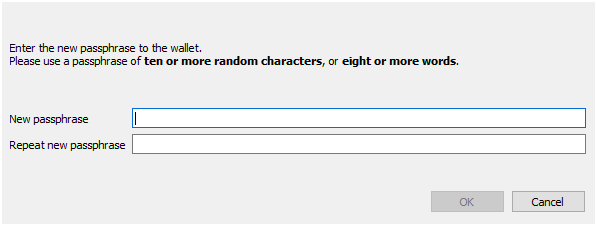
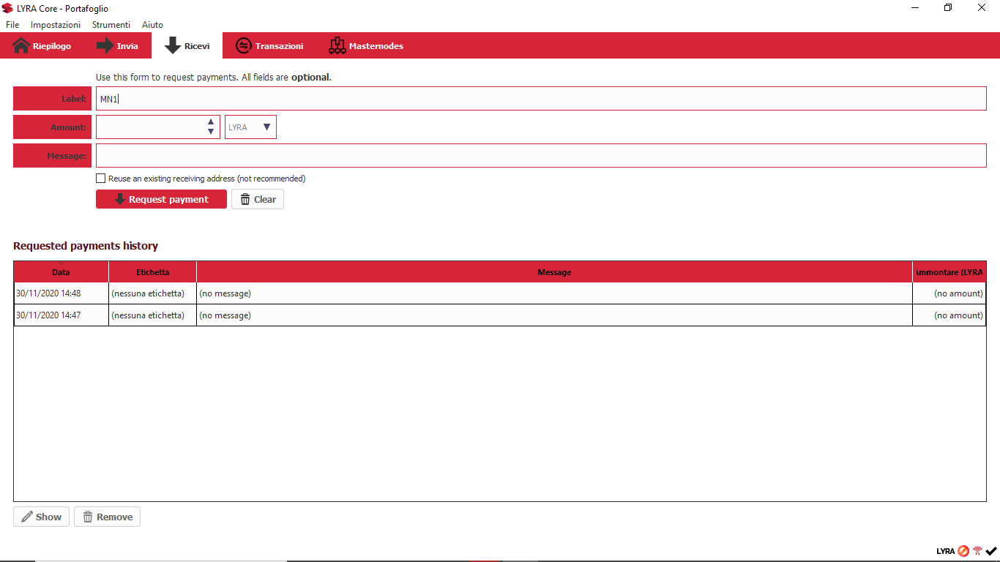
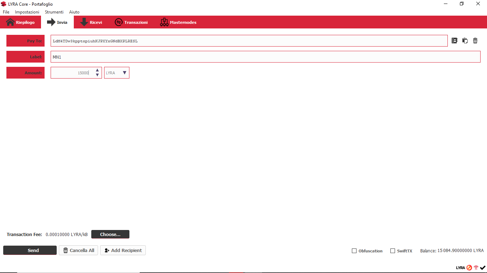
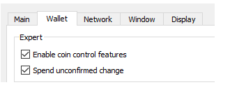
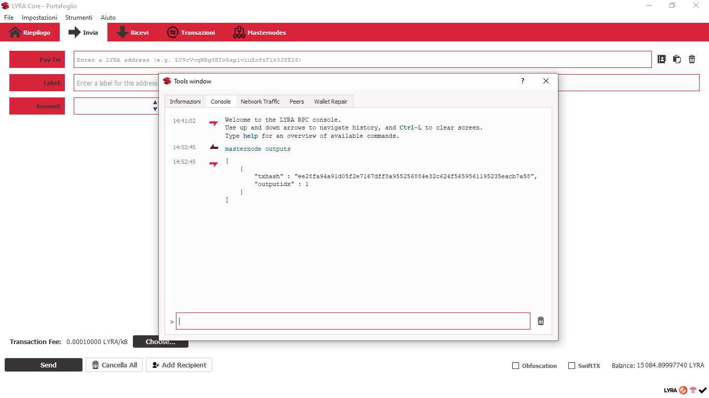
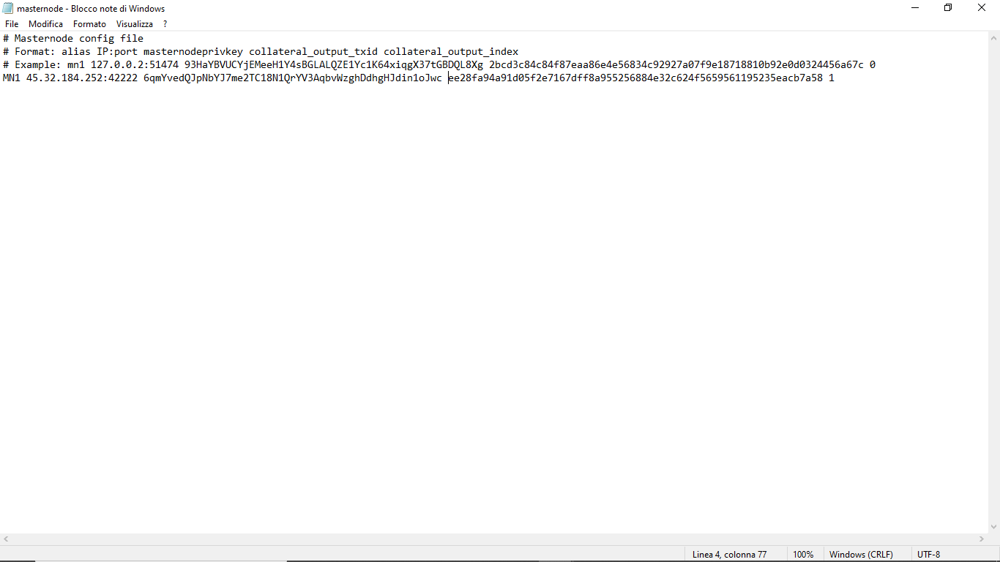
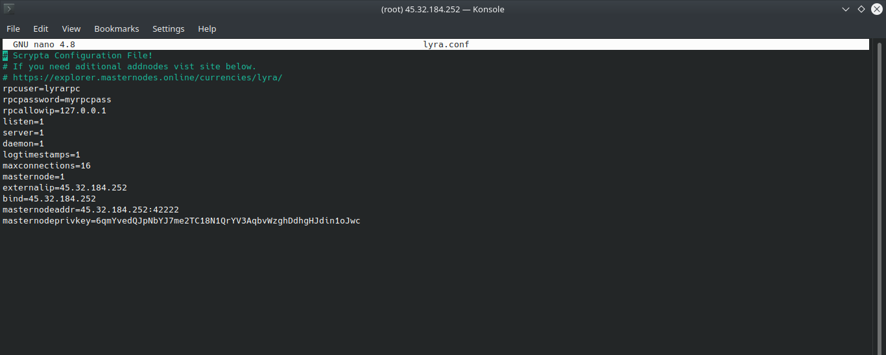
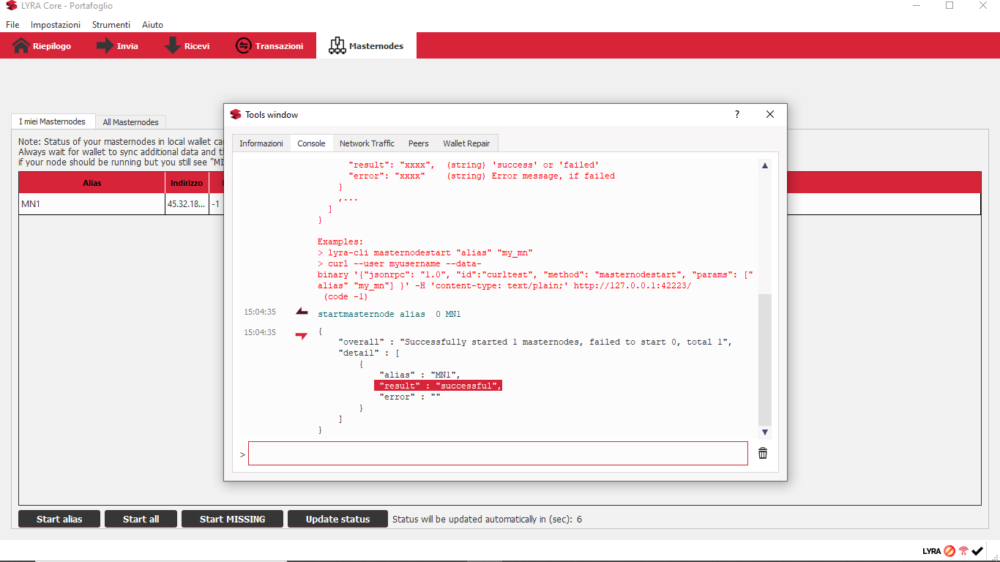
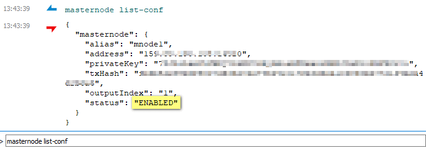
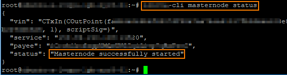

# Installazione Manuale

## Desktop Wallet Setup

### Requisiti

Assicurati di avere l'ultima versione del [LYRA Wallet](../wallet/fullnode.md).

Per sviluppare un Masternode avrai bisogno collateral necessario di **15000 LYRA** (preferibilmente qualcosa in più, al fine di coprire le spese di commissione del network che verranno addebitate quando effettuerai la transazione verso l'indirizzo masternode.

### **Step 1: Cifratura e Backup del wallet**

Se non l'hai già fatto, assicurati di crittografare il tuo desktop wallet. 

Vai su *Settings > Encrypt Wallet*.




::: tip NOTA

Il file wallet.dat rappresenta il tuo portafogli elettronico ed è adesso crittografato; la password rappresenterà un ulteriore livello di sicurezza.
:::

::: warning ATTENZIONE
Si consiglia di effettuare un backup del wallet su un'unità fisica o pen drive separata.
:::

::: warning
 Nessuno può aiutarti se perdi la password!
Per favore, non dimenticarla! 
:::

### **Step 2: Genera una masternode genkey e deposita 15000 LYRA sul tuo indirizzo masternode**

Nel tuo desktop wallet, clicca su *Help > Debug Console* e digita le seguenti istruzioni:

`masternode genkey`

Questo comando genera la **masternode genkey**.
Copiala su un qualsiasi file di testo (Notepad o txt file). 

Adesso inserisci:

`getnewaddress MN1`

 oppure dalla tab "Ricevi" del wallet:



Questa istruzione genera l'**indirizzo di deposito del masternode** a cui inviare le 15000 LYRA. Appunta anche questo sul file di testo. Se hai masternode multipli, puoi anche geneare più indirizzi e più genkey per ognuno di essi.

`masternode genkey`

`getnewaddress MN2`

`masternode genkey`

`getnewaddress MN3`

E così via.

Ora invia **ESATTAMENTE 15000 LYRA**,  in una singola transazione, all'indirizzo di deposito generato. Deve essere in un'unica transazione! Non sottrarre alcuna fee dall'importo.



::: warning ATTENZIONE
Non è consigliabile inviare direttamente il collateral all'indirizzo masternode da un exchange  in quanto potrebbero essere detrarre determinate commissioni di prelievo con conseguente trasferimento di ammontare inferiore a15000 LYRA.
:::

Dovrai attendere alcune conferme (circa mezz'ora) affinché questa transazione sia valida come deposito masternode (**sono necessarie 21 conferme**).

> Ma possiamo procedere con gli altri passaggi nel frattempo!

**Note speciali per chi sta creando più di un masternode:**

Se stai sviluppando più di un masternode, è necessario prestare particolare attenzione per assicurarti di creare correttamente i depositi. Non devi intaccare il precedente deposito di LYRA 15000 LYRA che hai appena effettuato per il masternode precedente.

Per fare ciò, sul tuo wallet desktop attiva il "**coin control**" : vai su *Settings > Options > Wallet* e clicca su *Enable coin control features*. Ciò consentirà un controllo accurato sui fondi (utxo) da usare per effettuare il tuo prossimo deposito di 15000 LYRA.



Quindi vai alla scheda *Send* , e vedrai le funzioni di controllo delle monete.

Clicca su *Inputs*. Dovresti vedere qui il tuo deposito di 15000 LYRA. Click destro e scegli *Lock Unspent*. Ciò significa che quando effettuerai il tuo nuovo deposito, il tuo wallet non toccherà questi fondi.

Una volta fatto questo, puoi effettuare il prossimo deposito di 15000 LYRA per il tuo prossimo masternode. 

Ripeti questo passaggio per ogni nuovo masternode che vuoi creare.

::: tip NOTA
Puoi anche verificare quali depositi sono elegibili per rappresentare un masternode: dalla consolle di debug Help > Debug Window , digita l'istruzione: masternode outputs verranno visualizzate le transazioni masternode valide.
:::

### **Step 3: TXIn / TXOut**

Ora dobbiamo individuare l'ID della transazione del tuo deposito masternode. Per fare questo, sul  desktop locale vai su *Help > Debug Window* e scrivi:

`masternode outputs`

Riceverai una risposta simile:

`{ "d6fd38868bb8f9958e34d5155437d009b72dfd33fc28874c87fd42e51c0f74fdb" : "0", }`

La prima parte è l'ID (**TXID**) della transazione e il secondo numero (in genere 0 o 1) è l'indice **TXOUT**. 



Ora hai tutte le informazioni necessarie per procedere con lo sviluppo del Masternode:

*Masternode Name* (a tua scelta)

*Masternode Genkey*

*Masternode TXIn*

*Masternode TXOut*

**Nota**: al termine dello sviluppo di masternode sul lato VPS, sarà necessario inserire una stringa di testo nel file masternode.conf che si trova nella cartella LYRA. 

Per chiarire le cose, mostriamo un esempio inventato di come appare una stringa del file masternode.conf. Questo esempio mostra due masternodes Scrypta.

```
MN1 128.22.10.54:42222 6gfTyhsXpX3dZcU7CoiFuFWqeHYw83r28btCFfIHqf6zkMp1PZ4 67hY6G68bb8f9958e34d5155437d009b72dfd33fc28874c87fd42e51c0kjy7ehjh 0

MN2 48.33.100.21:42222 6THBgtDSDkmQmXX5i2rG7BUQFt8YeEfsNE6CDyjefFX2ZjgLEcJ c98Jihyb9tgb75d9a7d0b2e86fb26e208095a9995eff5e169a4e2e047226197654 0
```

Dopo aver inserito i dettagli necessari, **salva** il file *masternode.conf* e **riavvia** il tuo wallet in modo da rendere effettive le nuove impostazioni.



::: tip Nota per masternode multipli 
Se si sta creando più di un masternode, il comando *masternode outputs* restituirà diversi hash e indici di transazione. Basta adesso determinare quale è la nuova transazione confrontandola con il tuo *masternode.conf* e verificando che non sia presente in esso. Quindi aggiungi i dettagli corrispondenti per il nuovo masternode.
:::

::: warning ATTENZIONE
Ricorda di riavviare il tuo wallet ogni volta che modifichi il file masternode.conf.
:::

## VPS Setup
Utilizzare un servizio **VPS** (Virtual Private Server) è la scelta ideale per gestire un masternode poichè garantisce una connessione persistente e una macchina performante. Esistono molti provider che offrono questo servizio. Noi consigliamo di utilizzare [Vultr](https://www.vultr.com/).

**Creare una chiave SSH**

::: tip NOTA
Le chiavi **SSH** (Secure Socket Shell) consentono l'accesso sicuro a un host remoto. E' modalità consigliate per accedere al tuo VPS e sarà necessaria per seguire il tutorial. Si prega di creare una chiave SSH prima di procedere.
:::

Per l'impostazione di una chiave SSH si consiglia di seguire la [guida ufficiale di Vultr​](https://www.vultr.com/docs/how-do-i-generate-ssh-keys)

Crea un account su Vultr  e sviluppa un Cloud Server
l primo passo è registrarsi su Vultr. Puoi usare il nostro "referral link": 

[Referral Link](https://www.vultr.com/?ref=7651545)

>Questo ci aiuta al mantenimento di nodi attivi per testnet e altri scopi tecnici e di sviluppo.

Dopo aver creato il tuo account e aggiunto un metodo di pagamento valido, puoi iniziare a configurare il tuo server VPS:

1. Scegli una Server Location (la posizione più vicina a te  è la scelta suggerita). 

2. Su Server Type , seleziona Ubuntu 16.04 x64. 

3. Seleziona la dimensione del server, ti consigliamo di scegliere VPS da $ 5/mo con 1CPU e 1024 MB di memoria. 

4. Aggiungi la tua chiave SSH. 

5. Passa alla sezione 7 e imposta a tua scelta un nome per il server Hostname & Label. 

6. Fai clic su Deploy Now.


### STEP #1
**Installazione delle Librerie**

Per prima cosa dobbiamo accedere al nostro VPS e configurare lo spazio di swap, al fine di aumentare la memoria virtuale per compilare correttamente il codice sorgente su una macchina a bassa RAM. 

Dopo aver effettuato l'accesso, esegui i seguenti comandi come utente root:

```
fallocate -l 3G /swapfile
chmod 600 /swapfile
mkswap /swapfile
swapon /swapfile
echo -e "/swapfile none swap sw 0 0 \n" >> /etc/fstab
```

### STEP #2
**Installazione Lyra Daemon**

Utilizza adesso i comandi seguenti per procedere con il download e l'avvio del Lyra Daemon:

```
wget https://github.com/scryptachain/scrypta/releases/download/2.0.1/lyra-2.0.1-linux-complete.zip
unzip lyra-2.0.1-linux-complete.zip
chmod 777 lyrad
chmod 777 lyra-cli
mv ./lyrad /usr/bin/lyrad
mv ./lyra-cli /usr/bin/lyra-cli
rm lyra-qt
rm lyra-2.0.1-linux-complete.zip
lyrad &
```

Da questo momento potrai avviare `lyrad` da qualsiasi cartella come ogni altro programma e potrai interagirvi usando il `lyra-cli` sempre da qualsiasi cartella.

### STEP #3
Quando avvierari il wallet per la prima volta, verra creata la [data directory](../wallet/fullnode.md#directory-dei-dati) lyra , essa contiene i blocchi della catena, il file di configurazione *lyra .conf* ed altri file necessari al funzionamento. Poiché il file *lyra.conf* non è stato ancora impostato, probabilmente riceverai il seguente messaggio:
```
Error: To use lyra, or the -server option to lyra-qt, you must set an rpcpassword in the configuration file: /root/.lyra/lyra.conf
```

Procedi adesso con il prossimo passaggio per impostare il file di configurazione.

### STEP #4
Di seguito le istruzioni per navigare fino alla data directory lyra e impostare correttamente il file di configurazione con i dati necessari al funzionamento del masternode:
```
cd ~/.lyra
sudo nano lyra.conf
```
Adesso **inserisci** le seguenti informazioni e **salva**:
```
rpcuser=YOUR_USERNAME
rpcpassword=YOUR_PASSWORD
rpcallowip=127.0.0.1
listen=1
server=1
daemon=1
logtimestamps=1
maxconnections=64
masternode=1
externalip=YOUR_VPS_IP
bind=YOUR_VPS_IP
masternodeaddr=YOUR_VPS_IP:42222
masternodeprivkey=YOUR_MASTERNODE_KEY
```
Salva con **Ctrl + X**, conferma con **Y** e premi **Invio**.



### STEP #5
Lancia il daemon e avvia il tuo masternode. Inserisci le seguenti istruzioni:
```
lyrad &
```

Ora è il momento di attendere una sincronizzazione completa dei dati blockchain. Puoi controllare lo stato con il seguente comando:
```
lyra-cli getinfo
```
Soffermati sulla voce  "*blocks*" :  e metti a confronto i blocchi raggiunti dal tuo nodo con quelli del [block explorer](https://explorer.scryptachain.org/) ufficiale.

::: warning ATTENZIONE
È necessaria una sincronizzazione completa per avviare correttamente il tuo masternode, potrebbe essere necessario del tempo per scaricare tutti i dati della blockchain.
Assicurarsi che il wallet online e il wallet locale abbiano la stessa versione e protocollo. Ad esempio: 
"version" : 2000100
"protocolversion" : 70922
:::

Quando la sincronizzazione è completa, puoi procedere con l'avvio del masternode e il controllo dello stato, operazioni che verranno illustrate nel prossimo paragrafo.

## Avvio del Masternode e controllo dello stato
### Masternode Configuration File

Adesso è il momento di tornare al Lyra Desktop Wallet, avvialo (se spento) e clicca su:

*‘Tools’->  ‘Open Masternode Configuration File’.*

::: tip NOTA 
Abbiamo affrontato questo argomento nella sezione chiamata Desktop Wallet Setup se hai già configurato il file *masternode.conf*,puoi procedere oltre.
:::

Adesso dovrai inserire le informazioni seguennti nel file ‘Masternode Configuration’


**MN Label**:  Scegli un nome per il tuo masternode.

**VPS IP:Port**: indirizzo **IP** dell tuo VPS e port **42222**.

**Masternode genkey**: Masternode Genkey  (quella che abbiamo precedentemente generato: Desktop Wallet Setup).

**TX ID**:  il numero didentificativo della tua transazione verso l'indirizzo masternode (consulta Desktop Wallet Setup).

**TX OUT:** OutputIndex della transazione> (consulta: Desktop Wallet Setup)

**Esempio**:
```
lyra_mn01 199.247.28.77:42222 6rPBVJLZ7837WFRutKuZTZmbFq6USZG3rHCTTPosJuXg4DpiyQ3 525901f650f28c83b4b2df449ea4a738e0627bf151734e62fb30bd56de01cf21 0
```
Inserita la stringa, **salva** il file, **chiudi il wallet  e riavvialo** per rendere effettive le modifiche apportate.

### Masternode Start
Dopo aver riavviato il wallet, apri la console di debug e scrivi il seguente comando:

```
startmasternode alias 0 MN1
```
dove MN1 è l'etichetta (label) che hai scelto per il tuo masternode



Adesso il tuo masternode dovrebbe essere attivo (*enabled*)!


### Controllo dello stato

**Sul desktop wallet**, apri la consolle di debug: `Tools >> Debug console` e digita:
``` 
masternode list-conf 
```

Ti apparirà lo stato dei tuoi masternode, *txHash*, *masternode genkey* e l'*indirizzo*. 

Se lo "status" è su *ENABLED*, il masternode è correttamente attivo e connesso. Ma segui per scrupolo i passaggi aggiuntivi sul wallet VPS.



**Sul wallet VPS**, effettua il Login sul tuo server VPS digita la seguente istruzione:
```
lyra-cli masternode status. 
```
La risposta di corretto funzionamento del masternode sarà: “*Masternode successfully started*”.


