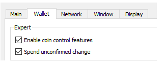
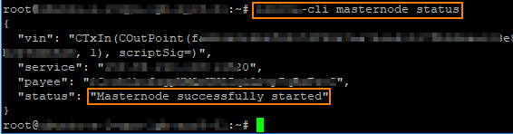

# Manual installation

## Desktop Wallet Setup

### Requirements

Make sure you have the latest version of the [LYRA Wallet](../scrypta-full-node/installazione.md).

To develop a Masternode you will need the necessary collateral of **15000 LYRA** (better to have something more, in order to cover the commission costs of the network that will be charged when you make the transaction to the masternode address).

### **Step 1: Wallet encryption and backup**

If you haven't done so already, be sure to encrypt your desktop wallet.

Go to *Settings > Encrypt Wallet*.


::: tip NOTE

The wallet.dat file represents your electronic wallet which is now encrypted; the password will represent an additional level of security.
:::

::: warning WARNING
We recommend backing up the wallet to a separate physical or pen drive.
:::

::: warning
 Nobody can help you if you lose your password!
Be careful, don't forget it!
:::

### **Step 2: Generate a genkey masternode and deposit 15000 LYRA on your masternode address**

In your desktop wallet, click on *Help > Debug Console* and type the following instructions:

`masternode genkey`

This command generates the **masternode genkey**.
Copy it to any text file (Notepad or txt file). 

Now enter

`getnewaddress`

This instruction generates the **masternode storage address** to which the 15000 LYRAs should be sent. Also write this on the text file. If you have multiple masternodes, you can also generate multiple addresses and multiple genkeys for each one.

`masternode genkey`

`getnewaddress MN2`

`masternode genkey`

`getnewaddress MN3`

And so on.

Now send **EXACTLY 15000 LYRA**, in a single transaction, to the generated deposit address. It must be in one transaction! Do not subtract any fees from the amount.


::: warning WARNING
It is not advisable to send the collateral directly to the masternode from an exchange, as certain withdrawal fees may be deducted resulting in a transfer of less than 15,000 LYRA.
:::

You will have to wait for some confirmations (about half an hour) for this transaction to be valid as a masternode deposit (**21 confirmations are required**).

> But we can proceed with the other steps in the meantime!

**Additional indications for those who are creating more than one masternode:**

If you are developing more than one masternode you need to be especially careful to make sure you create the deposits correctly. You don't have to dent the previous LYRA 15000 LYRA deposit that you just made for the previous masternode.

To do this, activate the "**coin control**" on your desktop wallet: go to *Settings> Options> Wallet* and click on * Enable coin control features *. This will allow for an accurate check on the funds (utxo) to be used to make your next 15000 LYRA deposit.



Then go to the *Send* tab, and you will see the coin checking functions.

Click on *Inputs*. Here you should see your 15000 LYRA deposit. Right click and choose * Lock Unspent *. This means that when you make your new deposit your wallet will not touch these funds.

Once this is done, you can make the next 15000 LYRA deposit for your next masternode.

Repeat this step for each new masternode you want to create.

::: tip NOTE
You can also check which deposits are eligible to represent a masternode: from the debug console Help> Debug Window, type the instruction: masternode outputs valid masternode transactions will be displayed.
:::

### **Step 3: TXIn / TXOut**

Now we need to find the transaction ID of your masternode deposit. To do this, on the local desktop go to *Help> Debug Window* and write:

`masternode outputs`

You will receive a similar response:

`{ "d6fd38868bb8f9958e34d5155437d009b72dfd33fc28874c87fd42e51c0f74fdb" : "0", }`

The first part is the ID(**TXID**) of the transaction and the second number (typically 0 or 1) is the index **TXOUT**. 

Now you have all the necessary information to proceed with the development of the Masternode:

*Masternode Name* (of your choice)

*Masternode Genkey*

*Masternode TXIn*

*Masternode TXOut*

**NotE**: at the end of the development of masternode on the VPS side it will be necessary to insert a text string in the masternode.conf file which is located in the LYRA folder.

To clarify the matter, we show an example string from the masternode.conf file. This example shows two Scrypta masternodes.

```
MN1 128.22.10.54:42222 6gfTyhsXpX3dZcU7CoiFuFWqeHYw83r28btCFfIHqf6zkMp1PZ4 67hY6G68bb8f9958e34d5155437d009b72dfd33fc28874c87fd42e51c0kjy7ehjh 0

MN2 48.33.100.21:42222 6THBgtDSDkmQmXX5i2rG7BUQFt8YeEfsNE6CDyjefFX2ZjgLEcJ c98Jihyb9tgb75d9a7d0b2e86fb26e208095a9995eff5e169a4e2e047226197654 0
```

After entering the necessary details, **save** the *masternode.conf* file and **restart** your wallet in order for the new settings to take effect.

::: tip Note for multiple masternodes
If you are creating more than one masternode the *masternode outputs* command will return different hashes and transaction indices. It is now necessary to determine what the new transaction is by comparing it with your *masternode.conf* and checking that it is not present in it. Then add the corresponding details for the new masternode.
:::

::: warning WARNING
Remember to restart your wallet every time you edit the masternode.conf file.
:::

## VPS Setup
Using a **VPS** service (Virtual Private Server) is the ideal choice to manage a masternode as it guarantees a persistent connection and a performing machine. There are many providers that offer this service. We recommend using [Vultr](https://www.vultr.com/).

**Create an SSH key**

::: tip NOTE
**SSH** Keys (Secure Socket Shell) allow secure access to a remote host. It is the recommended way to access your VPS and it will be necessary to follow the tutorial. Please create an SSH key before proceeding.
:::

For the setting of an SSH key it is recommended to follow the [official guide of Vultr](https://www.vultr.com/docs/how-do-i-generate-ssh-keys)

Create an account on Vultr and start a Cloud Server
The first step is to register on Vultr. You can use our "referral link":

[Referral Link](https://www.vultr.com/?ref=7651545)

>This is intended to support the maintenance of active nodes for testnet and other technical and development purposes.

After creating your account and adding a valid payment method you can start setting up your VPS server:

1. Choose a Server Location (we suggest choosing the location closest to you).

2. On Server Type, select Ubuntu 16.04 x64. 

3. Select the server size, we recommend choosing $ 5 / mo VPS with 1CPU and 1024 MB of memory.

4. Add your SSH key.

5. Proceed to section 7 and set a name of your choice for the Hostname & Label server.

6. Click on Deploy Now.


### STEP #1
**Installation of Libraries**

First we need to access our VPS and configure the swap space, in order to increase the virtual memory to correctly compile the source code on a low RAM machine.

After logging in, run the following commands as the root user:

```
fallocate -l 3G /swapfile
chmod 600 /swapfile
mkswap /swapfile
swapon /swapfile
echo -e "/swapfile none swap sw 0 0 \n" >> /etc/fstab
```

### STEP #2
Now we have to install the dependencies by entering the following instructions:

```
sudo add-apt-repository -y ppa:bitcoin/bitcoin
sudo apt-get install -y software-properties-common python-software-properties
sudo apt-get update
sudo apt-get install -y pkg-config
sudo apt-get -y install build-essential autoconf automake libboost-all-dev libleveldb-dev libgmp-dev libgmp3-dev libssl-dev libcurl4-openssl-dev libcrypto++-dev libqrencode-dev libminiupnpc-dev autogen libtool git libevent-dev libprotobuf-dev
sudo apt-get install -y curl g++ git-core pkg-config libtool fak
```
### STEP #3
Now compule database Berkely DB v4.8:
```
sudo apt-get install libdb4.8-dev libdb4.8++-dev -y
```
### STEP #4
**Lyra Daemon install**

Now use the following commands to proceed with the compilation and startup of the Lyra Daemon:

```
git clone https://github.com/scryptachain/scrypta
cd scrypta
./autogen.sh
./configure
sudo make
cd src
chmod 777 -R *
./lyrad &
```
::: warning NOTE
With Ubuntu 18.04 LTS, after the `./Configure` command, you may run into this error:

`configure: error: Detected LibreSSL: This is NOT supported, and may break consensus compatibility!`

You will solve the problem by installing the * ssl library v1.0 * with the following command:

`apt-get install libssl1.0-dev`

Continue by entering the command `./autogen.sh`.
:::

### STEP #5
When you start the wallet for the first time, the [data directory](../scrypta-full-node/data-directory.md) will be created. It contains the blocks of the chain, the configuration file *lyra.conf* and other files necessary for operation. Since the *lyra.conf* file has not been set up yet, you will probably receive the following message:
```
Error: To use lyra, or the -server option to lyra-qt, you must set an rpcpassword in the configuration file: /root/.lyra/lyra.conf
```

Proceed now to the next step to set up the configuration file.

### STEP #6
Here are the instructions to move to the lyra data directory and correctly set the configuration file with the data necessary for the operation of the masternode:
```
cd
cd .lyra
sudo nano lyra.conf
```
Now **enter** following texts and **save**:
```
rpcuser=YOUR_USERNAME
rpcpassword=YOUR_PASSWORD
rpcallowip=127.0.0.1
listen=1
server=1
daemon=1
logtimestamps=1
maxconnections=64
masternode=1
externalip=YOUR_VPS_IP
bind=YOUR_VPS_IP
masternodeaddr=YOUR_VPS_IP:42222
masternodeprivkey=YOUR_MASTERNODE_KEY
```
Save it with **Ctrl + X**, confirm with **Y** and click **Enter**.

### STEP #7
Go back to lyra's *src* folder, run the daemon and start your masternode. Enter the following instructions:
```
cd
cd scrypta/src
./lyrad &
```

Now we have to wait for the complete synchronization of the blockchain data. You can check the status with the following command:
```
./lyra-cli getinfo
```
Focus on the item "*blocks*": and compare the blocks reached by your node with those of the official [block explorer](https://explorer.scryptachain.org/).

::: warning WARNING
Full synchronization is required to properly start your masternode, it may take some time to download all blockchain data.
:::
When synchronization is complete, you can proceed with starting the masternode and checking the status. These operations will be illustrated in the next paragraph.


## Starting the Masternode and checking the status
### Masternode Configuration File

Now is the time to go back to the Lyra Desktop Wallet, start it (if off) and click on:

*‘Tools’->  ‘Open Masternode Configuration File’.*

::: tip NOTE
We covered this topic in the section called "Desktop Wallet Setup". If you have already configured the *masternode.conf* file, you can proceed further.
:::

Now you will need to enter the following information in the 'Masternode Configuration' file

**MN Label**:  Choose a name for your masternode.

**VPS IP:Port**: Address **IP** of your VPS and port **42222**.

**Masternode genkey**: Masternode Genkey (the one we previously generated in the Desktop Wallet Setup).

**TX ID**: the identification number of your transaction to the masternode address (see Desktop Wallet Setup).

**TX OUT:** Transaction OutputIndex> (see: Desktop Wallet Setup).

**Example**:
```
lyra_mn01 199.247.28.77:42222 6rPBVJLZ7837WFRutKuZTZmbFq6USZG3rHCTTPosJuXg4DpiyQ3 525901f650f28c83b4b2df449ea4a738e0627bf151734e62fb30bd56de01cf21 0
```
Insert the string, **save** the file, ** close the wallet and restart it ** to make the changes effective.

### Masternode Start

After restarting the wallet, go to the masternode section by clicking on *Your Masternodes*. Select your Masternode and click on * Start Alias *.

Now your masternode should be active (*enabled*).

If you want to start multiple masternodes simultaneously, you can use the *Start All* command in the * masternode * section.

### Status check

**On the desktop wallet** open the debug console: `Tools>>Debug console` and type:
``` 
masternode list-conf 
```

You will see the status of your masternodes, *txHash*, *masternode genkey* and the *address*.

If the "status" is on *ENABLED*, the masternode is correctly active and connected. But scrupulously follow the additional steps on the VPS wallet.


**On the VPS wallet** Login on your VPS server, navigate to the folder where the daemon and the lyra client reside:
```
cd
cd scrypta/src
```
Type the following statement:
```
./lyra-cli masternode status. 
```
The correct response of the masternode will be: “*Masternode successfully started*”.

