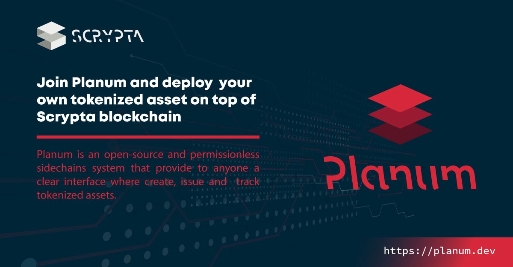

# Planum 
## Overview
Planume is an open-source and permissionless Sidechain Layer that allows you to create, issue and track tokenized resources through a clear interface available to anyone.

"Planum", accessible via the link https://planum.dev is a layer parallel to the Scrypta blockchain that allows you to issue your own tokenized resource, store it, manage it and protect it using the same IdANode Scrypta blockchain network.
Any "tokenized asset", once generated with its own metrics, has its independent life cycle in a protected sidechain level, which operates through the Scrypta blockchain, and which in the future can be exchanged with LYRA and all other tokens .

## What is "Tokenization"

The tokenization process is to connect real world resources to the blockchain, converting them into digital resources and providing a verifiable and certain property.
In a very simple way, we can digitize and convert anything into a supply of digital resources through the "tokenization" process. In doing so, the physical good, once symbolized, becomes "fungible" and can be electronically transferred, fractionated, stored or exchanged between different identities.

To date, high-value investments such as real estate, works of art such as collectibles or other types of goods that represent economic value, due to different types of restrictions, are often inaccessible to many investors.
Blockchain tokenization solves this problem, lowering investment barriers and favoring the introduction of new financial capital in the sector of interest.
Just to name a few, the most relevant application fields could be:

- Real estate investment market
- Membership and subscription systems
- Gaming industries
- Fintech
- Online ticket office
- Payment systems networks
- Tokenization of sports teams and franchises
- Issue of non-fungible tokens.

The tokenization process also reduces territorial barriers, eliminates the need for intermediaries, lowering the investment risk and improves the liquidity of tangible and intangible assets.

