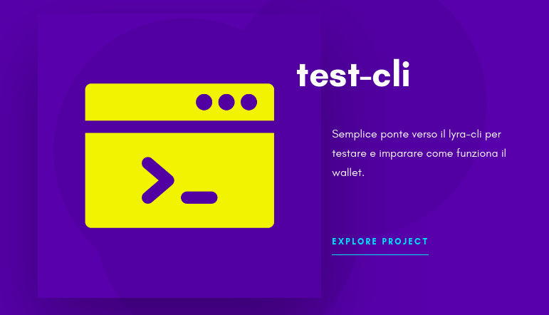

# Command List

The wallet commands listed here allow you to perform operations with the LYRA RPC client. On the desktop wallet you can use these commands from the [***Debug Console***](../scrypta-full-node/console.md) (*Tools menu*).

::: tip
In the client version it is necessary to indicate `./lyra-cli` before the commands.
:::

## Test-CLI

You can test the wallet commands through the console of the test-CLI tool, reachable here:

[**test-CLI**](https://cli.scryptachain.org/)

## Blockchain instructions
`getbestblockhash` Provides the latest/best hash block on the network.

`getblock <hash>` Specifying a specific block hash with this command will produce a response with all the details of the requested block.

`getblockchaininfo` Returns all information about the current blockchain.

`getblockcount` Returns the current number of synchronized blocks.

`getblockhash <index>` Returns the hash of the block at a specified index.

> For example `getblockhash 10000` will return `3f18205d5884fdcbf95f2adc7a933b28fd6ec4a474b7dffb41c7a2733d0c4c2d`

`getblockheader <hash>` Provides the header of the specified hash.

> Example: 
 `getblockheader 3f18205d5884fdcbf95f2adc7a933b28fd6ec4a474b7dffb41c7a2733d0c4c2d`

> Reply:
`
{
    "version" : 3,
    "previousblockhash" : "8614cb01c9c97c7424e2ada9ca726700804feedb80e7a730676752e8ea1e7be2",
    "merkleroot" : "bcb013dc62d59f01baca55f1d264e7b0574ce45821e44dbd1b52758657a09947",
    "time" : 1545994896,
    "bits" : "1c051271",
    "nonce" : 0
}
`

`getchaintips` Returns tips on network branches from all branches known by the node.

`getdifficulty` Returns the current difficulty in finding a hash below a certain target.

`getrawmempool` Returns the current mempool array.

`gettxout <txid>` Returns details about an output of the unspent transaction.

`gettxoutsetinfo` Returns database statistics of unspent transaction outputs managed by the node.

`verifychain` Returns the true or false value based on the validity of the blockchain hosted by the node.

## Control instructions

`getinfo` Returns general information about the blockchain.

`help` List of all commands.

`stop` Stop the software.

## Masternode instructions

`masternode "command"...` 

Set of commands to perform operations related to the masternodes.

### masternode commands

`count`            - Returns the number of all masternodes detected by the network (optional terms: 'ps', 'enabled', 'all', 'qualify').

`current`          - Returns information about the current winning masternode to be paid to the next block (calculated locally).

`genkey`           - Generate a new masternodeprivkey.

`outputs`          - Print compatible outputs for masternode.

`start-alias`      - Start a single remote masternode via the assigned alias configured in *masternode.conf*.

`start-<mode>`     - Start a single remote masternode via the assigned alias configured in masternode.conf (mode: 'all', 'missing', 'disabled').

`status`           - Returns the status information of the masternode.

`list`             - Returns a list of all known masternodes (see masternodelist for more information).

`list-conf`        - Returns the masternode.conf in JSON format.

`masternodelist ( "mode" "filter" )`     Get a list of masternodes in different ways.

## Network instructions
`addnode <node_ip> <add|remove|onetry>` Manually connect to a peer using the counterparty's IP address.

`getconnectioncount` Returns the number of peer-to-peer connections of the node.

`getnettotals` Returns the total of bytes received and sent, as well as the uptime in milliseconds.

`getnetworkinfo` Returns statistical information about the network.

`getpeerinfo` Returns an array of statistical information related to connected peers.

`ping` Requires that a ping be sent to all other nodes to measure the ping time.

::: tip Note
The results provided by getpeerinfo, pingtime are in tenths of a second.
:::

## Instructions for Raw Transactions
`createrawtransaction [{"txid":"id","vout":n},...] {"address":amount,"data":"hex",...} ( locktime )` Create a transaction by spending data inputs and creating new outputs. The outputs can be addresses or data. Returns the raw transaction with hexadecimal encoding. Transaction inputs are unsigned and not stored in the wallet or transmitted to the network.

`decoderawtransaction "hexstring"` Returns a JSON object representing the serialized transaction with hexadecimal encoding. decodescript "hex" decodes a hexadecimal encoded script.

`fundrawtransaction "hexstring"` Add input to a transaction until it has enough value to satisfy its value out. This will not modify existing inputs and will add a modification output to the outputs themselves.

`getrawtransaction "txid" ( verbose )` Returns the raw transaction data. If verbose = 0, returns a serialized string, with hexadecimal encoding for 'txid'. If verbose is nonzero, returns an object with information on 'txid'.

`sendrawtransaction "hexstring"` Sends the raw transaction (serialized, hexadecimal) to the local node and to the network. See also greatertransaction and signrawtransaction.

`signrawtransaction "hexstring" ( [{"txid":"id","vout":n,"scriptPubKey":"hex","redeemScript":"hex"},...] ["privatekey1",...] sighashtype )` Sign the inputs for the raw transaction (serialized, encoded in hexadecimal). The second argument, optional (can be null), is an output array of the previous transactions on which this transaction depends but which may not yet be transferred to the block chain. The third argument, optional (can be null), is an array of base58-encoded private keys which, if provided, will be the only keys used to sign the transaction.

## Wallet instructions

`addmultisigaddress nrequired ["key",...] ( "account" )`

Add a multisignature address to sign the wallet. Each key is a LYRA address or public key with hexadecimal coding. If you specify "account" (DEPRECATED), assign the address to that account.

`autocombinerewards <true/false> threshold`

the Wallet will automatically monitor any "packets" of coins (utxo) with a value lower than the threshold amount and will combine them (only if they reside on the same LYRA address).

`backupwallet "destination"`

Safely copy wallet.dat to the destination, which can be a directory or path with a file name.

`bip38decrypt "lyraaddress"`

Decode and import the password protected private key.

`dumpprivkey "lyraaddress"`

Reveal the private key corresponding to the "lyraaddress".

`dumpwallet "filename"`

Download all the keys of the wallet in a human-readable format.

`encryptwallet <passphrase>`

Encrypt the wallet with the chosen passphrase.

`getaccount "lyraaddress"`

Returns the account associated with the indicated address.

`getaccountaddress "account"`

Returns the current LYRA address to receive payments on this account. If this does not exist, a new associated address will be created and shown.

`getaddressesbyaccount "account"`

Returns the list of addresses for the specified account.

`getbalance ( "account" minconf includeWatchonly )`

If the [account] not specified, returns the total available balance of the server. If you [account] is indicated, it returns the balance to the account.

`getaddressesbyaccount "account"`

Return a new LYRA address to receive payments. If the [account] is indicated, payments received with the address will be credited to the [account].

`getaddressesbyaccount "account"`

Returns the list of addresses for the specified account.

`getbalance ( "account" minconf includeWatchonly )`

If the [account] is not indicated it will return the total available balance of the server. If the [account] is indicated, it will show the balance of the account.

`getnewaddress ( "account" )`

Return a new LYRA address to receive payments. Specifying the [account], payments received with the address will be credited to the [account].

`getrawchangeaddress`

Returns a new LYRA address for a change of reception. This is for use with Raw transactions, NOT with normal ones.

`getreceivedbyaccount "account" ( minconf )`

Returns the total amount received from the [account] addresses in transactions with at least [minconf] confirmations. If the [account] is not specified, all transactions from all accounts will be shown.

`getreceivedbyaddress "lyraaddress" ( minconf )`

Returns the amount received from incoming transactions with at least [minconf] confirmations. Addresses are always and only used to receive transactions. It only works for addresses in the local wallet, external addresses will always show 0.

`getstakesplitthreshold`

Returns the threshold at which packet division (utxo) is set in staking

`getstakingstatus`

returns a message containing detailed staking information.

`gettransaction "txid" ( includeWatchonly )`

Show detailed information about the specific transaction in the wallet.

`getunconfirmedbalance`

Returns the total unconfirmed balance of the server.

`getwalletinfo`

Returns a message containing various information about the state of the wallet.

`importaddress "address" ( "label" rescan )`

Add an address or script (in hexadecimal) that can be imported into your wallet in "watch" mode only, therefore monitored but not expendable.

`importprivkey "lyraprivkey" ( "label" rescan )`

Add a private key (as returned by dumpprivkey) to your Wallet.
This operation imports the address with all its Lyra Coin content.

`importwallet "filename"`

Import the keys (and their addresses) from a wallet dump file (see dumpwallet).

`keypoolrefill ( newsize )`

Fill the keypool.

`listaccounts ( minconf includeWatchonly )`

Show account names, keys, account balances.

`listaddressgroupings`

Returns all wallet addresses and information used for coincontrol.

`listlockunspent`

Returns a list of outputs temporarily set as non-expendable.

`listreceivedbyaccount ( minconf include empty includeWatchonly )`

Lists the account balance.

`listreceivedbyaddress ( minconf include empty includeWatchonly )`

Lists the balance of the receiving address

`listsinceblock ( "blockhash" target-confirmations includ Watchonly )`

Get all transactions in blocks, from block [blockhash].

`listtransactions ( "account" count from includeWatchonly )`

Returns the most recent transactions for [account]. If [account] not specified it will return recent transactions from all accounts.

`listunspent ( minconf maxconf  ["address",...] )`

Returns an output array of unspent transactions with confirmations between minconf and maxconf (included). Optionally, you can filter to include only txouts sent to specified addresses.

`lockunspent unlock [{"txid":"txid","vout":n},...]`

Updated list of outputs temporarily not expendable.

`move "fromaccount" "toaccount" amount ( minconf "comment" )`

Switch from one account in your Wallet to another.

`multisend <command>`

**MultiSend** allows users to automatically send a percentage of their rewards (staking or masternode) to desired addresses. The MultiSend transaction is sent when the coins have at least 60 confirmations (about 60 min.).

> ### Commands
> `print` - displays the current MultiSend vector.
> 
> `clear` - deletes the current MultiSend vector.
> 
> `enablestake/activatestake` - activates the current MultiSend vector to be activated on stake rewards.
> 
> `enablemasternode/activatemasternode` - activates the current MultiSend vector to be activated on masternode rewards
> 
> `disable/deactivate` - disables the current MultiSend vector.
> 
> `delete <Address #>` - deletes an address from the MultiSend vector.
> 
> `disable` - prevents a specific address from sending MultiSend transactions.
> 
> `enableall` - enables all addresses to be eligible to send MultiSend transactions.
> 
> If you have done previous configurations, you can check if you already have them and know their activity status with `multisend print`. If you've never used it, your message will look like this:
> `~ $ ./Lyra-cli multisend print
[
  {
    "MultiSendStake Activated?": false,
    "MultiSendMasternode Activated?": false
  },
  "MultiSend Addresses to Send To:",
  {
  }
]`

`sendfrom "fromaccount" "tolyraaddress" amount ( minconf "comment" "comment-to" )`

It is a real value, rounded to the second decimal place. He will send the indicated amount to the indicated address, using the [minconf] confirmations to verify that the account has a valid balance. Returns the transaction ID if successful (not in the JSON object).

`sendmany "fromaccount" {"address":amount,...} ( minconf "comment" )`

Send multiple times. Amounts are double precision floating point numbers.

`sendtoaddress "lyraaddress" amount ( "comment" "comment-to" )`

Send an amount to a specific address. It is a real value and is rounded to 8 decimal places. Returns the transaction ID on success.

`sendtoaddressix "lyraaddress" amount ( "comment" "comment-to" )`

Send an amount to a specific address using SwiftX. It corresponds to a real value and is rounded to 8 decimal places. Returns the transaction ID on success.

`setaccount "lyraaddress" "account"`

Set up the account associated with the indicated address. Assigning the address already assigned to the same account will create a new address associated with that account.

`setstakesplitthreshold <1 - 999,999>`

Automatic division of utxo: the size of the output of the packets (utxo) in stakes will be greater than the indicated value.

`settxfee amount`

Set the transaction fee per KB.

`signmessage "lyraaddress" "message"`

Sign a message with an address's private key.

`walletlock`

Removes the wallet encryption key from memory, locking the wallet.

`walletpassphrase "passphrase" timeout ( anonymizeonly )`

Stores the decoding key of the wallet in memory for "timeout" seconds.

`walletpassphrasechange "oldpassphrase" "newpassphrase"`

Change your wallet passphrase from "oldpassphrase" to "newpassphrase".