# Introduction to the QT Wallet

In this section we explain in more detail the Scrypta QT Wallet illustrating some of its functions in more detail.
Even if there are different types of wallets for cryptocurrencies, it is still important to understand the basics of operation since the operations that can be performed are roughly the same for all cryptocurrencies.

In this guide section we will analyze the setup of the wallet after the first start, the backup and the encryption of the wallet, the export of the single private keys or of the entire wallet, plus other additional operations.

### What is a QT wallet?
QT is a UI framework and a cross platform application for developers compiled using the C ++ programming language.
Most QT wallets are developed using this programming environment. These clients are available for the main operating systems.
QT wallets are clients that offer the full set of features to manage cryptocurrencies.
They are applications that require discrete amounts of disk space because, in order to work, they must download the entire copy of the blockchain on your computer on which you are running it.

## Scrypta Core Official Wallet
Regardless of what type of wallet is used, the first notion to understand is that the cryptocurrencies we own are not physically kept inside the wallet. Funds are stored in a distributed public register called a blockchain.
What provides access to the funds contained in a given address are the private keys of the address itself. Losing private keys will lose access to funds and, consequently, not having private keys means not having access to the funds that the wallet contains.

The Core Wallet keeps the private keys of the funds contained in each corresponding address. Each cryptocurrency has its own core wallet, so different blockchain wallets cannot communicate with each other as they are part of different peer-to-peer networks.

There are specific functions depending on the wallet and the cryptocurrency we are using. However, all the coins share most of the functions and their respective commands.

- Wallet Encryption
- Wallet Backup
- Private Send
- Instant Send
- Debug Console
- Address Book / QR code generation
- Staking Coins and Masternode Commands
- Sign and Verify Message
- Coin and fee control
- Dark Send
- Block Explorer

Before exploring these features, we will provide a brief description of the first wallet setup below.

## First installation Wallet Scrypta

First you need to download the Scrypta Official Wallet from the [Github repository](https://github.com/scryptachain/scrypta/releases).

Once the software is downloaded, start **Lyra-QT**. 
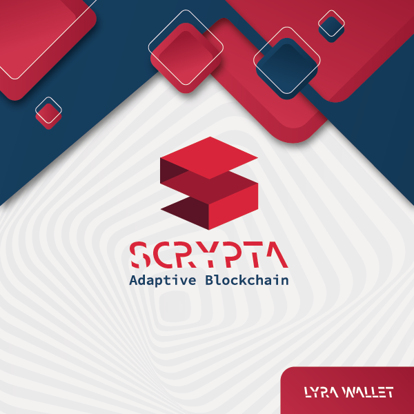.

For more information about the installation, you can visit this link:

[Installation](installation.md)

At the first start you will be asked to choose the location of the system files where to save your ** wallet.dat ** file and the copy of the blockchain.
Confirm the path proposed by the software or modify it at your choice and proceed.
  Just make sure you have enough space available on the hard disk.

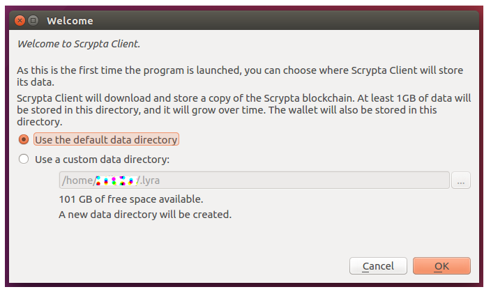

By default, the system folder can be found at the following locations (verify that hidden folders must be disabled):

**Linux:**
~/.lyra/

**MacOS:**
~/Library/Application Support/lyra/

**Windows:**
%APPDATA%\lyra

For further information on the data directory, you can consult the following section:

[Data Directory](data-directory.md)

### Synchronization with the Scrypta blockchain

After the startup process of the wallet is completed, the client will connect to the Scrypta peer-to peer network to start the synchronization of the blockchain by downloading an updated copy that will be saved in the previously defined system folder.

At the bottom of the software you will find a bar indicating the amount of data left to complete the sync.
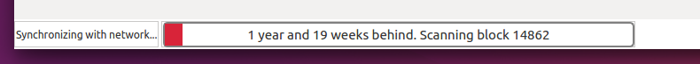
The wallet will be fully synchronized upon completion of the bar.

In the lower right part you will find these symbols
 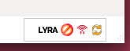
 which respectively indicate that:
- the wallet is not encrypted
- the wallet is connected to the other peers of the network
- the wallet is syncing with the blockchain.

In order to speed up the sync of the blockchain, we can use the ** bootstrap ** (a recently updated copy of the blockchain)
  Definitions and more in-depth details on the bootstrap files are provided in the [appropriate section](../scrypta-full-node/setup.html#bootstrap).

::: warning  
Since a lot of data will be downloaded, make sure you have enough space available on your hard disk to save the entire copy of the blockchain.
  The timing of completion of synchronization depends on the connection speed.
:::

Once the synchronization has been completed, as indicated by the symbol in the lower right corner, your client is connected to the blockchain and is ready to exchange transactions with other desktop/app clients of the Scrypta network and to carry out all the above operations indicated.
 

::: tip  
In the event that the wallet cannot connect to the list of nodes and synchronize, it will be possible to force it by manually adding a list of nodes in the **lyra.conf** file located in the system folder.
:::

To get an updated list of nodes, go to the blockexplorer and click on ["node list":](https://chainz.cryptoid.info/lyra/#!network).
 Copy the contents of the table and paste it into the **lyra.conf** file.
Save the file and restart the wallet. Synchronization should now start without further problems.

## Menu overview

### Main menu
This is the menu bar for the main wallet operations, as described below:
 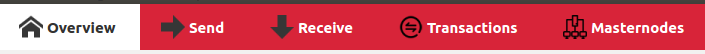
- **Overview:** the main dashboard with balance, recent transactions and the **obfuscation** function, which will be explored in the [following sections](../scrypta-full-node/setup.md##additional-features).
 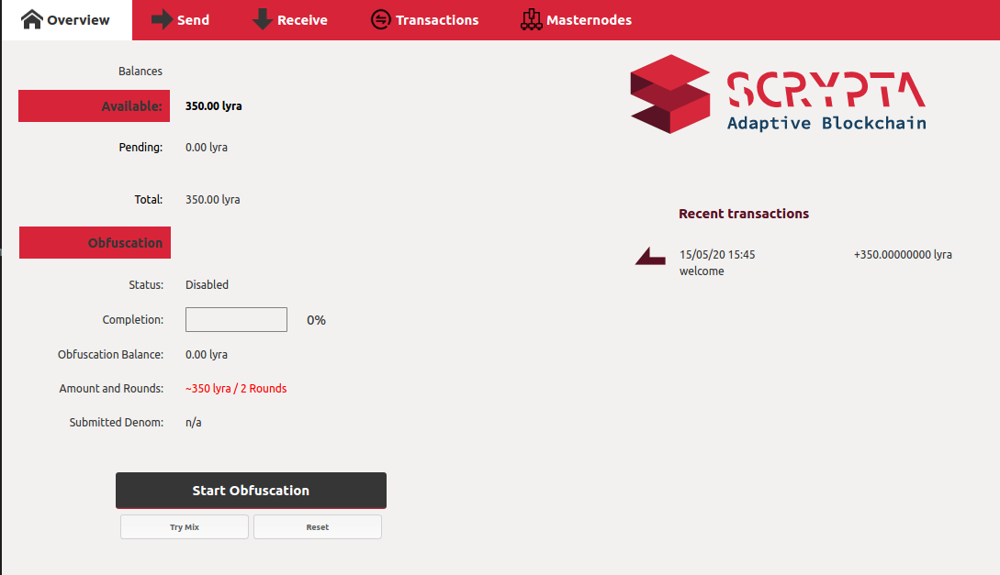
 

- **Send:** main functions for sending Lyra.
 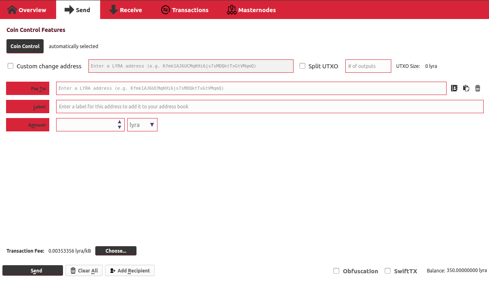
 

- **Receive:** advanced functions for receiving Lyra and organising payments.
 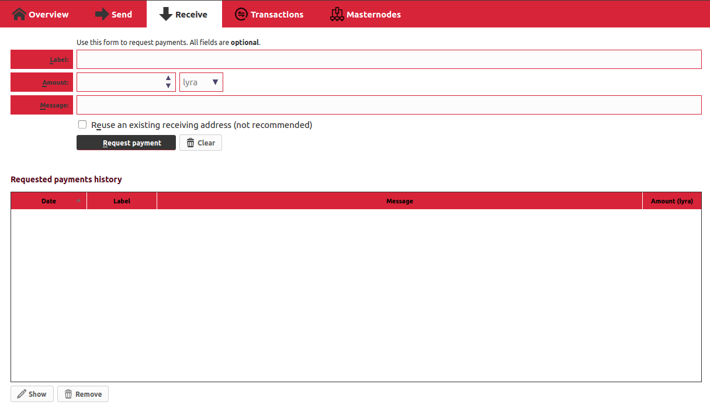
 

- **Transactions:** the complete log of all incoming and outgoing transactions of your wallet, including any rewards from masternodes and staking.
 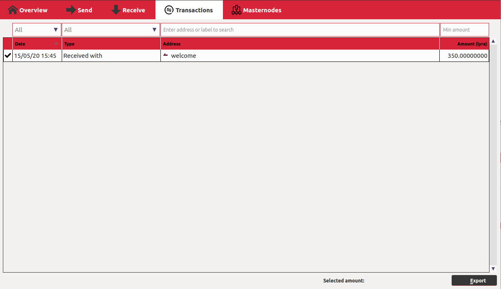
 

- **Masternodes:** control panel of your masternodes and the entire network.
 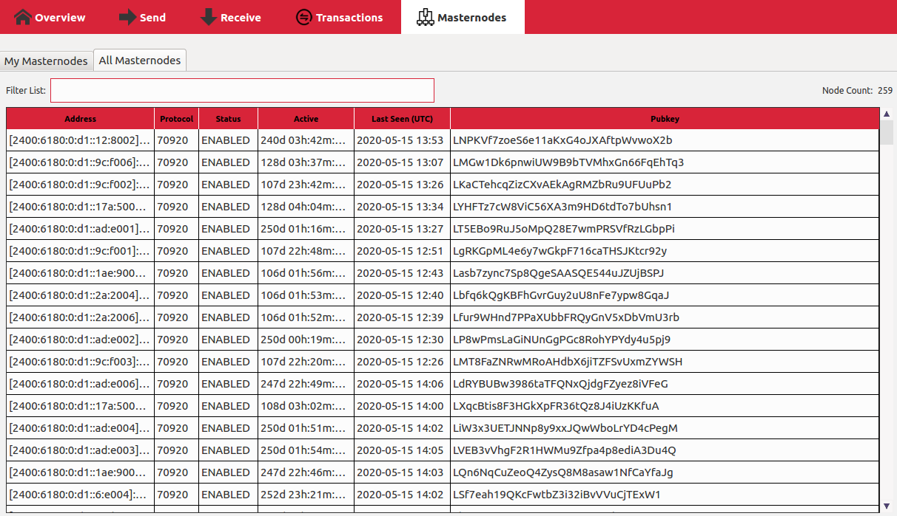
 

### Menu bar
Through the menus on the software system bar, you will access other more technical and detailed functions, various configurations and settings.

- **Menu FILE**
  Through the ** FILE ** menu you can access functions such as creating new addresses, address book of current addresses, signing and verifying messages and, above all, backing up the wallet.
 

- **Menu SETTINGS**
 Through the ** SETTINGS ** menu you can access the wallet encryption functions (which we will explain below), lock and unlock an encrypted wallet, change the encryption password, multisend functions and wallet system options.
  **Caution is advised in making changes. Any mistake could irreparably compromise your funds.**
 

- **Menu TOOLS**
 Through the ** TOOLS ** menu you can access the network monitoring functions, the very important [***debug console***](../scrypta-full-node/setup.html#debug-console) (the internal terminal of your Scrypta wallet from which it is possible to send commands to directly query the network), and to other options that are useful for easily reaching the wallet's *.conf* system files.

## Wallet Encryption

The encryption of the wallet is one of the main functions as it protects the funds (or the data contained in the blockchain) from unauthorized use and access.
  In principle, these suggestions and procedures are valid for most other cryptocurrency.

The **"Encrypt Wallet"** function, reachable from the **SETTINGS** menu, adds an additional level of security to the wallet, protecting the funds from fraudulent or incorrect submissions, or from other operations that could modify the ownership of the funds contained in the wallet, through the  [dump of private keys](../scrypta-full-node/setup.html#dump-and-import-private-keys) or other security operations.

The encryption of the wallet is a very simple operation to carry out, however you have to be very careful.
  To proceed with the encryption, from the **SETTINGS** > **ENCRYPT WALLET** menu a window will open as shown below:
 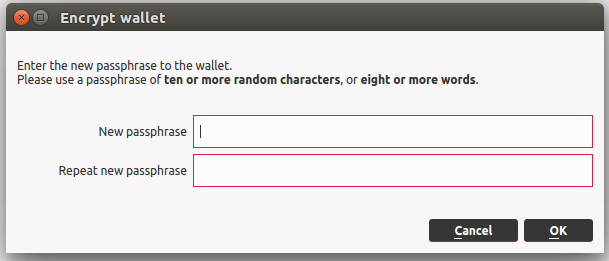
 

::: tip  
For greater security choose a strong password, with ten or more characters, preferably random.
Make sure you remember your password and ALWAYS keep it in a safe place.
:::

Once the password has been chosen, proceed with the encryption by pressing **OK**.

::: danger  
**ATTENTION:** If you forget or lose your password after the encryption, you will lose access to all your funds.
:::

The wallet app will close at the end of the encryption operation.
  On the next reboot, the wallet will display a closed padlock symbol in the lower right corner.
 
 This indicates that to perform operations such as staking, sending funds, dumping private keys or other main functions, you must simply proceed with the unlocking of the wallet first.

## Lock/Unlock wallet
To unlock the wallet you need to enter the passphrase used to perform the encryption.
From the **SETTINGS** menu, selecting **UNLOCK WALLET** the window will open as shown in the image:
 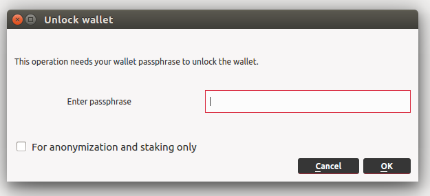

Enter the passphrase and press **OK**.
 By ticking the option *"For anonymization and staking only"* the wallet will be unlocked only for the staking and the process of [**obfuscation**](../scrypta-full-node/setup.html#funzionalita-aggiuntive).
At this point the wallet is unlocked for all operations. This status is indicated by the green padlock in the lower corner.
 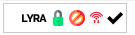

## Wallet Backup
Once the encryption process is complete, we proceed with making a backup copy of our **wallet.dat**, the file that contains all the information of our digital wallet and all the addresses with the respective private keys.
  To proceed with the backup, from the menu **"FILE"** select **"BACKUP WALLET"** and choose a name and the path on which to save the backup of the wallet.dat file in a safe place.

::: warning  
**ATTENTION:** This backup copy will allow you to recover your funds simply by importing the wallet.dat file on another Scrypta client, so keep it with extreme care and caution.
:::

## Debug Console

The debug console of the Scrypta QT wallet is a very useful tool from which you can manually send commands to perform all the operations available within the portfolio.
Accessible from the menu **"TOOLS"** > **"DEBUG CONSOLE"**, it looks like a terminal window.
 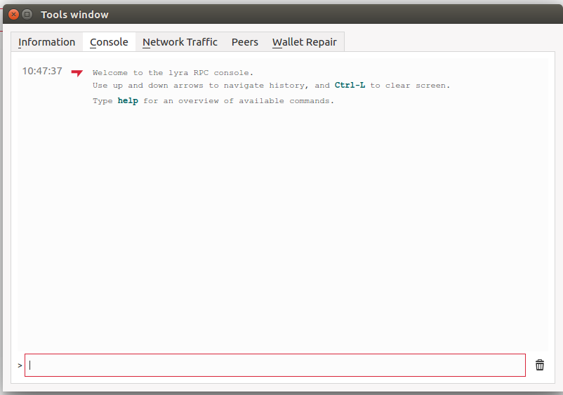

Entering the ** help ** command will open the complete list of commands, a detailed explanation of which is available in the [specific section](command-list.md).

For an exhaustive explanation of all the commands, consult the section:

[Command List](command-list.md)

 Through the *debug console* it is possible to directly query the blockchain on the status of the network, a transaction, masternodes, or you can create manual transactions, set operational or security settings, generate new addresses and, above all, manage private keys and the wallet itself.

We see below the main operations on private keys.
::: danger  
**ATTENTION:** Maximum caution is always recommended when carrying out operations with your private keys.
:::

## Dump and import private keys
These are among the most important operations that you can perform in your wallet.
  To own the funds present in a Lyra address or in a wallet, it is necessary to have ownership of the corresponding private keys.
  Each time a new public address is created in a wallet, the corresponding private key is generated.
However, this private key is never exposed by the client for security reasons and must be exported (dumped) through the debug console.

By importing these private keys into a new wallet on another device, the funds contained in it will be made accessible, which therefore will be the exclusive property of the one (or those) who hold the private keys of that specific address.
  To do this and the others listed in this section of the guide, the wallet must be [unlocked](../scrypta-full-node/setup.html#lock-unlock-wallet).

::: danger  
** ATTENTION: ** Maximum caution is always recommended when exposing your private keys.
  Making them accessible to third parties means giving them access to your funds.
:::

::: warning  
We recommend that you always make redundant backups on private keys, as well as keep them in a place that you can always access.
  The loss of private keys implies the inaccessibility of anyone, including you, to your funds.
:::

### Dump private keys

To dump a private key to a specific address, you must first open the debug console.
  The command to export the private key of an address is `**dumpprivkey**`.
  Through the command **`dumpprivkey "lyraaddress"`** we are revealed the private key corresponding to the address "lyraaddress".

::: warning  
Each address has its own private key: if you store your funds in different addresses it is essential that you do the dump for each of the addresses on which there are funds.
:::

::: tip  
The address for which you want to export the private key must be yours. Typing **`validateaddress "lyraaddress"`** the system will return you info on that address.
:::

Once the private key is revealed to us, it can be imported into any Scrypta wallet to have access to the funds linked to it.
It is not possible to export private keys to addresses that we do not have.

### Import of a private key
If we have a private key and want to import it, simply open the debug console and give the command
**`importprivkey "lyraprivkey "`** which scans the blokchchain for that specific address, displays and makes available the balance of the address corresponding to the owner of the private key.

### Dump the entire wallet
Through the `**dump wallet**` function, complete export of all private keys for all the addresses generated by your wallet (whether they have already been used or not) saved in encrypted format within the file ** * wallet.dat ***.

In this regard it is good to make a clarification: the `**dump wallet**` operation has some differences with the operation described previously in the section [**"backup wallet"**](../scrypta-full-node/setup.html#wallet-backup), as the backup saves the encrypted copy of the wallet.dat file.
  By restoring the file ***wallet.dat*** we will have the possibility to import and view the contents of the entire wallet but we will not be able in any way to access the funds contained in it without knowing the encryption password to decipher the wallet .
  With the command `**dump wallet**` you will export a text file **not encrypted** containing the complete list of all the addresses created by the wallet with all the corresponding private keys. Consequently, the owner of that file will be in possession of all the funds contained in it.
  This is why, before proceeding, it was important to explain the difference between the two types of backup, so that we can understand when one mode should be used rather than another.

#### To perform the "dump wallet":
To proceed with the export of all private keys through the `**dump wallet**` command, simply open the debug console and give the command:
 **`dumpwallet "path/to/file/dump.txt"`**
 
 dwhere "path / to / file" is the path where we want the system to save our file and "dump.txt" is the example name of our file, containing all the private keys.

  By opening the newly saved ***dump.txt*** file, we will see something similar to what is shown in the figure: an initial part with a report on when the file was exported and from which wallet, and the whole list of keys private (starting with S) and their respective addresses.
  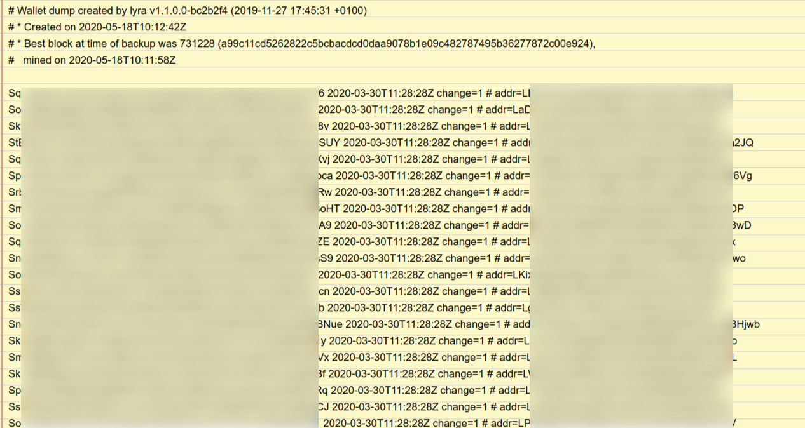

 ::: danger  
**ATTENTION:** We recommend once again to keep this file with maximum security and to access it only in case of extreme necessity, as the information it contains provides **FULL** access to your funds.
:::

The data in that file is generated when you start the wallet for the first time, along with the wallet.dat file.
  When first started, the system generates 1000 random addresses and corresponding private keys and saves them for future use.
  Whenever we request a new address with **"getnewaddress"**, the system draws on that list of pre-generated addresses to provide us with an address to use.

### Bootstrap
The bootstrap is a file (or set of files) containing an updated "photograph" of the state of the blockchain at any given moment, an exact copy of the public ledger to be used as a restore point.
    The bootstrap can be useful to us due to an incorrect closure of the wallet, which at the next startup results in a corrupt copy of the blockchain.
  Replacing corrupt files with a bootstrap allows a faster boot of the wallet, as the software does not have to re-download the entire copy of the blockchain.
  When we launch a wallet for the first time, or install a vps that needs complete sync, using boostrap ensures a significant time saving.

The bootstrap is usually composed of:
- Folder **"Blocks"**
- Folder **"Chainstate"**
- File **"peers.dat"**

To save a copy of bootstrap to be reused later, it is necessary to save the above in a zip file, better if online.
It is recommended to save the bootstrap when the wallet is closed, so as to preserve the integrity of the files and folders.

Once saved, if it should be necessary to use it, just copy the contents of the bootstrap into the system folder ***.lyra*** in your operating system or VPS.
On the next reboot, the wallet will resume synchronization from the last block saved in your bootstrap.

## Additional features
There are other tools that can be used within the wallet, as well as additional operations that will be explained below.

### Blockexplorer
Through the **"TOOLS"** menu, clicking on **"BLOCKCHAIN EXPLORER"** you access a blockexplorer inside the wallet through which it is possible to carry out some operations of control on data, addresses and transactions.
The internal blockexplorer of the wallet lacks some important features and therefore it is recommended to use it only in the event that it is not possible to connect to the official blockexplorer.

### Obfuscation protocol
This function, accessible from the ** "OVERVIEW" ** section of the wallet, is also called ** "Obfuscation" **. It is based on an anonymization protocol of a part of the funds contained within the wallet.
  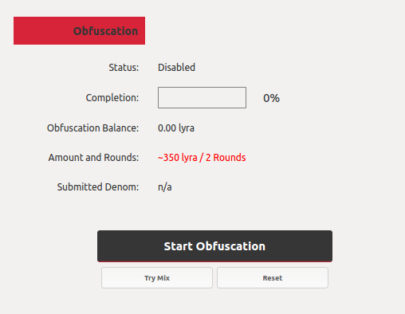

 Clicking the **"Start Obfuscation"** button starts an anonymization process for the coins which, once completed, makes it difficult to identify the origin of the funds for which the process was completed, thus increasing the privacy of the transactions.
    From the following images we can see the process when it is in **enabled state** and the consequences on the funds involved in the obfuscation process.

   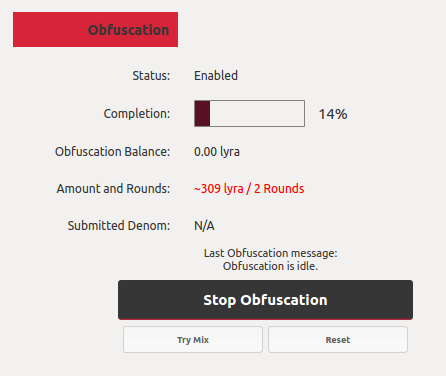

As soon as the obfuscation process is enabled, the wallet sends the desired quantity of coins to the network of masternodes, where the request is processed and the identical but "mixed" consideration is returned and divided into denominations of a smaller amount.
 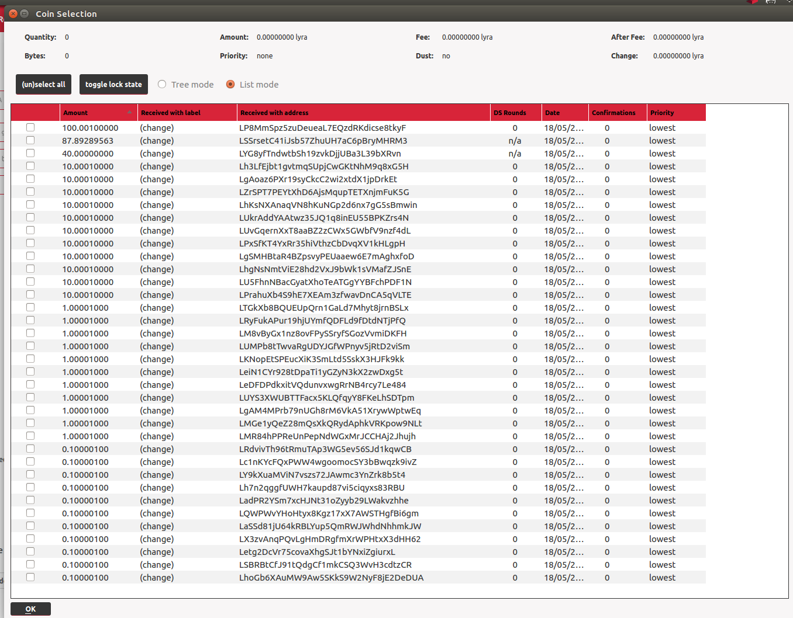
As you can see from the image, it is as if the funds in our wallet have been received by X different addresses and "exchanged" with other owners.
  Regularly using obfuscation on all your funds makes it impossible to trace the operations carried out, significantly increasing the level of privacy for your transactions.
  The contraindication is that obfuscation penalizes the staking process, in that its stake amount is divided into amounts so small as to make the staking process fruitless. Therefore it is recommended to use the obfuscation protocol only if really necessary.

### Instant Send
When we talk about **Instant Send** (or **SwiftTX**) we refer to the ability of the Scrypta network to send and receive transactions even in the absence of confirmations from the network.
  This feature is active by default and works for amounts not exceeding 1000 lyra per transaction.
    This means that once the submission is complete, the amount will already be visible in the recipient's wallet under the heading "unconfirmed", although the block in which the transaction is included has not yet been mined.
  This significantly reduces waiting times when working with transactions up to a certain amount.
  However, in the case of uses related to payment methods, it is recommended to always wait for the transaction to be effectively confirmed by the blockchain and included in one of the blocks after sending.