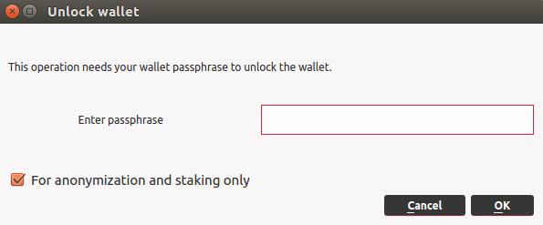

# Staking con Desktop Wallet

## Abilitare lo Staking
Sono due i passaggi da eseguire per abilitare lo staking sul deskotp wallet:

1. Assicurarsi che nel file di configurazione *lyra.conf* non sia presente la stringa di blocco: `staking=0`: 
   
Clicca su *Tools > Open Wallet Configuration File*.

• Se il tuo *lyra.conf* è vuoto o contiene la stringa `staking=1`, puoi procedere al punto 2.
• Se il tuo *lyra.conf* contiene la stringa `staking=0`, dovrai modificarla in `staking=1`. 

> Riavvia  il wallet per rendere effettive le modifiche. 

2. Vai su *Settings > Unlock Wallet*, ti apparirà la schermata seguente:



Basta spuntare la casella di anonimizzazione e staking: *For anonymization and staking only*, inserire la passphrase e cliccare su *OK*. 

Nel tuo wallet, entro qualche secondo dovresti vedere un'icona verde che simboleggia lo '*staking attivo*'.


In base a quando hai inviato LYRA coin al tuo portafoglio, potresti dover aspettare 1 ora, che è l'età minima di staking:  *staking minimum age*. Finché vedi l'icona verde e tieni il tuo wallet attivo e online, hai diritto a ricevere ricompense.

::: warning NOTA BENE
Se non compare la finestra di sblocco wallet, ciò significa che il wallet non è ancora crittografato. E' altamente raccomandato farlo, per la tua sicurezza. Consulta la sezione apposita: [Cifratura del wallet](../masternode-setup/installazione-manuale.md).
:::

## Coin Control

Utilizzando la funzione *Coin Control*  è possibile consolidare transazioni più piccole in un'unica somma di lyra più grande. 

Potrai anche scegliere quali indirizzi saranno quelli che invieranno le Lyra ad ogni transazione in uscita che effettuerai.

Consolidare le monete nel tuo wallet, creando dei nuovi UTXO più grandi, vuol dire avere un peso maggiore nella probabilità di firmare blocchi, in questo modo renderai più efficace il tuo staking ricevendo più ricompense.

Per prima cosa, abilita la funzione *Coin Control* su *Options > Wallet*.

Quindi recati sulla sezione *Send* (Invio), e troverai un nuovo pulsante:  *Inputs/ Coin Control* .

Seleziona un indirizzo e copialo (tasto destro), clicca su *Ok*.

Adesso inserisci (incolla) lo stesso indirizzo nella finestra di *invio* nel campo “*Pay To*”.

Copia e incolla l'ammontare che compare in alto:  *amount “After Fee”* (tasto destro per copiare), adesso possiamo inviare le LYRA in una unica transazioner (UTXO) allo stesso indirizzo.

::: tip NOTA
Se gestisti col desktop wallet un Masternode  Scrypta, potresti raggruppare le masternode rewards in set più grandi. Tuttavia è importante essere sicuri che il collateral relativo al masternode rimanga intaccato e che nella sezione *Coin Control*  sia settato su “*locked*” . 

Se il collateral del masternode viene speso accidentalmente, la txhash e l'output associati verranno distrutti, lasciando offline il masternode.

È possibile bloccare e sbloccare manualmente le transazioni facendo clic con il pulsante destro del mouse e selezionando *Lock unspent* o *Unlock unspent*.

Se stai cercando di sbloccare il collateral del Masternode per utilizzarlo e inviarlo, questo è un buon metodo per farlo.
:::

## Split Threshold
Con questa funzione la prima volta che il tuo indirizzo viene ricompensato per lo staking, si dividerà automaticamente in 2 input (UTXO) e continuerà a dividersi ad ogni ricompensa di blocco che trova fino a raggiungere il limite della soglia di split (**il valore predefinito è 2000 monete per input**). 

Dopo aver raggiunto questo limite, smetterà di dividersi in input più piccoli.

> Esempio: appena una UTXO raggiungerà 4000 Lyra e riceverà una ricompensa,esso verrà automaticamente diviso in 2 UTXO da 2000 LYRA circa.

Puoi controllare il valore di soglia impostato sul tuo wallet dalla console di debug: *Tools > Debug Console* e inserendo il comando:
```
getstakesplitthreshold
```
Per modificare la soglia:
inserisci il comando:
```
setstakesplitthreshold <1 – 999999>
```

## Multisend Option

Con la funzione *Multisend* puoi inviare automaticamente le tue ricompense Masternode e Staking a qualsiasi altro indirizzo LYRA nella percentuale che preferisci, fino al 100%.

Per attivare il MultiSend, vai su *Settings → MultiSend*. Apparirà una finestra di dialogo con le caselle di input da compilare.

Come puoi vedere, prima devi scegliere di attivare la funzione per Masternode Rewards o Staking Rewards. Possono anche essere selezionate contemporaneamente. 

La casella *Percentuale* si riferisce alla percentuale della ricompensa selezionata che verrà inviata alla casella *Indirizzo* nella riga successiva. Dopo aver inserito le informazioni desiderate, fai clic su *Add - aggiungi*.

Puoi dividere le percentuali su più indirizzi diversi, assicurati in questo caso che la percentuale totale non superi il 100%.

Una volta completato, fai clic su *Activate - attiva*. Ora controlla lo stato facendo clic su *View Multisend*. Se tutto è corretto, dovresti vedere che MultiSend è attivo-  *Active*.

Se si desidera disabilitarlo, fare clic su *Deactivate*.
 
::: warning ATTENZIONE
Per rendere effettive queste modifiche, potrebbe essere necessario riavviare il wallet.
:::

## Video Tutorial

[Scrypta Wallet e Lyra Staking Tutorial](https://www.youtube.com/watch?v=bOlJ2xm_IcQ) di Tiziano Tridico


<iframe width="560" height="315" src="https://www.youtube.com/embed/bOlJ2xm_IcQ" frameborder="0" allow="accelerometer; autoplay; encrypted-media; gyroscope; picture-in-picture" allowfullscreen></iframe>

[Ottimizzare lo Staking - Lyra Inputs Tutorial](https://www.youtube.com/watch?v=0e5mewkVqys&t=5s) di Tiziano Tridico

<iframe width="560" height="315" src="https://www.youtube.com/embed/0e5mewkVqys" frameborder="0" allow="accelerometer; autoplay; encrypted-media; gyroscope; picture-in-picture" allowfullscreen></iframe>

