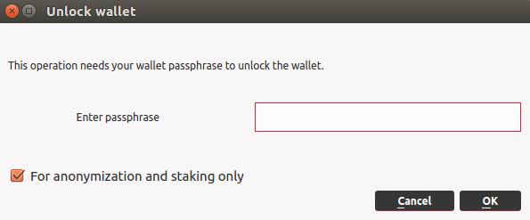
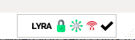

# Staking with the Desktop Wallet

## Enable Staking
Here are the two steps to take to enable staking on the desktop wallet:

1. Make sure that the block string is not present in the configuration file *lyra.conf*: `staking = 0`:
   
Click on *Tools> Open Wallet Configuration File*.

• If your *lyra.conf* is empty or contains the string `staking = 1`, you can proceed to step 2.
• If your *lyra.conf* contains the string `staking = 0`, you will need to change it to` staking = 1`.

> Restart the wallet for the changes to take effect.

2. Go to *Settings > Unlock Wallet*, the following screen will appear:



Check the anonymization and staking box: *For anonymization and staking only*, enter the passphrase and click on *OK*.

Within a few seconds, a green icon should appear in the wallet symbolizing 'active *staking*'.



Depending on when you sent LYRA coin to your wallet, you may have to wait 1 hour, equal to the minimum staking age: * staking minimum age *. When the icon is green and the wallet is active and online, you are entitled to receive rewards.

::: warning PLEASE NOTE
If the wallet unlock window does not appear, it means that the wallet is not yet encrypted. It is highly recommended to do this, for your safety. See the appropriate section: [Wallet encryption](../masternode-setup/installazione-manuale.md).
:::

## Coin Control

Using the *Coin Control* feature, smaller transactions can be consolidated into a single larger lyra sum.

You will also be able to choose which addresses will be the ones that will send the Lyra to each outgoing transaction you make.

Consolidating the coins in your wallet, creating new larger UTXOs, means having a greater weight in the probability of signing blocks: in this way you will make your staking more effective by receiving more rewards.

First, enable the *Coin Control* feature on *Options > Wallet*.

Then go to the *Send* section where you will find a new button: *Inputs/Coin Control*.

Select an address and copy it (using the right button), click on *Ok*.

Now enter (paste) the same address in the *send* window in the "*Pay To*" field.

Copy and paste the amount shown above: *amount "After Fee"* (right key to copy), where to send the LYRA in a single transaction (UTXO).

::: tip NOTE
By managing a Scrypta Masternode via desktop wallet, you can group masternode rewards into larger sets. However, it is important to be sure that the collateral for the masternode remains intact and that in the *Coin Control* section it is set to "*locked*".

If the masternode collateral is accidentally spent, the associated txhash and output will be destroyed leaving the masternode offline.

You can lock and unlock transactions manually by right-clicking and selecting *Lock unspent* or *Unlock unspent*.

This is a good way to unlock the Masternode collateral in order to use and send it
:::

## Split Threshold
With this function, the first time your address will be rewarded for staking, the amount will automatically be divided into 2 inputs (UTXO) and will continue to divide with each block reward it finds until it reaches the split threshold limit ( **the default is 2000 coins per input**).

After reaching this limit, it will stop dividing into smaller inputs.

> Example: as soon as a UTXO reaches 4000 Lyra and receives a reward, it will automatically be divided into 2 UTXO of about 2000 LYRA.

You can check the threshold value set on your wallet from the debug console: *Tools> Debug Console* and by entering the command:
```
getstakesplitthreshold
```
To change the threshold:
enter the command:
```
setstakesplitthreshold <1 – 999999>
```

## Multisend Option

With the *Multisend* function you can automatically send your Masternode and Staking rewards to any other LYRA address in the percentage you prefer, up to 100%.

To activate MultiSend, go to *Settings → MultiSend*. A dialog box will appear with the input boxes to fill in.

First you have to choose to activate the function for Masternode Rewards or Staking Rewards. They can also be selected simultaneously.

The *Percentage* box refers to the percentage of the selected reward that will be sent to the *Address* box on the next line. After entering the desired information, click on *Add*.

You can divide the percentages on several different addresses, in this case make sure that the total percentage does not exceed 100%.

Once completed, click *Activate*. Now check the status by clicking on *View Multisend*. If everything is correct, you should see that MultiSend is *Active*.

If you want to disable it, click on *Deactivate*.
 
::: warning WARNING
For these changes to take effect, you may need to restart the wallet.
:::

## Video Tutorial

[Scrypta Wallet and Lyra Staking Tutorial](https://www.youtube.com/watch?v=bOlJ2xm_IcQ) by Tiziano Tridico


<iframe width="560" height="315" src="https://www.youtube.com/embed/bOlJ2xm_IcQ" frameborder="0" allow="accelerometer; autoplay; encrypted-media; gyroscope; picture-in-picture" allowfullscreen></iframe>

[Optimize Staking - Lyra Inputs Tutorial](https://www.youtube.com/watch?v=0e5mewkVqys&t=5s) by Tiziano Tridico

<iframe width="560" height="315" src="https://www.youtube.com/embed/0e5mewkVqys" frameborder="0" allow="accelerometer; autoplay; encrypted-media; gyroscope; picture-in-picture" allowfullscreen></iframe>

