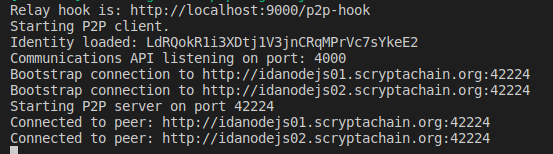
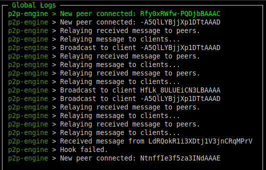

# P2P Network

This tool is a NodeJS / Express application that allows the creation of real-time communications signed by Lyra addresses in the form of a peer-to-peer network between servers and clients,

This tool is still under development and is lacking in some features including the _discovery_ of new peers (servers), an efficient system of _relay_ of the messages and the stabilization of the system of _crypting_ of the messages themselves through RSA keys.

In theory, this tool should be coupled to a dApp, since every time a message is received it is sent back to a hook, defined in the `.env` file.

In the future this tool will be natively included in IdANodeJS, so that all IdANodes can communicate with each other and allow communication between various clients. To interact with the IdANode network it is necessary to use ScryptaCore or the specific calls of the IdANode itself.

The basic technology used is [https://socket.io/](https://socket.io/).

## Installation

Clone the repository and install all dependencies:

```
git clone https://github.com/scryptachain/scrypta-p2p-network
cd scrypta-p2p-network
npm install
```
Now you need to create an .env file like:
```
PORT=42224
NODE_KEY=YOUR_LYRA_PRIVKEY
ENCRYPT_COMMUNICATIONS=false
HOOK=http://localhost:9000/p2p-hook
EXPRESS_PORT=4000
BOOTSTRAP_NODES=idanodejs01.scryptachain.org,idanodejs02.scryptachain.org
```

## Use

To start the connection to the network you must run the command:

```
npm start
```
The console response will look something like:



As we can see, the engine loads the identity written on the `.env` file and connects to the bootstrap nodes. If something goes wrong with the nodes or with your connection, you won't see the connection lines:

```
Connected to peer: http://idanodejs01.scryptachain.org:42224
Connected to peer: http://idanodejs02.scryptachain.org:42224
```
From this moment on, it is possible to send messages simply by invoking the endpoint `/broadcast`!

### [POST] /broadcast

This endpoint involves sending the only **message** field. The message will be signed by the private key and transformed into JSON in the following format:
```
{ 
  signature: '2b37797321241e28b889c3cd1b7eec6bd01d0b47a2a0fff21dc7d873954e0baa7e3b77f860c57ad53ab2009c030b885444cab6f0b94e37988bb3771768f8642e',
  pubKey: '027460a5f721e97f5e241d9767fb1b7fd778892e7c40684b79fcb4420d07d240e0',
  address: 'LdRQokR1i3XDtj1V3jnCRqMPrVc7sYkeE2',
  message: 'Hello P2P!' 
 }
  ```
As in the case of messages signed by _Scrypta Core_, these also present the signature, the address that sent it, the pubKey to verify the message and the message itself.

At this point, all the nodes that receive the message replicate it to the other connected nodes. This system ensures the relay of information. It will send messages to both online nodes with open ports, and to clients, which usually have inbound connection ports closed.

This type of activity can be analyzed by starting the tool on a remote server, whose port (42224) is open:



Chiunque riceve il messaggio, prima di far partire la relativa chiamata post verso l'_hook_, controlla che il messaggio sia stato effettivamente inviato da quell'indirizzo e, in caso positivo, trasmette il messaggio.
## Possible use cases

This tool can be used by applications that need to exchange information verified in real time. Combined with all other Scrypta technologies, this tool allows the effective sending of information from certified sources. If you want, you can send absolutely private information in real time by encrypting the information with RSA keys,

It is important to underline that **no** information is saved neither by the IdANodes, nor by the engine. This means that messages cannot be recovered and only connected peers can view them. This architectural choice is based on the desire to create a lean system, which does not overload in time, leaving the actual need for message storage to the developers who want to use it.
<!--stackedit_data:
eyJoaXN0b3J5IjpbNTE3OTc3NTU4XX0=
-->