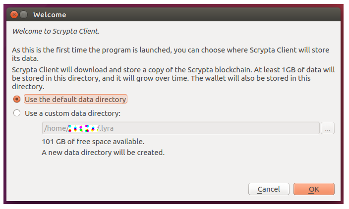
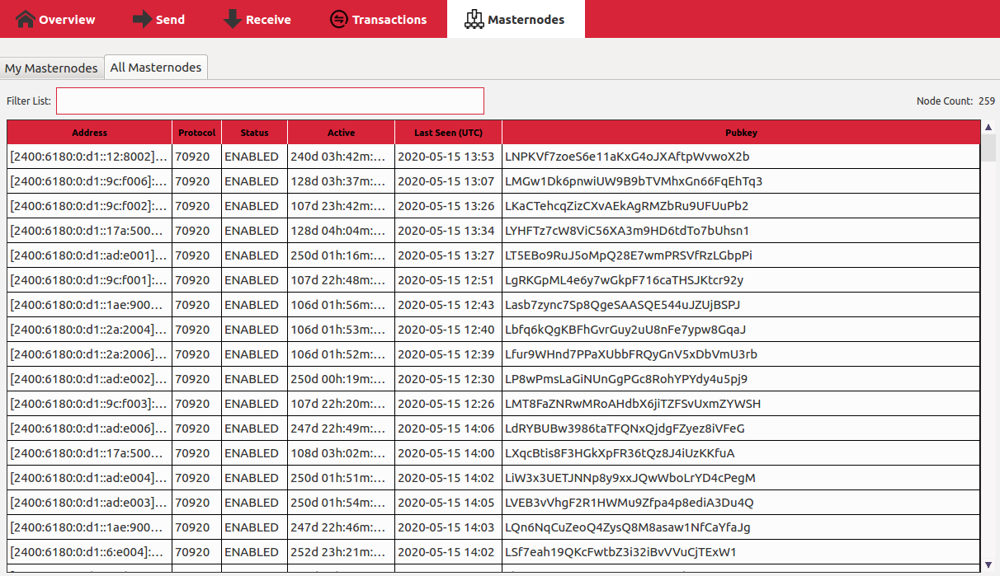
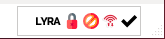

# Scrypta Full Node

il full-node è un **wallet** che conferma e trasmette le transazioni nella rete **Scrypta**. Questo significa che non è necessario affidarsi a terze parti per convalidare i pagamenti. 

I full-node contengono l'intero registro distribuito e sono essenziali per proteggere la rete. Però, richiedono spazio sul disco fisso (oltre 2GB), banda di connessione internet e tempo per la sincronizzazione iniziale.

Il full-node permette inoltre di effettuare lo staking e di sviluppare masternode.

## Installazione

L'installazione del **LYRA WALLET** prevede passaggi diversi e variazioni dei percorsi dei file in base al sistema operativo. 

Il LYRA WALLET è attualmente disponibile per Linux, MacOS, Windows e Raspberry Pi 4 al seguente Link:

[LYRA WALLET](https://github.com/scryptachain/scrypta/releases)

Di seguito le istruzioni per ogni sistema operativo:

### Linux

Ecco i passaggi per il processo di installazione di Lyra Wallet su **Linux**, nello specifico su **Ubuntu 16.0.4**: 

1. Apri il Termiale (CTRL-ALT-T)
2. Inserisci questo codice riga per riga (premendo invio ad ogni riga) in modo da compilare il LYRA Wallet nella versione GUI (con interfaccia grafica).
```
sudo add-apt-repository -y ppa:bitcoin/bitcoin
sudo apt-get install -y software-properties-common python-software-properties
sudo apt-get update
sudo apt-get install libdb4.8-dev libdb4.8++-dev -y
sudo apt-get -y install build-essential autoconf automake libboost-all-dev libleveldb-dev libgmp-dev libgmp3-dev libssl-dev libcurl4-openssl-dev libcrypto++-dev libqrencode-dev libminiupnpc-dev autogen libtool git libevent-dev libprotobuf-dev
sudo apt-get install -y curl g++ git-core pkg-config libtool faketime bsdmainutils mingw-w64 g++-mingw-w64 nsis zip ca-certificates python
sudo apt-get install libzmq3-dev
sudo apt-get install libqt5gui5 libqt5core5a libqt5dbus5 qttools5-dev qttools5-dev-tools libprotobuf-dev protobuf-compiler
sudo apt-get install libqrencode-dev
git clone https://github.com/scryptachain/scrypta
cd scrypta
./autogen.sh
./configure
sudo make
cd src/qt
chmod 777 -R *
./lyra-qt
```
::: warning Attenzione
Nota che con Ubuntu 18.04 LTS, dopo il comando```./configure```, potresti imbatterti in questo errore:
configure: error: `Detected LibreSSL: This is NOT supported, and may break consensus compatibility!`

Risolverai il problema installando la **ssl library v1.0** con il seguente comando:
```
apt-get install libssl1.0-dev
```
Ricomincia adesso dal comando `./autogen.sh`.
:::

### Windows

Il modo più semplice per configurare il portafoglio LYRA su **Windows** è utilizzare l' eseguibile precompilato disponibile su Github:  

[Windows Wallet](https://github.com/scryptachain/scrypta/releases)

Ecco di seguito il processo passo per passo:

1. Scarica il file zip
2. Estrai il contenuto dei file Zip nella posizione desiderata
3. Esegui il file eseguibile lyra-qt.exe

::: warning Attenzione
È possibile che venga visualizzato un avviso antivirus (falso positivo) per il quale dovrete ignorare o creare un'eccezione.
:::

### macOS
L'installazione di Lyra Wallet su Mac è un processo relativamente semplice.
1. Vai sul [portale Github di Scrypta](https://github.com/scryptachain/scrypta/releases).
2. Fai clic sull'ultima versione del file macOS.dmg.
3. Una volta scaricato il file DMG, fai doppio clic su di esso.
4. Verrà generato un file chiamato Lyra-Qt,
sposta questo file nella cartella delle applicazioni.
5. Esegui Lyra-Qt per avviare il wallet.

### Raspberry Pi 4

Di seguito troverai la guida completa con tutti i comandi per compilare e installare manualmente tutte le librerie e le dipendenze per il tuo wallet Scrypta su **Raspberry PI 4**. 

In alternativa puoi seguire la guida per l'installazione del "file immagine" del sistema operativo fornito da Scrypta che puoi trovare di seguito. 

Per un'installazione manuale passo-passo, procedi all'avvio del terminale e digita i seguenti comandi:
```
sudo apt-get update && sudo apt-get upgrade
```
Dopo il comando, la Raspberry richiederà il Riavvio. Procedi riavviando la tua Rasp.

Al riavvio, digita i seguenti comandi da Terminale:
```
sudo apt-get install -y pkg-config
sudo apt-get install -y software-properties-common python-software-properties
wget https://raw.githubusercontent.com/scryptachain/scrypta-os/master/add-apt-repository.sh
sudo mv add-apt-repository.sh /usr/bin/add-apt-repository
sudo chmod +x /usr/bin/add-apt-repository
sudo add-apt-repository -y ppa:bitcoin/bitcoin
sudo apt-get -y install build-essential autoconf automake libtool libboost-all-dev libboost-program-options-dev libssl1.0-dev
sudo apt-get -y install libleveldb-dev libgmp-dev libgmp3-dev libcurl4-openssl-dev libcrypto++-dev libqrencode-dev
sudo apt-get -y libminiupnpc-dev autogen libtool libevent-dev libprotobuf-dev protobuf-compiler
sudo apt-get -y install curl g++ git git-core faketime bsdmainutils mingw-w64 g++-mingw-w64 nsis zip ca-certificates python
sudo apt-get -y install libgmp-dev libssl-dev libcurl4-openssl-dev
sudo apt-get -y install qtbase5-dev libqt5gui5 libqt5core5a libqt5dbus5 qttools5-dev qttools5-dev-tools libzmq3-dev
wget http://download.oracle.com/berkeley-db/db-4.8.30.NC.tar.gz
tar -xzvf db-4.8.30.NC.tar.gz
cd db-4.8.30.NC/build_unix
../dist/configure --enable-cxx
sudo make -j2
sudo make install
export BDB_INCLUDE_PATH="/usr/local/BerkeleyDB.4.8/include"
export BDB_LIB_PATH="/usr/local/BerkeleyDB.4.8/lib"
sudo ln -s /usr/local/BerkeleyDB.4.8/lib/libdb-4.8.so /usr/lib/libdb-4.8.so
sudo ln -s /usr/local/BerkeleyDB.4.8/lib/libdb_cxx-4.8.so /usr/lib/libdb_cxx-4.8.so
cd
```
Riavvia nuovamente la tua Raspi e digita i seguenti comandi dopo il riavvio:
```
git clone https://github.com/scryptachain/scrypta
cd lyra
sudo chmod +x share/genbuild.sh
sudo chmod +x autogen.sh
sudo chmod 755 src/leveldb/build_detect_platform
./autogen.sh
sudo ./configure --with-gui=qt5 --with-libressl --disable-sse2 CPPFLAGS="-I/usr/local/BerkeleyDB.4.8/include -O2" LDFLAGS="-L/usr/local/BerkeleyDB.4.8/lib"
sudo make -j4
```
Complimenti! Adesso puoi avviare e utilizzare il **Lyra Wallet-Qt** sulla tua Raspberry 4

### Guida per l'installazione di Raspberry PI 4 con File Immagine

Il file immagine per Raspberry PI 4 si basa su **Raspbian Debian Buster** con tutte le librerie già installate e un Lyra wallet funzionante. 

È possibile masterizzare il file immagine  sulla scheda SD seguendo la nostra guida all'installazione.

> Questa sezione spiega come installare un'immagine del sistema operativo Raspberry Pi su una scheda SD. Avrai bisogno di un altro computer con un lettore di schede SD.


Il file di immagine ufficiale Scrypta è disponibile per il download al seguente link:

[https://scrypta.sfo2.digitaloceanspaces.com/scryptaOS_rasp_1.1.0.img](https://scrypta.sfo2.digitaloceanspaces.com/scryptaOS_rasp_1.1.0.img)

Sarà necessario utilizzare uno strumento di scrittura delle immagini per installare l'immagine scaricata sulla scheda SD.

::: tip BalenaEtcher
BalenaEtcher è uno strumento grafico per la scrittura di schede SD che funziona su Mac OS, Linux e Windows ed è l'opzione più semplice per la masterizzazione di file immagine. BalenaEtcher supporta anche la scrittura di immagini direttamente dal file zip, senza che sia necessario decomprimere.
:::

Per scrivere la tua immagine con balenaEtcher: 
- Scarica l'ultima versione di [balenaEtcher](https://www.balena.io/etcher/) e installala.
- Collega un lettore di schede SD con la scheda SD all'interno. 
- Apri balenaEtcher e seleziona dal tuo disco rigido il file .img Scrypta che desideri scrivere sulla scheda SD. 
- Seleziona la scheda SD su cui desideri scrivere l'immagine. 
- Rivedi le tue selezioni e fai clic su "Flash!" per iniziare a scrivere i dati sulla scheda SD. 
- Attendere il completamento del processo, quindi inserire la scheda SD in Raspberry PI 4.

::: warning Nota bene
Per motivi di sicurezza, il portafoglio installato sul tuo sistema viene fornito senza il file wallet.dat per garantire che nessuno oltre te abbia le chiavi private del tuo portafoglio. Il file wallet.dat verrà generato automaticamente quando avvii il portafoglio per la prima volta.
:::

## Introduzione al QT Wallet

In questa sezione spieghiamo in modo piu' approfondito il QT Wallet di Scrypta illustrandone alcune funzioni in modo più approfondito.
Anche se esistono diversi tipi di walet per cryptovalute, è comunque essenziale capirne le basi di funzionamento perche' comunque le operazioni che si possono compiere sono pressappoco uguali per tutte le cryptovalute.

In questa sezione di guida analizzeremo il setup del wallet dopo il primo avvio, il backup e l'encrypting del wallet, l'export delle chiavi private singole o dell'intero wallet, più altre operazioni aggiuntive.

### Cos'è un QT wallet?
QT è un framework UI e un'applicazione cross platform per sviluppatori compilata usando il linguaggio di programmazione C++.
La maggior parte dei wallet QT è sviluppata usando questo ambiente di programmazione, e tali clients sono disponibili per i principali sistemi operativi.
I wallet QT sono dei veri e propri client e offrono tutto il set di funzionalità complete per gestire le cryptovalute.
Tuttavia sono applicazioni che richiedono discrete quantità di spazio sul disco poicheè, per funzionare, devono scaricare l'intera copia della blockchain in questione sul vostro computer su cui state eseguendo il client.

## Scrypta Core Official Wallet
A prescindere da quale sia la tipologia di wallet utilizzato, la prima nozione da comprendere e' che le cryptovalute che possediamo non sono custodite fisicamente all'interno del wallet. I fondi sono memnorizzati in un registro pubblico distribuito chiamato blockchain.
Ciò che fornisce l'accesso ai fondi contenuti in un dato indirizzo, sono le chiavi private dell'indirizzo stesso. Perdendo le chiavi private si perde l'accesso ai fondi, per cui non avere le chiavi private significa non avere accesso ai fondi che il wallet contiene.

Attraverso il Core Wallet, abbiamo il possesso delle chiavi private e dei fondi contenuti in ciascun indirizzo corrispondente. Ovviamente ciascuna cryptovaluta ha il proprio core wallet per cui wallet di blockchain diverse non possono dialogare tra loro in quanto fanno parte di diversi network peer-to-peer.

Ci sono delle funzioni specifiche a seconda del wallet e della cryptovaluta che stiamo usando, tuttavia tutte le coin condividono la maggior parte delle funzioni e dei rispettivi comandi.

- Wallet Encryption
- Wallet Backup
- Private Send
- Instant Send
- Debug Console
- Address Book / QR code generation
- Staking Coins and Masternode Commands
- Sign and Verify Message
- Coin and fee control
- Dark Send
- Block Explorer

Prima di esplorare queste funzionalità, di seguito forniremo una breve descrizione sul primo setup del wallet.

### Prima installazione Wallet Scrypta

La prima cosa da fare è scaricare il Wallet Ufficiale Scrypta dal [repository di Github](https://github.com/scryptachain/scrypta/releases) adatta al vostro sistema operativo.

Una volta scaricato il software, avviate **Lyra-QT**. 
.

Per maggiori informazioni in merito all'installazione, puoi visitare questo link:

[Installazione](installazione.md)


Al primo avvio vi verrà chiesto di scegliere la posizione dei file di sistema, dove verra' salvato il vostro file **wallet.dat** e la copia della blockchain.
Confermate il percorso propostovi dal software o modificatelo a vostra scelta e procedete.
<br>Assicuratevi solo di avere abbastanza spazio disponibile nell'hard-disk.



Di default, è possibile trovare la cartella di sistema ai seguenti percorsi (verificare che sia necessario disabilitare le cartelle nascoste):

**Linux:**
~/.lyra/

**MacOS:**
~/Library/Application Support/lyra/

**Windows:**
%APPDATA%\lyra

Per un approfondimento sulla data directory, puoi consultare la seguente sezione:

[Data Directory](data-directory.md)


### Sincronizzazione con la blockchain Scrypta

Dopo che il processo di avvio del wallet si è concluso, il client si collegherà al network peer-to peer di Scrypta per avviare la sincronizzazione della blockchain scaricandone una copia aggiornata che verrà salvata nella cartella di sistema che avete definito in precedenza.

Sulla parte bassa del software troverete una barra che indica la quantità di dati rimanente per completare il sync.

Quando quella barra sarà completata, il wallet sarà completamente sincronizzato.

Nella parte bassa a destra invece troverete questi simboli
<br>
<br>che indicano rispettivamente che:
- il wallet non e' encrypted
- il wallet e' connesso agli altri peers della rete
- il wallet sta syncando con la blockchain.

Al fine di velocizzare il sync della blockchain, possiamo utilizzare il **bootstrap**, che introduciamo adesso definendolo una copia aggiornata della blockchain ad un tempo piu' recente.
<br>Definzioni e dettagli piu' approfonditi sui file di bootstrap sono forniti nell'[apposita sezione](../scrypta-full-node/setup.html#bootstrap).

::: warning <br>
Poichè verranno scaricati parecchi dati, assicuratevi di avere sufficiente spazio disponibile sul vostro hard-disk per salvare l'intera copia della blockchain.
<br>A seconda della velocità della connessione, per completare la sincronizzazione potrebbe volerci molto tempo.
:::

Una volta che la sincronizzazione è stata completata, indicata dal simbolo nell'angolo in basso a destra, il vostro client è connesso alla blockchain ed è pronto sia per scambiare transazioni con altri client desktop/app della rete Scrypta sia per permetterci di effettuare tutte le operazioni sopra riportate.
<br>

::: tip <br>
Nel caso in cui il wallet non riesce a sincronizzare in automatico e a collegarsi alla lista dei nodi, è possibile forzare la sincronizzazione aggiungendo manualmente una lista di nodi al file **lyra.conf** che troverete nella cartella di sistema.
:::

Per ottenere una lista aggiornata di nodi, andare nel blockexplorer e cliccare su ["node list":](https://chainz.cryptoid.info/lyra/#!network).
<br>Copiare il contenuto della tabella e incollarlo nel file **lyra.conf**. 
Quindi salvate il file e riavviate il wallet. La sincronizzazione dovrebbe adesso avviarsi senza ulteriori problemi.

## Panoramica dei menu

### Menu principale
Questa è la barra del menù per le principali operazioni del wallet, come descritto di seguito:
<br>
- **Overview:** la dashboard principale con il balance, le transazioni recenti e la funzione di **obfuscation**, che verrà approfondita [nelle sezioni successive](../scrypta-full-node/setup.html#funzionalita-aggiuntive).
<br>
<br>

- **Send:** principali funzioni per l'invio di Lyra
<br>
<br>

- **Receive:** funzioni avanzate per la ricezione di Lyra e creazione di pagamenti.
<br>
<br>

- **Transactions:** il registro completo di tutte le transazioni in entrata e uscita del vostro wallet, comprese eventuali rewards da masternodes e staking.
<br>
<br>

- **Masternodes:** pannello di controllo dei vostri masternodes e dell'intero network
<br>
<br>

### Barra dei menu
Attraverso i menu' presenti sulla barra di sistema del software, si hanno altre funzioni, più tecniche e dettagliate, configurazioni e settings vari.

- **Menu FILE**
<br>Attraverso il menu **FILE** è possibile accedere a funzioni come creazione di nuovi indirizzi, rubrica degli indirizzi attuali, firma e verifica dei messaggi, ma soprattutto il backup del wallet.
<br>

- **Menu SETTINGS**
<br>Attraverso il menu **SETTINGS** si raggiungono le funzioni di encryption del wallet (che spiegheremo di seguito), di blocco e sblocco di un portfaoglio encrypted, il cambio della password di encryption e le funzioni multisend, oltre alle opzioni di sistema del wallet.
<br>**Si raccomanda di modificare solo ciò di cui si conoscono gli effetti. Ogni errore potrebbe comptomettere irrimediabilmente i vostri fondi.**
<br>

- **Menu TOOLS**
<br>Attraverso il menu **TOOLS** si raggiungono funzioni di monitoraggio del network, l'importantissima [***console di debug***](../scrypta-full-node/setup.html#debug-console) (il terminale interno del vostro wallet Scrypta da cui è possibile inviare comandi per interrogare direttamente il network), e altre opzioni che vi permettono di raggiungere facilmente i file di sistema *.conf* del wallet.


## Wallet Encryption

L'encryption del wallet e' una delle funzioni principali e più importanti in quanto protegge i nostri fondi (o i dati contenuti in blockchain) da usi e accessi non autorizzati.
<br>in linea di principio, tali suggerimenti e procedure sono validi per la gran parte di altre cryptocurrency.


La funzione **"Encrypt Wallet"**, raggiungibile dal menu **SETTINGS**, aggiunge un livello aggiuntivo di sicurezza al nostro wallet, proteggendo i fondi da invii fraudolenti o errati, oppure da altre operazioni che potrebbero modificare la proprietà dei fondi contenuti nel wallet (attraverso il [dump delle chiavi private](../scrypta-full-node/setup.html#dump-e-importazione-private-keys)) o altre operazioni di sicurezza.

L'encryption del wallet e' un'operazione molto semplice da effettuare, tuttavia bisogna fare molta attenzione.
<br>Per procedere all'encryption, dal menu **SETTINGS** > **ENCRYPT WALLET** si aprirà una finestra come mostrato qui di seguito:
<br>
<br>

::: tip <br>
Per maggiore sicurezza scegliete una password forte, con dieci o piu' caratteri, meglio se casuali.
Assicuratevi di ricordare la password e di conservarla SEMPRE in un luogo sicuro.
:::

Una volta scelta la password, in modo che sia difficile da corrompere, procedete con l'encryption premendo **OK**.

::: danger <br>
**ATTENZIONE:** Se dimenticate o smarrite la password dopo l'encryption, perderete l'acesso a tutti i vostri fondi.
:::

Al termine dell'operazione di encryption, il software si chiuderà.
<br>Al successivo riavvio, il wallet presenterà stavolta il simbolo di un lucchetto chiuso nell'angolo in basso a destra.
<br>
<br>Ciò indica che per effettuare operazioni come lo staking, l'invio dei fondi, il dump delle chiavi private o altre funzioni principali, dovete sempe procedere prima con l'unlock del wallet.

## Lock/Unlock wallet
Per sbloccare il wallet, bisogna inserire la passphrase che abbiamo usato per effettuare l'encryption.
Dal menu **SETTINGS** scegliamo **UNLOCK WALLET**, si aprirà quindi la finestra come da immagine:
<br>

Inserire la passphrase e premere **OK**.
<br>Flaggando l'opzione *"For anonymization and staking only"*, il wallet verrà sbloccato solo per lo staking e il processo di [**obfuscation**](../scrypta-full-node/setup.html#funzionalita-aggiuntive).
A questo punto il vostro wallet e' sbloccato per tutte le operazioni,e tale stato è indicato dal lucchetto verde nell'angolo in basso.
<br>

## Wallet Backup
Dopo aver completato il processo di encryption, procediamo con l'effettuare una copia di backup del nostro **wallet.dat** appena cryptato, il file che contiene tutte le informazioni del nostro portafoglio digitale e tutti gli indirizzi con le rispettive chiavi private.
<br>Per procedere col backup, dal menu **"FILE"** andate su **"BACKUP WALLET"**, scegliete un nome e il percorso su cui salvare il backup del file wallet.dat, in un luogo sicuro.

::: warning <br>
**ATTENZIONE:** Questa copia di backup vi permetterà di recuperare i vostri fondi semplicemente importando il file wallet.dat su un altro client Scrypta, per cui custoditelo con estrema attenzione e cautela.
:::

## Debug Console

La debug console del QT wallet di Scrypta è un utilissimo strumento dal quale si possono manualmente inviare i comandi per compiere tutte le operazioni disponibili all'interno del portafoglio.
Accessibile dal menu **"STRUMENTI"** > **"CONSOLE DI DEBUG"**, si presenta come una finestra di terminale.
<br>

Digitando il comando **help** si aprirà la lista completa dei comandi, di cui è disponibile spiegazione dettagliata nell'[apposita sezione.](../scrypta-full-node/comandi.md).

Per una spiegazione esaustiva di tutti i comandi consultate la sezione:

Lista dei Comandi

<br>Attraverso la *debug console* è possibile interrogare direttamente la blockchain sullo stato del network, di una transazione, dei masternodes, oppure si possono creare transazioni manuali, settare impostazioni operative o di sicurezza, generare nuovi indirizzi, ma soprattutto gestire le chiavi private e il wallet stesso.

Vediamo di seguito le principali operazioni sulle chiavi private.
::: danger <br>
**ATTENZIONE:** Si raccomanda sempre la massima prudenza quando si effettuano operazioni di qualsiasi tipo con le proprie chiavi private.
:::

## Dump e importazione chiavi private
Queste sono fra le più importanti operazioni che è possibile effettuare nel proprio wallet.
<br>Per essere realmente in possesso dei fondi presenti in un indirizzo Lyra o in un wallet, dobbiamo avere la proprietà delle corrispondenti chiavi private.
<br>Ogni volta che create un nuovo indirizzo pubblico in un wallet, viene generata anche la corrispondente chave privata.
Tuttavia tale chiave privata non viene mai esposta dal client per ragioni di sicurezza, e bisogna esportarle (fare il "dump") attraverso la debug console.

Importando tali chiavi private in un nuovo wallet su altro dispositivo, avrà infatti la conseguenza di rendere accessibili i fondi in esso contenuti, che pertanto saranno di proprietà esclusiva di colui (o coloro) che detengono le chiavi private di quell'indirizzo specifico.
<br>Per effettuare questa operazione e le altre riportate in questa sezione della guida, è necessario che il wallet sia [unlocked](../scrypta-full-node/setup.html#lock-unlock-wallet).

::: danger <br>
**ATTENZIONE:** Si raccomanda sempre la massima prudenza quando si espongono le proprie chiavi private.
<br>Renderle accessibili a terzi, da loro accesso ai vostri fondi.
:::

::: warning <br>
Si consiglia di effettuare sempre backup ridondanti sulle chiavi private, nonchè di conservarle in un luogo a cui vi è sempre possibile accedere.
<br>Lo smarrimento delle chiavi private comporta l'inaccessibilità da parte di chiunque, voi compresi, ai vostri fondi.
:::

### Dump delle chiavi private

Per effettuare il dump di una chiave privata per uno specifico indirizzo è sufficiente aprire la debug console come spiegato in precedenza.
<br>Il comando per esportare la chiave privata di un indirizzo è `**dumpprivkey**`.
<br>Attraverso il comando **`dumpprivkey "lyraaddress"`** ci viene  rivelata la chiave privata corrispondente all'indirizzo "lyraaddress".


::: warning <br>
Ogni indirizzo ha la propria chiave privata, se conservate i vostri fondi in indirizzi diversi, è fondamentale che facciate il dump per ciascuno degli indirizzi sui cui sono presenti dei fondi.
:::

::: tip <br>
L'indirizzo per cui volete esportare la chiave privata deve essere di vostra proprietà,per verificarlo basta digitare
**`validateaddress "lyraaddress"`**, e il sistema vi restituirà delle info su quell'indirizzo.
:::

Una volta che ci viene restituita la chiave privata, è possibile importarla in qualsiasi wallet Scrypta per avere accesso ai fondi in essa contenuti.
Non è ovviamente possibile esportare chiavi privte per indirizzi di cui non siamo in possesso.

### Import di una chiave privata
Se siamo in possesso di una chiave privata e vogliamo procedere alla sua importazione, è sufficiente aprire la debug console come spiegato in precedenza e dare il comando
**`importprivkey "lyraprivkey"`** che scannerizza la blokchchain per quello specifico indirizzo, visualizza e rende disponibile il balance dell'indirizzo corrispondente al possessore della chiave privata.

### Dump dell'intero wallet
Attraverso la funzione `**dump wallet**` si effettua l'export completo di tutte le chiavi private per tutti gli indirizzi (siano essi già stati usati o meno) generati dal vostro wallet e salvati in formato cryptato all'interno del file ***wallet.dat***.

A tal proposito è bene fare una precisazione: l'operazione di `**dump wallet**` presenta delle differenze con l'operazione descritta in precedenza nella sezione [**"backup wallet"**](../scrypta-full-node/setup.html#wallet-backup), in quanto il backup salva la copia cryptata del file wallet.dat.
<br>Ripristinando il file ***wallet.dat*** avremo la possibilità di importare e visualizzare il contenuto dell'intero wallet, ma non potremo in alcun modo accedere ai fondi in esso contenuti senza avere la password di encryption per decifrare il portafoglio.
<br>Con il comando `**dump wallet**` andiamo ad esportare un file di testo **non cryptato** che contiene la lista completa di tutti gli indirizzi creati dal wallet con tutte le corrispondenti chiavi private, pertanto il possessore di quel file sarà in possesso di tutti i fondi in esso contenuti.
<br>Ecco perchè, prima di procedere, era importante spiegare la differenza che c'è tra i due tipi di backup, così da poter comprendere quando bisogna utilizzare una modalità piuttosto che un'altra.

#### Per effettuare il "dump wallet":
Per procedere all'export di tutte le chiavi private attraverso il comando `**dump wallet**`, è sufficiente aprire la debug console come spiegato in precedenza e dare il comando:
<br>**`dumpwallet "path/to/file/dump.txt"`**
 
 dove "path/to/file" è il percorso dove vogliamo che il sistema salvi il nostro file, e "dump.txt" è il nome di esempio del nostro file, contenente tutte le chiavi private.

 Aprendo il file ***dump.txt*** appena salvato, vedremo qualcosa di simile a quanto riportato in figura: una parte iniziale con un report su quando il file e' stato esportato e da quale wallet, e tutta la lista delle chiavi private (che iniziano per S) e dei rispettivi indirizzi.
 <br>

 ::: danger <br>
**ATTENZIONE:** Raccomandiamo ancora una volta di custodire questo file con la massima sicurezza ed accedervi solo in caso di estrema necessità, in quanto le informazioni in esso contenute forniscono l'accesso **COMPLETO** ai vostri fondi.
:::

I dati contenuti in quel file vengono generati quando si avvia il wallet per la sua prima volta, assieme al file wallet.dat.
<br>Al primo avvio, il sistema genera 1000 indirizzi casuali e le corrispondenti chiavi private, e le salva per i futuri utilizzi.
<br>Ogni volta che richiediamo un nuovo indirizzo con **"getnewaddress"**, il sistema attinge a quella lista di indirizzi pre-generati per fornirci un indirizzo da usare.


### Bootstrap
Il bootstrap non e' altro che un file (o insieme di files) contenente una "fotografia" aggiornata dello stato della blockchain in un dato momento, una copia esatta del public ledger da usare per differenti scopi come punto di ripristino.
<br><br>Il bootstrap può esserci utile a causa di una chiusura errata del wallet, che al successivo avvio risulta in una copia corrotta della blockchain.
<br>Sostituire i file corrotti con un bootstrap, permette un avvio piu' celere del wallet, in quanto il software non deve riscaricare l'intera copia della blockchain.
<br>A maggior ragione, quando lanciamo un wallet per la prima volta, oppure installiamo una vps che necessita di un sync completo, usare il boostrap assicura un notevole risparmio di tempo.

Il bootstrap è solitamente composto da:
- Cartella **"Blocks"**
- Cartella **"Chainstate"**
- File **"peers.dat"**

Per salvare una copia di bootstrap da riutilizzare in un secondo momento basta salvare quanto indicato sopra in un file zip e salvarlo per successivi utilizzi, meglio se online.
Si raccomanda di effettuare il salvataggio del bootstrap quando il wallet è chiuso, così da preservare l'integrità dei files e delle cartelle.

Una volta salvato, se dovese essere necessario utilizzarlo, basta copiare ll contenuto del bootstrap all'interno della cartella di sistema ***.lyra*** nel vostro sistema operativo o VPS.
Al successivo riavvio, il wallet riprenderà la sincronizzazione dall'ultimo blocco salvato nel vostro bootstrap.

## Funzionalità aggiuntive
Oltre alle funzionalità che coinvolgono il wallet e i fondi in eso contenuti, ci sono altri strumenti che è possibile usare all'interno del wallet, e operazioni aggiuntive che verranno illustrate di seguito.

### Blockexplorer
Attraverso il menu **"TOOLS"**, cliccando su **"BLOCKCHAIN EXPLORER"** si accede ad un blockexplorer interno attraverso cui e' possibile effettuare alcune operazioni di controllo sui dati, sugli indirizzi e sulle tramsazioni. 
Tuttavia il blockexplorer interno del wallet manca di alcune importanti funzinalità, pertanto si consiglia di usarlo solo nel caso in cui non sia possibile collegarsi al blockexplorer ufficiale.

### Obfuscation protocol
Questa funzione, accessibile dalla sezione **"OVERVIEW"** del wallet, è anche chiamata **"Obfuscation"**, e si basa su un protocollo di anonimizzazione di una parte dei fondi contenuti all'interno del wallet.
 <br>

 Attraverso il pulsante **"Start Obfuscation"**, si avvia un processo di anonimizzazione delle coin che, una volta completato, rende difficoltoso individuare l'origine dei fondi per cui si è completato il processo, aumentando di fatto la privacy delle transazioni.
 <br>Dalle immagini successive possiamo vedere il processo quando è in stato **"enabled"**, e le conseguenze sui fondi coinvolti nel processo di obfuscation.

  <br>

Non appena il processo di obfuscation viene abilitato, il wallet invia la quantità desiderata al network dei masternodes, che elabora la richiesta e restituisce indietro immediatamente lo stesso corrispettivo, ma "mixato" e frazionato in denominazioni di importo minore. 
<br>
Come si può vedere dall'immagine, è come se i fondi nel nostro wallet sono stati ricevuti da X indirizzi diversi, come se fossero stati "scambiati" con altri proprietari.
<br>Utilizzare regolarmente l'obfuscation su tutti i propri fondi rende di fatto impossibile tracciare le operazioni effettuate, aumentando sensibilmente il livello di privacy per le proprie transazioni.
<br>La controindicazione è che l'obfuscation penalizza il processo di staking, in quanto il proprio stake amount viene frazionato in importi talmente piccoli da rendere infruttuoso il processo di staking stesso, pertanto si raccomanda di utilizzare l'obfuscation protocol solo se davvero necessario.

### Instant Send
Quando parliamo di **Instant Send** (o **SwiftTX**) non facciamo riferimento ad una funzione da abilitare o disabilitare, ma alla capacità del network Scrypta di inviare e ricevere transazioni anche in assenza di conferme per quel blocco da parte del network.
<br>Tale funzionalità è attiva di default e funziona per importi non superiori a 1000 lyra per transazione.
<br><br>Ciò significa che, una volta completato l'invio, l'importo sarà gia' visibile nel wallet del ricevente, sotto la voce "unconfirmed", sebbene il blocco in cui è inclusa la transazione non sia ancora stato minato.
<br>Ciò permette di ridurre notevolmente i tempi di attesa quando si lavora con transazioni di un determinato importo.
<br>Tuttavia, in caso di utilizzi legati a metodi di pagamento, si consiglia di attendere sempre che la transazione sia effettivamente confermata dalla blockchain e inclusa in uno dei blocchi successivi all'invio.

## Directory dei Dati

La Directory dati è la cartella di sistema Scrypta Blockchain che contiene tutte le informazioni relative alla rete blockchain e p2p. 

Questa cartella contiene anche un file importante chiamato "**wallet.dat**" che memorizza le chiavi private per i tuoi indirizzi.

::: danger
Perdere il file "wallet.dat" significa perdere l'accesso a tutte le tue monete LYRA. Eseguite regolarmente dei backup!
:::

### Posizione della directory
​
La Data Directory chiamata "lyra" si trova, per impostazione predefinita, nei seguenti percorsi specifici per ciascun sistema operativo:

### Windows
Vai su Start > Run > E scrivi: `%APPDATA%\lyra`

### macOS
 `~/Library/Application Support/lyra`

 (/Users/“username”/Library/Application Support/lyra)

Si noti che la cartella "Library" potrebbe essere nascosta.

### Linux
`~/.lyra`

### Descrizione dei file

***backups***: cartella per i backup automatici del wallet

***blocks***: cartella che contiene il database dei blocchi scaricati dalla rete p2p.

***chainstate***: cartella che contiene il database dell'indice dei blocchi necessario per navigare nei blocchi stessi

***debug.log***: stampe di debug dal client. Di solito è necessario per conoscere l'origine di alcuni problemi.

***lyra.conf***: file che contiene la configurazione di avvio.

***fee_estimates.dat***: cache delle ultime commissioni pagate sulla blockchain, necessarie per la stima delle commissioni stesse.

***masternode.conf***: contiene la configurazione per i masternode controllati da questo wallet. Questo file deve essere compilato se l'utente vuole avviare un masternode.

***mncache.dat***: database che memorizza informazioni sui masternode noti a questo nodo. Utilizzato per impedire lo spamming della rete con richieste masternode ad ogni esecuzione.

***mnpayments.dat***: database che memorizza informazioni sui pagamenti masternode. Utilizzato per verificare e confermare che il pagamento del masternode è valido.

***netfulfilled.dat***: cache locale delle richieste di rete completate.

***peers.dat***: database che memorizza informazioni sui nodi in p2p del network. Utilizzato dal client per connettersi rapidamente a nodi noti.

***sporks***: cartella che contiene il database degli sporks sincronizzati dalla rete p2p.

***testnet2***: cartella opzionale che contiene la stessa struttura di cartelle della cartella mainnet ma con dati per la testnet.

***wallet.dat***: il file più importante. Memorizza le chiavi private per i tuoi indirizzi. Perdere questo automaticamente significa perdere l'accesso a tutte le tue coin LYRA.

## Lista dei Comandi

I comandi del wallet elencati qui sono i metodi con i quali è possibile eseguire operazioni con il client LYRA RPC. Sul wallet desktop è possibile utilizzare questi comandi dalla [***Debug Console***](../scrypta-full-node/console.md) (*Tools menu*).

::: tip
Nella versione client è necessario chiamare tutti questi comandi preceduti da `./lyra-cli`
:::

### Test-CLI

Puoi testare i comandi del wallet attraverso la consolle dello strumento test-CLI, raggiungibile qui:

[**test-CLI**](https://cli.scryptachain.org/)


### Istruzioni Blockchain
`getbestblockhash` Fornisce semplicemente l'ultimo/miglior hash di blocco nella rete.

`getblock <hash>` Passare un hash di blocco specifico a questo comando produrrà una risposta con tutti i dettagli del blocco richiesto.

`getblockchaininfo` Restituisce tutte le informazioni sulla blockchain corrente.

`getblockcount` Restituisce il numero corrente di blocchi sincronizzati.

`getblockhash <index>` Restituisce l'hash del blocco in corrispondenza di un indice specificato. 

> Ad esempio `getblockhash 10000` ritornerebbe `3f18205d5884fdcbf95f2adc7a933b28fd6ec4a474b7dffb41c7a2733d0c4c2d`

`getblockheader <hash>` Fornisce l'intestazione dell' hash specificato.

> Esempio: 
 `getblockheader 3f18205d5884fdcbf95f2adc7a933b28fd6ec4a474b7dffb41c7a2733d0c4c2d`

> Risposta:
`
{
    "version" : 3,
    "previousblockhash" : "8614cb01c9c97c7424e2ada9ca726700804feedb80e7a730676752e8ea1e7be2",
    "merkleroot" : "bcb013dc62d59f01baca55f1d264e7b0574ce45821e44dbd1b52758657a09947",
    "time" : 1545994896,
    "bits" : "1c051271",
    "nonce" : 0
}
`

`getchaintips` Restituisce i suggerimenti sui rami del network da tutti i rami noti dal nodo.

`getdifficulty` Restituisce l'attuale difficoltà a trovare un hash al di sotto di un determinato obiettivo.

`getrawmempool` Restituisce l'array mempool corrente.

`gettxout <txid>` Restituisce dettagli su un output della transazione non spesa.

`gettxoutsetinfo` Restituisce le statistiche sul database degli output di transazione non spesi gestiti dal nodo.

`verifychain` Restituisce il valore vero o falso in base alla validità della blockchain ospitata dal nodo.

### Istruzioni di Controllo

`getinfo` Restituisce informazioni generali sulla blockchain.

`help` Elenco di tutti i comandi.

`stop` Stop del software.

### Istruzioni Masternode

`masternode "command"...` 

Set di comandi per eseguire operaziozioni relative ai masternode. 

#### Comandi Disponibili

`count`            - Restituisce il numero di tutti i masternode rilevati dalla rete (opzionale: 'ps', 'enabled', 'all', 'qualify').

`current`          - Stampa le informazioni sull'attuale masternode vincitore  da pagare al blocco successivo (calcolato localmente).

`genkey`           - Genera una nuova masternodeprivkey.

`outputs`          - Stampa gli output compatibili per masternode.

`start-alias`      - Avvia un singolo masternode remoto tramite l'alias assegnato configurato in *masternode.conf*.

`start-<mode>`     - Avvia un singolo masternode remoto tramite l'alias assegnato configurato in masternode.conf (mode: 'all', 'missing', 'disabled').

`status`           - Stampa le informazioni sullo stato del masternode.

`list`             - Stampa una lista di tutti i masterno conosciuti (consulta masternodelist per maggiori informazioni).

`list-conf`        - Stampa il masternode.conf in formato JSON.

`masternodelist ( "mode" "filter" )`     Ottieni un elenco di masternode in diverse modalità.

### Istruzioni del Network
`addnode <node_ip> <add|remove|onetry>` Connettersi manualmente a un peer utilizzando l'indirizzo IP della controparte.

`getconnectioncount` Restituisce il numero di connessioni peer-to-peer del nodo.

`getnettotals` Restituisce il totale dei byte ricevuti e inviati, nonché il tempo di attività in millisecondi.

`getnetworkinfo` Restituisce informazioni statistiche sulla rete.

`getpeerinfo` Restituisce una matrice di informazioni statistiche relative ai peer connessi.

`ping` Richiede che un ping venga inviato a tutti gli altri nodi, per misurare il tempo di ping. 

::: tip Nota
I risultati forniti da getpeerinfo, pingtime sono in secondi decimali.
:::

### Istruzioni per transazioni Raw
`createrawtransaction [{"txid":"id","vout":n},...] {"address":amount,"data":"hex",...} ( locktime )` Crea una transazione spendendo gli input dati e creando nuovi output. Le uscite possono essere indirizzi o dati. Restituisce la transazione grezza con codifica esadecimale. Si noti che gli input della transazione non sono firmati e non sono memorizzati nel portafoglio o trasmessi alla rete.

`decoderawtransaction "hexstring"` Restituisce un oggetto JSON che rappresenta la transazione serializzata con codifica esadecimale. decodescript "hex" decodifica uno script con codifica esadecimale.

`fundrawtransaction "hexstring"` Aggiungi input a una transazione fino a quando non ha abbastanza valore per soddisfare il suo valore out. Ciò non modificherà gli ingressi esistenti e aggiungerà un output di modifica agli output stessi.

`getrawtransaction "txid" ( verbose )` Restituisce i dati di transazione grezzi. Se verbose = 0, restituisce una stringa serializzata, con codifica esadecimale per 'txid'. Se verbose è diverso da zero, restituisce un oggetto con informazioni sulla 'txid'. 

`sendrawtransaction "hexstring"` Invia la transazione non elaborata (serializzata, con codifica esadecimale) al nodo locale e alla rete. Vedi anchecreaterawtransaction e signrawtransaction. 

`signrawtransaction "hexstring" ( [{"txid":"id","vout":n,"scriptPubKey":"hex","redeemScript":"hex"},...] ["privatekey1",...] sighashtype )` Firma gli input per la transazione grezza (serializzata, codificata in esadecimale). Il secondo argomento, facoltativo (può essere null), è un array di output delle transazioni precedenti da cui dipende questa transazione ma che potrebbe non essere ancora trasferita alla catena di blocchi. Il terzo argomento, facoltativo (può essere null), è un array di chiavi private codificate in base58 che, se fornite, saranno le uniche chiavi utilizzate per firmare la transazione.

### Istruzioni Wallet

`addmultisigaddress nrequired ["key",...] ( "account" )`

Aggiunge un indirizzo multisignature per firmare il wallet. Ogni chiave è un indirizzo LYRA o chiave pubblica con codifica esadecimale. Se si specifica "account" (DEPRECATED), assegna l'indirizzo a quell'account. 

`autocombinerewards <true/false> threshold`

il Wallet monitorerà automaticamente eventuali "pacchetti" monete (utxo) con un valore inferiore all'importo della soglia (threshold)  le combinerà (solo se risiedono sullo stesso indirizzo LYRA).

`backupwallet "destination"`

Copia in modo sicuro wallet.dat nella destinazione, che può essere una directory o un percorso con nome file.

`bip38decrypt "lyraaddress"`

Decodifica e quindi importa la chiave privata protetta da password.

`dumpprivkey "lyraaddress"`

Rivela la chiave privata corrispondente al "lyraaddress".

`dumpwallet "filename"`

Scarica tutte le chiavi del wallet in un formato leggibile dall'uomo.

`encryptwallet <passphrase>`

Crittografa il portafoglio con la passphrase scelta .

`getaccount "lyraaddress"`

Restituisce l'account associato all'indirizzo indicato.

`getaccountaddress "account"`

Restituisce l'indirizzo LYRA corrente per ricevere pagamenti su questo account. Se non esiste, verrà creato insieme a un nuovo indirizzo associato che verrà mostrato.

`getaddressesbyaccount "account"`

Restituisce l'elenco di indirizzi per l'account specificato.

`getbalance ( "account" minconf includeWatchonly )`

Se [account] non è specificato, restituisce il saldo disponibile totale del server. Se si specifica [account], restituisce il saldo nel conto.

`getaddressesbyaccount "account"`

Restituisce un nuovo indirizzo LYRA per ricevere pagamenti. Se si specifica [account], i pagamenti ricevuti con l'indirizzo verranno accreditati su [account].

`getaddressesbyaccount "account"`

Restituisce l'elenco di indirizzi per l'account specificato.

`getbalance ( "account" minconf includeWatchonly )`

Se [account] non è specificato, restituisce il saldo disponibile totale del server. Se si specifica [account], restituisce il saldo nel conto.

`getnewaddress ( "account" )`

Restituisce un nuovo indirizzo LYRA per ricevere pagamenti. Se si specifica [account], i pagamenti ricevuti con l'indirizzo verranno accreditati su [account].

`getrawchangeaddress`

Restituisce un nuovo indirizzo LYRA per un cambio di ricezione . Questo è per l'uso con transazioni Raw, NON normali.

`getreceivedbyaccount "account" ( minconf )`

Restituisce l'importo totale ricevuto dagli indirizzi con [account] nelle transazioni con almeno [minconf] conferme. Se [account] non specificato, mostrerà tutte le transazioni su tutti gli account.

`getreceivedbyaddress "lyraaddress" ( minconf )`

Restituisce l'importo ricevuto dalle transazioni in ingresso con almeno [minconf] conferme. Tieni presente che gli indirizzi vengono sempre e solo utilizzati per ricevere transazioni. Funziona solo per gli indirizzi nel portafoglio locale, gli indirizzi esterni mostreranno sempre 0.

`getstakesplitthreshold`

Restituisce la soglia a cui è impostata la divisione dei pacchetti (utxo) in staking

`getstakingstatus`

restituisce un messaggio contenente informazioni dettagliate sullo staking.

`gettransaction "txid" ( includeWatchonly )`

Mostra informazioni dettagliate sulla specifica transazione nel wallet.

`getunconfirmedbalance`

Restituisce il saldo totale non confermato del server.

`getwalletinfo`

Restituisce un messaggio contenente varie informazioni sullo stato del wallet.

`importaddress "address" ( "label" rescan )`

Aggiunge un indirizzo o uno script (in esadecimale) che possono essere importati nel tuo wallet ma solo in modalità "watch", quindi monitoritati ma che non possono essere spesi.

`importprivkey "lyraprivkey" ( "label" rescan )`

Aggiunge una chiave privata (come restituita da dumpprivkey) al tuo Wallet.
Questa operazione importa l'indirizzo con tutto il suo contenuto di Lyra Coin.

`importwallet "filename"`

Importa le chiavi (e i relativi indirizzi) da un file di dump del wallet (vedi dumpwallet).

`keypoolrefill ( newsize )`

Riempie il keypool.

`listaccounts ( minconf includeWatchonly )`

Mostra i nomi account, chiavi, saldi account.

`listaddressgroupings`

Restituisce tutti gli indirizzi del wallet e le informazioni utilizzate per il coincontrol.

`listlockunspent`

Restituisce un elenco di output temporaneamente settati come non spendibili.

`listreceivedbyaccount ( minconf include empty includeWatchonly )`

Elenca il bilancio dell'account.

`listreceivedbyaddress ( minconf include empty includeWatchonly )`

Elenca il bilancio dell'indirizzo di ricezione

`listsinceblock ( "blockhash" target-confirmations includ Watchonly )`

Ottieni tutte le transazioni in blocchi, dal blocco [blockhash].

`listtransactions ( "account" count from includeWatchonly )`

Restituisce le transazioni più recenti per [account]. Se [account] non specificato restituirà le transazioni recenti da tutti gli account.

`listunspent ( minconf maxconf  ["address",...] )`

Restituisce un array di output di transazioni non spese con conferme tra minconf e maxconf (incluso). Facoltativamente, si può filtrare per includere solo txout inviate a indirizzi specificati.

`lockunspent unlock [{"txid":"txid","vout":n},...]`

Elenco aggiornato degli outputs temporaneamente non spendibili.

`move "fromaccount" "toaccount" amount ( minconf "comment" )`

Passa da un account nel tuo Wallet a un altro.

`multisend <command>`

**MultiSend** consente a un utente di inviare automaticamente una percentuale delle proprie ricompense (staking o masternode) a degli indirizzi desiderati. La transazione MultiSend viene inviata quando le coin hanno almeno 60 conferme (circa 60 min.). 

> #### Comandi
> `print` - displays the current MultiSend vector.
> 
> `clear` - deletes the current MultiSend vector.
> 
> `enablestake/activatestake` - activates the current MultiSend vector to be activated on stake rewards.
> 
> `enablemasternode/activatemasternode` - activates the current MultiSend vector to be activated on masternode rewards
> 
> `disable/deactivate` - disables the current MultiSend vector.
> 
> `delete <Address #>` - deletes an address from the MultiSend vector.
> 
> `disable` - prevents a specific address from sending MultiSend transactions.
> 
> `enableall` - enables all addresses to be eligible to send MultiSend transactions.
> 
> Se hai fatto configurazioni precedenti, puoi verificare se ne hai già esistenti e conoscere il loro stato di attività con `multisend print`. Se non l'hai mai usato, il tuo messaggio sarà simile al seguente:
> `~ $ ./Lyra-cli multisend print
[
  {
    "MultiSendStake Activated?": false,
    "MultiSendMasternode Activated?": false
  },
  "MultiSend Addresses to Send To:",
  {
  }
]`

`sendfrom "fromaccount" "tolyraaddress" amount ( minconf "comment" "comment-to" )`

È un valore reale ed è arrotondato al secondo decimale. Invierà l'importo indicato all'indirizzo indicato, assicurando che l'account abbia un saldo valido utilizzando le conferme [minconf]. Restituisce l'ID transazione se ha esito positivo (non nell'oggetto JSON).

`sendmany "fromaccount" {"address":amount,...} ( minconf "comment" )`

Invia più volte. Gli importi sono numeri in virgola mobile a precisione doppia

`sendtoaddress "lyraaddress" amount ( "comment" "comment-to" )`

Invia un importo a un determinato indirizzo. è un valore reale ed è arrotondato a 8 cifre decimali. Restituisce l'ID transazione in caso di successo.

`sendtoaddressix "lyraaddress" amount ( "comment" "comment-to" )`

Invia un importo a un determinato indirizzo utilizzando SwiftX. è un valore reale ed è arrotondato a 8 cifre decimali. Restituisce l'ID transazione in caso di successo.

`setaccount "lyraaddress" "account"`

Imposta l'account associato all'indirizzo indicato. L'assegnazione dell'indirizzo già assegnato allo stesso account creerà un nuovo indirizzo associato a tale account.

`setstakesplitthreshold <1 - 999,999>`

Divisione automativa degli utxo. Questo farà in modo che la dimensione dell'output dei tuoi pacchetti (utxo) in stake,  non sia mai inferiore al valore dato.

`settxfee amount`

Imposta la commissione di transazione per KB.

`signmessage "lyraaddress" "message"`

Firma un messaggio con la chiave privata di un indirizzo.

`walletlock`

Rimuove la chiave di crittografia del wallet dalla memoria, bloccando il wallet.

`walletpassphrase "passphrase" timeout ( anonymizeonly )`

Memorizza la chiave di decodifica del portafoglio in memoria per "timeout" secondi.

`walletpassphrasechange "oldpassphrase" "newpassphrase"`

Cambia la passphrase del wallet da "oldpassphrase" a "newpassphrase".

## Testnet

Per utilizzare la versione testnet della blockchain Scrypta avrete bisogno di scaricare ed installare il wallet ufficiale. Potete trovare una guida all'installazione nella seguente sezione:

[Installazione](installazione.md) 

Successivamente dovrete avviarlo in modalità Testnet.

Per fare ciò è necessario inserire la riga di testo `testnet=1` nel file di configurazione `lyra.conf` e riavviare il wallet.

Il file di configurazione si trova nella Directory dei Dati che viene creata automaticamente al primo avvio del wallet. 

Per maggiori informazioni consultate la relativa sezione [Directory dei dati](data-directory.md).

### Passaggi per l’avvio di Scrypta Testnet

1. Scaricare il wallet ed avviarlo. In questo modo avrete permesso la creazione della directory dei dati;
2. Chiudere il wallet e recarsi nella directory dei dati chiamata lyra;
3. Aprire il file lyra.conf con un editor di testo; 
4. Aggiungere la stringa  testenet=1;
5. Salvare le modifiche nel file lyra.conf;
6. Avviare lyra-qt (wallet con interfaccia grafica) o lyrad (versione senza interfaccia grafica).

::: tip Nota
 se successivamente desideri avviare il wallet in modalità mainnet, basterà sostituire nel file di configurazione testnet=1 con testenet=0, salvare le modifiche e riavviare il wallet.
 ::::

### Faucet tLYRA (testnet LYRA)
Per ricevere delle LYRA di test (*tLyra*), puoi utilizzare il sistema Faucet realizzato attraverso la tecnologia IdANode:

[Faucet Link](https://testnet.scryptachain.org/#)

Genera un indirizzo di ricezione Lyra testnet nel tuo wallet e inseriscilo nel campo *INIT* della sezione *Tool*. 

In questo modo riceverai **50 tLyra**.

Attraverso l’IdANode Testnet puoi anche generare un nuovo indirizzo, inviare a quest’ultimo delle *tlyra* attraverso la funzione *INIT* ed importare nel desktop wallet la chiave privata attraverso la *console di debug*, utilizzando il comando `importprivkey YOURPRIVATEKEY`. 
