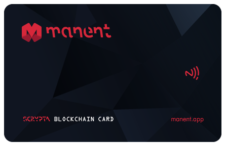

# Scrypta Blockchain Card
### Hardware Wallet

Scrypta Blockchain Card è il tuo wallet tascabile con LYRA Adress associato da utilizzare con Manent App.

La tua identità digitale e i rispettivi balances possono essere collegati alla Scrypta Card. Uno strumento potente e affidabile che può essere utilizzato per creare backup sicuri del tuo wallet, per la gestione quotidiana dei tuoi fondi Lyra, la gestione delle identità digitali e delle informazioni in esse contenute, o come sistema di pagamento all'interno delle sidechain o dei POS fisici.

E' possibile ottenere la Scrypta Card attraverso lo [Shop di Scrypta Consortium](https://scrypta.shop/)

### Come acquistare Scrypta Card
Ecco un video tutorial che illustra come acquistare la Scrypta Card utilizzando **LYRA** come metodo di pagamento:

<iframe width="560" height="315" src="https://www.youtube.com/embed/CJXpjN50zB0" frameborder="0" allow="accelerometer; autoplay; encrypted-media; gyroscope; picture-in-picture" allowfullscreen></iframe>

E' possibile utilizzare anche altri metodi di pagamento: Paypal, carta di debito o bonifico bancario.

### Come utilizzare Scrypta Card
Ecco un video tutorial che illustra come sincronizzare la card con Manent app e come utilizzarla:

<iframe width="560" height="315" src="https://www.youtube.com/embed/y2shLdjy2Sg" frameborder="0" allow="accelerometer; autoplay; encrypted-media; gyroscope; picture-in-picture" allowfullscreen></iframe>

